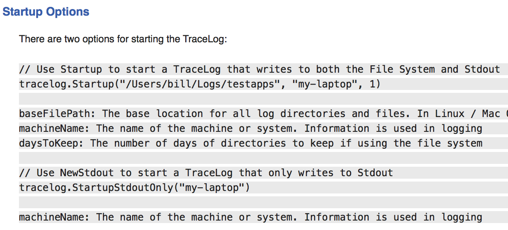

## 使用 Godoc 记录 Go 代码

> [Documenting Go Code With Godoc](https://www.ardanlabs.com/blog/2013/06/documenting-go-code-with-godoc.html)

如果您阅读我的博客，您就会知道，我一直在构建一组新的实用程序包，以便我可以在开发新项目时使用。 我是 Go 和 Mac OS 的新手。 毋庸置疑，在过去的一个月里，这是一种地狱般的教育。 但我一点也不怀念 Windows 或 C#。

我在编码方面取得了一些进展，并希望为代码构建文档。 我一直在 LiteIDE 中使用文档查看器，我希望能很好地将我的文档集成到其中。 看到 LiteIDE 已经在其集成的 Godoc 查看器中列出了我的软件包，我真的很惊讶。
这也就出现一个问题。 这是如何工作的？

经过一番挖掘，我找到了这个本地 HTML 文件。 如果您安装了 LiteIDE，您可以将以下 URL 复制到您的浏览器中。

file:///Applications/LiteIDE.app/Contents/Resources/golangdoc/about.html

这是它显示的：

**Overview**
LiteIDE 中集成的 Godoc 查看器提供了一种无需离开编辑器即可轻松浏览由 godoc 工具生成的文档的方法。可以查看官方 Go 语言和自定义包的文档。 本页的其余部分描述了调用 Godoc 查看器的方法。

**Supported URL Schemes**

可以通过在 Godoc 查看器的地址栏中直接输入 URL 来查看文档。 执行此操作时，您可以通过在地址前添加以下 URL schemes 之一来指定您要查找的文档类型：

- **find**

  搜索名称中包含指定字符串的包。 例如：

    - find:zip
    - find:godoc

- **list**

  列出给定目录中的所有包。 主要选择是“pkg”和“cmd”，它们可以作为页面标题中的链接找到。 例如：

    - list:pkg - 显示 Golang 包
    - list:cmd - 显示 Golang 命令

- **pdoc**

  查看指定包或命令的文档。 例如：

    - pdoc:fmt
    - pdoc:archive/zip
    - pdoc:gofmt
    - pdoc:f:/hg/zmq/gozmq

- **file**

  查看指定的 HTML、Markdown 或纯文本文件。 例如：

    - file:c:/go/doc/docs.html

- **Automatic Schemes**

  对于 "file" 和 "pdoc" schemes，您不需要将 scheme 作为 URL 的一部分键入。 例如：

    - /doc/code.html
    - /src/pkg
    - /src/cmd
    - /pkg/fmt
    - /cmd/cgo
    - archive/zip
    - Go

**File Browser**

您可以通过右键单击文件或目录并选择 "View Godoc Here"，直接从文件浏览器打开 Godoc 查看器。 Godoc 查看器将自动打开所选项目的包文档。

当我从 LiteIDE Godoc 搜索工具中单击我的包 ArdanStudios/threadpool 时，它使用了 pdoc URL schema, *pdoc:ArdanStudios/threadpool* 。

我很快推断出 LiteIDE 正在使用 GOROOT 和 GOPATH 变量来查找文档。 现在还有一个问题，我没有创建任何文档。

当我在 /usr/local/go 和我自己的空间中环顾四周以找到文档文件，但什么也没有。 那么这个文档到底是如何生成并发布在屏幕上的呢？

然后我找到了 Go 团队的这个文档：http://golang.org/cmd/godoc/

第一行说，“Godoc 为 Go 程序提取并生成文档。” 好的，所以这个程序正在被 LiteIDE 使用，但是具体怎样使用的？ Godoc 为所有这些文档生成的文件在哪里？

哈哈，我很难从过去20 年来 Windows 环境中转变过来。

在多次阅读文档后，我打开了一个终端会话并运行了以下命令。

`godoc /Users/bill/Spaces/GoPackages/src/ArdanStudios/threadpool`

突然，文档以文本格式出现在我的屏幕上。 但是我在 LiteIDE 中看到了 HTML？ 我找到了 -html 选项。

`godoc -html /Users/bill/Spaces/GoPackages/src/ArdanStudios/threadpool`

现在，我生成了在 LiteIDE 中看到的相同文档。 我的机器上没有多余的文件，LiteIDE 正在将 Godoc 的输出直接流式传输到屏幕上。 非常聪明的做事方式！！

所以如果我能看到标准 Go 包的文档，那么这些包的源代码必须在我的机器上。 经过一番查找，我在以下位置找到了它们： **/usr/local/go/src/pkg**

它们似乎位于 src 下一个名为 pkg 的文件夹中。 这是因为 Go 团队喜欢将可重用库的源代码放在 pkg 下的项目中。 并非所有开发人员都遵循相同的约定，您可以自由选择。 我个人不遵守那个约定。 显然，Godoc
工具在查找源代码文件时没有问题。

Godoc 工具始终读取源代码文件以生成最新版本的文档。 因此，在 LiteIDE 中，当您更新文档并保存代码文件时，Godoc 工具会立即显示更改。

现在我遇到的下一个问题是，我的文档看起来很糟糕。 我从标准库文件中看到的文档看起来好多了。 那么如何在 Go 代码文件中正确格式化我的文档呢？

我从 Go 团队找到了这个文档：http://golang.org/doc/articles/godoc_documenting_go_code.html

简介是这样写的：

**Godoc: documenting Go code**

Go 项目非常重视文档。 文档是使软件可访问和可维护的重要组成部分。 当然，它必须写得好且准确，但也必须易于编写和维护。 理想情况下，它应该与代码本身耦合，以便文档随代码一起发展。 程序员制作好的文档越容易，对每个人都越好。

为此，我们开发了 godoc 文档工具。 本文描述了 godoc 的文档方法，并解释了如何使用我们的约定和工具为自己的项目编写好的文档。

Godoc 解析 Go 源代码 - 包括注释 - 并生成 HTML 或纯文本格式的文档。 最终结果是文档与它所记录的代码紧密结合。 例如，通过 godoc 的 Web 界面，您可以一键从函数的文档导航到其实现。

对于来自 C# 世界并在过去的 10 年中使用 <summary> 之类的 XML 标记并且必须记住选中 "produce XML documentation file" 选项，这是一个梦想。 哦，是的，没有额外的文档文件。

然而，页面的其余部分缺乏。 我喜欢 fmt.Printf 文档的样子，所以我很快找到了 go 源文件并研究了程序员做了什么。 经过一番尝试，我终于找到了帮助 Godoc 工具清晰地格式化文档所需的 3 条基本规则。

这是我的 tracelog 包的文档示例：



编写文档时有 3 个要素在起作用。 标题部分、标准文本和突出显示的文本。

在代码文件的最顶部，使用 // 注释操作或类似操作添加以下内容。 很明显，你想为自己的工作赢得荣誉，哈哈。

```
// Copyright 2013 Ardan Studios. All rights reserved.
// Use of this source code is governed by a BSD-style
// license that can be found in the LICENSE file.
```

然后添加块注释运算符，我们就可以开始了。 确保包代码语句正好在结束注释运算符之后。 两者之间不能没有空行。

标签非常重要。 我们正在使用两层标签。 保持这两层标签一致。

```
/*
->TAB Package TraceLog implements a file based logging.
->TAB The programmer should feel free to tace log as much of the code.
->CRLF
->TAB New Parameters
->CRLF
->TAB The following is a list of parameters for creating a TraceLog:
      ->TAB baseFilePath: The base location to store all log directories.
      ->TAB machineName: The name of the machine or system. Information is used.
      ->TAB writeToStdout: Set to True if you want the system to also write.
->CRLF
->TAB TraceLog File Management
->CRLF
->TAB Every 2 minutes TraceLog will check each open file for two conditions:
->CRLF
      ->TAB 1. Has a message been written to the file within the last 2 minutes.
      ->TAB 2. Is the size of the file greater than 10 Meg.
*/
package tracelog
```

评论的第一部分将显示在我们文档的顶部，就在概述部分的下方。 第一句也会出现在 Godoc 的包列表中。

然后我们有一个空行和一个字符串，只要下一行是双倍行距并具有相同的缩进，它就会成为标题。

最后一个组件是第二个制表缩进。 这将导致该文本以灰色背景突出显示。

您可能需要从 Go 代码文件中删除所有现有文档并将其放入文本编辑器。 然后把它放回去，确保所有的标签和回车都是干净的。

**使用 GoDoc.org**

如果您正在构建公共包，您可以使用 GoDoc 网站发布您的文档。 查看 GoDoc 网站：http://godoc.org/

该网站已设置为读取您的代码文件并显示您的所有优秀文档。 在搜索框中输入这个 url (github.com/goinggo/utilities/v1/workpool) 并查看 GoDoc 为我的工作池包生成的文档：


您可以看到在本地提供给您的相同文档现在已发布在 GoDoc 网站上，并带有您自己的可重复使用的 url：

那么如何最好地使用这个 url 向人们提供你的文档呢？ 当你为你的包创建一个仓库时，添加一个 README.md 文件。 这是一个特殊的“Markdown”文件，支持标准文本、html 和一些自己的特殊操作符。 Github
有自己的扩展，你可以在这里找到关于 Markdown 的文档：https://help.github.com/articles/github-flavored-markdown

如果你碰巧在 Github 上看到我的公共工作池包，你会看到以下内容：


有我的代码文件、许可证文件和我的自述 Markdown 文件。

这是我使用的典型 README Markdown 文件：


在此处查看原始版本：https://raw.github.com/goinggo/utilities/master/v1/workpool/README.md

查看文件底部的 Markdown 链接。 此语法创建指向文档的链接。 硬括号 [] 中的文本提供链接的锚文本。

由于 Github 总是向用户显示 Readme Markdown 文件（如果存在），这就是人们在访问 Github 页面时看到的内容：


现在人们也可以访问我在网络上编写的文档。 我不需要将文档复制并粘贴到 Readme Markdown 文件中，只需提供一个链接即可。 所有文档都集中在一个地方，并且格式清晰一致。

与往常一样，我希望这会以某种方式帮助您，并且您的文档会吸引人们参与到您的工作中来。