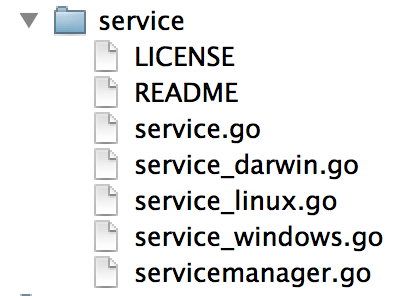

# 将 Go 程序作为后台进程运行

> [Running Go Programs as a Background Process](https://www.ardanlabs.com/blog/2013/06/running-go-programs-as-background.html)


自 1999 年以来，我一直在用 C/C++ 和 C# 编写 Windows 服务。现在我正在用 Go 为 Linux 操作系统编写基于服务器的软件，我完全迷失了。更令人沮丧的是，我正在开发的操作系统（Mac
OSX）第一次不是我将部署代码的操作系统。那将是另一篇博客文章。

我想在 Mac 上将代码作为后台进程（daemon）运行。唯一的问题是，我不知道它在 Mac OS 上是如何工作的。

我很幸运地在 Bitbucket 上找到了一个由 Daniel Theophanes 提供的名为 [service](https://bitbucket.org/kardianos/service/src)
的开源项目。这段代码教会了我如何在 Mac OS 上创建、安装、启动和停止守护进程。该代码还支持 Linux OS 和 Windows 的守护进程。

**Background Processes on the Mac OS**

Mac OS 有两种类型的后台进程，Daemons 和 Agents。以下是相应的定义：

**守护进程**是作为整个系统的一部分在后台运行的程序（也就是说，它不依赖于特定用户）。守护进程不能显示任何 GUI；更具体地说，不允许连接到窗口服务器。Web 服务器是守护进程的完美示例。

**代理**是代表特定用户在后台运行的进程。代理很有用，因为它们可以做守护进程不能做的事情，比如可靠地访问用户的主目录或连接到窗口服务器。

想要查询更多的信息：

http://developer.apple.com/library/mac/#documentation/MacOSX/Conceptual/BPSystemStartup/Chapters/Introduction.html

让我们从如何在 Mac OS 中构建守护进程开始。


如果您打开 finder，您将看到以下文件夹。Library 下的 LaunchDaemons 文件夹是我们需要添加 launchd .plist 文件的地方。在 /System 下还有一个 Library/LaunchDaemons
文件夹对应于操作系统的守护程序。

launchd 程序是用于在 Mac OS 中启动、停止和管理守护进程、应用程序、进程和脚本的服务管理框架。一旦内核启动 launchd，程序会扫描几个目录，包括 /etc 中的脚本以及 /Library 和 /System/Library
中的 LaunchAgents 和 LaunchDaemons 文件夹。LaunchDaemons 目录中的程序以 root 用户角色运行。

这是 launchd .plist 文件的版本，其中包含我们需要的所有基础配置：

```
<?xml version=‘1.0’ encoding=‘UTF-8’?>
<!DOCTYPE plist PUBLIC \“-//Apple Computer//DTD PLIST 1.0//EN\” \”http://www.apple.com/DTDs/PropertyList-1.0.dtd\” >
<plist version=‘1.0’>
<dict>
<key>Label</key><string>My Service</string>
<key>ProgramArguments</key>
<array>
<string>/Users/bill/MyService/MyService</string>
</array>
<key>WorkingDirectory</key><string>/Users/bill/MyService</string>
<key>StandardOutPath</key><string>/Users/bill/MyService/My.log</string>
<key>KeepAlive</key><true/>
<key>Disabled</key><false/>
</dict>
</plist>
```

您可以在此处找到 .plist 文件的所有不同选项：

https://developer.apple.com/library/mac/documentation/Darwin/Reference/ManPages/man5/launchd.plist.5.html

ProgramArguments 键是一个重要的标签：

```
<key>ProgramArguments</key>
<array>
    <string>/Users/bill/MyService/MyService</string>
</array>
```

在这里，您指定要运行的程序的名称以及要传递给 main 的任何其他参数。

另外还有两个标签，WorkingDirectory 和 StandardOutPath 也很有帮助：

```
<key>WorkingDirectory</key><string>/Users/bill/MyService</string>
<key>StandardOutPath</key><string>/Users/bill/MyService/My.log</string>
```

一旦我们有了一个 launchd .plist 文件，我们就可以使用一个名为 launchctl 的特殊程序来启动我们的程序作为后台进程（daemon）。

```
launchctl load /Library/LaunchDaemons/MyService.plist
```

launchctl 程序提供服务控制和报告。`load` 命令用于启动基于 launchd .plist 文件的守护进程。要验证程序是否正在运行，请使用 `list` 命令：

```
launchctl list

PID  Status  Label
948  -       0x7ff4a9503410.anonymous.launchctl
946  -       My Service
910  -       0x7ff4a942ce00.anonymous.bash
```

PID 946 被分配给正在运行的程序 My Service。现在使用 `unload` 命令来停止程序运行：

```
launchctl unload /Library/LaunchDaemons/MyService.plist
launchctl list

PID  Status  Label
948  -       0x7ff4a9503410.anonymous.launchctl
910  -       0x7ff4a942ce00.anonymous.bash
```

现在该程序已被终止。当我们的程序启动和终止时，我们需要实现一些代码来处理来自操作系统的启动和停止请求。

**OS Specific Go Coding Files**

您可以创建仅针对您正在构建的目标平台编译的 Go 源代码文件。



在我的 Going Go 的 LiteIDE 项目中，您将看到五个 Go 源代码文件。其中三个文件具有构建代码的目标平台的名称，darwin (Mac)、linux 和 windows。

由于我是针对 Mac OS 构建的，因此编译器会忽略 service_linux.go 和 service_windows.go 文件。

编译器默认识别此命名约定。

这很酷，因为每个环境都需要做一些不同的事情并使用不同的包。与 service_windows.go 的情况一样，需要以下导入：

```
“code.google.com/p/winsvc/eventlog”
“code.google.com/p/winsvc/mgr”
“code.google.com/p/winsvc/svc”
```

我现在没有安装这些包，因为我不打算在 Windows 上运行代码。它不影响构建代码，因为 service_windows.go 被忽略。

这样做还有另一个非常酷的副作用，我可以在这些文件中重用类型和函数名，因为这些文件中只有一个是用于编译的。这意味着在更改环境时不必修改使用此包的任何代码。真的很酷！

**Service Interfaces**

每个服务必须实现三个接口，为服务提供命令和控制。

```
type Service interface {
    Installer
    Controller
    Runner
}

type Installer interface {
    Install(config *Config) error
    Remove() error
}

type Controller interface {
    Start() error
    Stop() error
}

type Runner interface {
    Run(config *Config) error
}
```

Installer 接口提供了在特定操作系统上作为后台进程安装和卸载的逻辑。Controller 接口提供了从命令行启动和停止服务的逻辑。Runner 接口用于执行应用程序的逻辑，并在请求时将程序作为服务运行。

**Darwin Implementation**

由于这篇文章是专门针对 Mac OS 的，我将专注于 service_darwin.go 代码文件的实现。

Installer 接口需要实现两个函数，Install 和 Remove。如上所述，我们需要为服务创建一个 launchd .plist 文件。最好的方法是使用 text/template 包。

_InstallScript 函数使用多行字符串为 launchd .plist 文件创建模板。

```
func _InstallScript() (script string) {
    return &lt;?xml version='1.0' encoding='UTF-8'?&gt;<br />
&lt;!DOCTYPE plist PUBLIC \"-//Apple Computer//DTD PLIST 1.0//EN\" \"[ http://www.apple.com/DTDs/PropertyList-1.0.dtd ](/broken-link)\" &gt;<br />
&lt;plist version='1.0'&gt;<br />
&lt;dict&gt;<br />
&nbsp; &nbsp; &lt;key&gt;Label&lt;/key&gt;&lt;string&gt;<b>{{.DisplayName}}</b>&lt;/string&gt;<br />
&nbsp; &nbsp; &lt;key&gt;ProgramArguments&lt;/key&gt;<br />
&nbsp; &nbsp; &lt;array&gt;<br />
&nbsp; &nbsp; &nbsp; &nbsp; &lt;string&gt;<b>{{.WorkingDirectory}}</b>/<b>{{.ExecutableName}}</b>&lt;/string&gt;<br />
&nbsp; &nbsp; &lt;/array&gt;<br />
&nbsp; &nbsp; &lt;key&gt;WorkingDirectory&lt;/key&gt;&lt;string&gt;<b>{{.WorkingDirectory}}</b>&lt;/string&gt;<br />
&nbsp; &nbsp; &lt;key&gt;StandardOutPath&lt;/key&gt;&lt;string&gt;<b>{{.LogLocation}}</b>/<b>{{.Name}}</b>.log&lt;/string&gt;<br />
&nbsp; &nbsp; &lt;key&gt;KeepAlive&lt;/key&gt;&lt;true/&gt;<br />
&nbsp; &nbsp; &lt;key&gt;Disabled&lt;/key&gt;&lt;false/&gt;<br />
&lt;/dict&gt;<br />
&lt;/plist&gt;
}
```

多行字符串最酷的地方在于回车、换行和空格都会得到保留。由于这是一个模板，我们需要有将被数据替换的变量。使用 {{.variable_name}} 定义这些变量。

下面是 Install 函数的实现：

```
func (service *_DarwinLaunchdService) Install(config *Config) error {
    confPath := service._GetServiceFilePath()

    _, err := os.Stat(confPath)
    if err == nil {
        return fmt.Errorf(“Init already exists: %s”, confPath)
    }

    file, err := os.Create(confPath)
    if err != nil {
        return err
    }
    defer file.Close()

    parameters := struct {
        ExecutableName string
        WorkingDirectory string
        Name string
        DisplayName string
        LongDescription string
        LogLocation string
    }{
        service._Config.ExecutableName,
        service._Config.WorkingDirectory,
        service._Config.Name,
        service._Config.DisplayName,
        service._Config.LongDescription,
        service._Config.LogLocation,
    }

    template := template.Must(template.New(“launchdConfig”).Parse(_InstallScript()))
    return template.Execute(file, &parameters)
}
```

_GetServiceFilePath() 抽象了每个环境配置文件的位置。对于 Darwin，函数如下所示：

```
func (service *_DarwinLaunchdService) _GetServiceFilePath() string {
    return fmt.Sprintf(“/Library/LaunchDaemons/%s.plist”, service._Config.Name)
}
```

现在代码检查文件是否已经存在，如果不存在，则创建一个空文件。接下来，我们动态构建一个结构，并使用模板执行函数调用所需的所有参数填充它。请注意，字段的名称与模板中的 {{.variable_name}} 变量匹配。

Execute 函数将处理模板，然后使用文件句柄将结果写入磁盘。

Controller 接口需要实现两个函数，Start 和 Stop。在 Darwin 源代码文件中，实现很简单：

```
func (service *_DarwinLaunchdService) Start() error {
    confPath := service._GetServiceFilePath()

    cmd := exec.Command(“launchctl”, “load”, confPath)
    return cmd.Run()
}

func (service *_DarwinLaunchdService) Stop() error {
    confPath := service._GetServiceFilePath()

    cmd := exec.Command(“launchctl”, “unload”, confPath)
    return cmd.Run()
}
```

每个函数都以与上面相同的方式来执行 launchctl 程序。这提供了一种方便的方式来启动和停止守护程序。

最后需要实现的接口是 Runner，它有一个名为 Run 的函数。

```
func (service *_DarwinLaunchdService) Run(config *Config) error {
    defer func() {
        if r := recover(); r != nil {
            fmt.Println(”******> SERVICE PANIC:“, r)
        }
    }()

    fmt.Print(”******> Initing Service\n”)

    if config.Init != nil {
        if err := config.Init(); err != nil {
            return err
        }
    }

    fmt.Print(”******> Starting Service\n”)

    if config.Start != nil {
        if err := config.Start(); err != nil {
            return err
        }
    }

    fmt.Print(”******> Service Started\n”)

    // Create a channel to talk with the OS
    var sigChan = make(chan os.Signal, 1)
    signal.Notify(sigChan, os.Interrupt)

    // Wait for an event
    whatSig := <-sigChan

    fmt.Print(”******> Service Shutting Down\n”)

    if config.Stop != nil {
        if err := config.Stop(); err != nil {
            return err
        }
    }

    fmt.Print(”******> Service Down\n”)
    return nil
}
```

当程序将作为守护进程运行时调用 Run，它首先调用用户 onInit 和 onStart 函数。用户应该执行任何初始化，启动他们的线程，然后返回控制权。

接下来，代码创建一个用于与操作系统通信的通道。对 signal.Notify
的调用将通道绑定到接收操作系统事件。然后代码开始一个无限循环并等待，直到操作系统通知程序一个事件。该代码正在寻找任何告诉它关闭的事件。一旦接收到要关闭的事件，就会调用用户 onStop 函数并且 Run 函数返回控制权以关闭程序。

**Service Manager**

Service Manager 提供所有样板代码，因此任何程序都可以轻松实现 Service。它实现了名为 Run 的 Config 成员函数。

```
func (config *Config) Run() {
    var err error
    config.Service, err = NewService(config)
    if err != nil {
        fmt.Printf(“%s unable to start: %s”, config.DisplayName, err)
        return
    }

    // Perform a command and then return
    if len(os.Args) > 1 {
        verb := os.Args[1]

        switch verb {
            case “install”:
                if err := service.Install(config); err != nil {
                    fmt.Println(“Failed to install:“, err)
                    return
                }

                fmt.Printf(“Service \“%s\” installed.\n”, config.DisplayName)
                return

            case “remove”:
                if err := service.Remove(); err != nil {
                    fmt.Println(“Failed to remove:“, err)
                    return
                }

                fmt.Printf(“Service \“%s\” removed.\n”, config.DisplayName)
                return

            case “debug”:
                config.Start(config)

                fmt.Println(“Starting Up In Debug Mode”)

                reader := bufio.NewReader(os.Stdin)
                reader.ReadString(’\n’)

                fmt.Println(“Shutting Down”)

                config.Stop(config)
                return

           case “start”:
               if err := service.Start(); err != nil {
                   fmt.Println(“Failed to start:“, err)
                   return
               }

               fmt.Printf(“Service \“%s\” started.\n”, config.DisplayName)
               return

           case “stop”:
               if err := service.Stop(); err != nil {
                   fmt.Println(“Failed to stop:“, err)
                   return
               }

               fmt.Printf(“Service \“%s\” stopped.\n”, config.DisplayName)
               return

           default:
               fmt.Printf(“Options for \“%s\”: (install | remove | debug | start | stop)\n”, os.Args[0])
               return
        }
    }

    // Run the service
    service.Run(config)
}
```

Run 函数首先根据提供的配置创建服务对象。然后它查看命令行参数。如果有命令，则对其进行处理并终止程序。如果命令是 `debug`，程序会像作为服务运行一样启动，只是它不会挂载到操作系统。点击 <enter> kill 将关闭程序。

如果没有提供命令行参数，代码会尝试通过调用 service.Run 作为守护程序启动。

**Implementing The Service**

以下代码显示了使用服务的示例：

```
package main

import (
    “fmt”
    “path/filepath”

    “github.com/goinggo/service/v1”
)

func main() {
    // Capture the working directory
    workingDirectory, _ := filepath.Abs(“”)

    // Create a config object to start the service
    config := service.Config{
        ExecutableName: “MyService”,
        WorkingDirectory: workingDirectory,
        Name: “MyService”,
        DisplayName: “My Service”,
        LongDescription: “My Service provides support for…”,
        LogLocation: _Straps.Strap(“baseFilePath”),

        Init: InitService,
        Start: StartService,
        Stop: StopService,
    }

    // Run any command line options or start the service
    config.Run()
}

func InitService() {
    fmt.Println(“Service Inited”)
}

func StartService() {
    fmt.Println(“Service Started”)
}

func StopService() {
    fmt.Println(“Service Stopped”)
}
```

Init、Start 和 Stop 函数必须将控制权返回给 config.Run 函数。

我已经在 Mac OS 上测试过该代码。除了需要创建和安装的脚本外，linux 的代码是相同的。启动和停止的实现也使用不同的程序。在不久的将来，我将测试代码的 Linux 部分。Window 部分需要一些重构并且不会构建。如果您打算使用
Windows，请从 Daniel 的代码开始。

构建代码后，打开已创建二进制文件的终端会话并运行不同的命令。

```
./MyService debug

./MyService install

./MyService start

./MyService stop
```

一如既往，我希望这些代码可以帮助您创建和运行自己的服务。