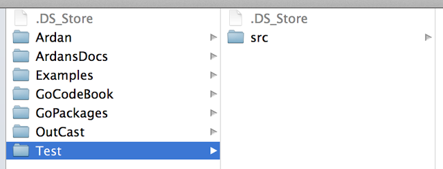
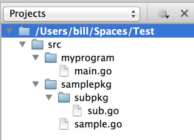
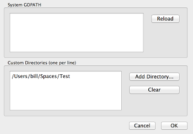
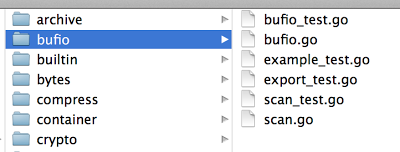
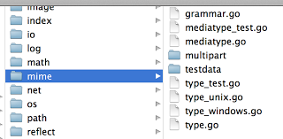
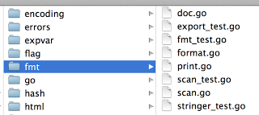
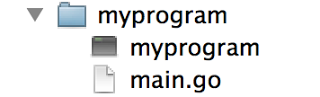
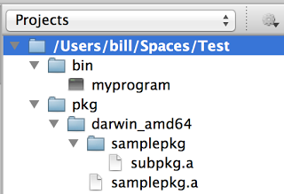

# 在 Go 中包是如何工作的？

> [How Packages Work in Go](https://www.ardanlabs.com/blog/2013/07/how-packages-work-in-go-language.html)


自从我开始用 Go 编写代码以来，如何最好地组织代码和使用 package 关键字对我来说一直是个谜。package 关键字类似于在 C# 中使用命名空间，但约定是将包名称与目录结构联系起来。

Go 有这个网页试图解释如何编写 Go 代码。

http://golang.org/doc/code.html

当我开始使用 Go 编程时，这是我阅读的第一批文档之一。这超出了我的想象，主要是因为我一直在 Visual Studio
中工作，并且代码被打包在解决方案和项目文件中。处理文件系统上的目录是一个疯狂的想法。现在我喜欢它的简单性，但它花了很长时间才变得有意义。

"How to Write Go Code" 从工作区的概念开始。将其视为项目的根目录。如果您在 Visual Studio 中工作，这是解决方案或项目文件所在的位置。然后在您的工作区中，您需要创建一个名为 src 的子目录。如果您希望
Go 工具正常工作，这是强制性的。在 src 目录中，您可以自由地以您想要的方式组织您的代码。但是，您需要了解 Go 团队为包和源代码制定的约定，否则您可能需要重构您的代码。

在我的机器上，我创建了一个名为 Test 的工作区和名为 src 的子目录。这是创建项目的第一步。



然后在 LiteIDE 中打开 Test 目录（Workspace），并创建以下子目录并清空 Go 源代码文件。



首先，我们为我们正在创建的应用程序创建一个子目录。main 函数所在目录的名称将是可执行文件的名称。在我们的例子中 main.go 包含 main 函数并且在 myprogram 目录下。这意味着我们的可执行文件将被称为
myprogram。

src 中的其他子目录将包含我们项目的包。按照惯例，目录的名称应该是位于该目录中的源代码文件的包的名称。在我们的例子中，新的包被称为 samplepkg 和 subpkg。源代码文件的名称可以是您喜欢的任何名称。



创建相同的包文件夹并清空 Go 源代码文件以进行后续操作。

如果您不将 Workspace 文件夹添加到 GOPATH，我们将会遇到问题。

我花了一点时间才意识到自定义目录窗口是一个文本框。因此，您可以直接编辑这些文件夹。系统 GOPATH 是只读的。

Go 设计者在命名他们的包和源代码文件时做了几件事。所有文件名和目录都是小写的，并且它们没有使用下划线来分隔包目录名中的单词。此外，包名称与目录名称匹配。目录中的代码文件属于以该目录命名的包。

查看一些标准库包的 Go 源代码目录：



bufio 和 builtin 的包目录是目录命名约定的绝佳示例。它们可能被称为 buf_io 和 built_in。

再次查看 Go 源代码目录并查看源代码文件的名称。



请注意在某些文件名中使用了下划线。当文件包含测试代码或特定于平台时，使用下划线。

通常的约定是将源代码文件之一命名为与包名称相同。在 bufio 中遵循此约定。然而，这是一个松散遵循的约定。



在 fmt 包中，您会注意到没有名为 fmt.go 的源代码文件。我个人喜欢以不同的方式命名我的包和源代码文件。

最后，打开 doc.go、format.go、print.go 和 scan.go 文件。它们都被声明在 fmt 包中。

让我们看一下 sample.go 的代码：

```
package samplepkg

import (
    "fmt"
)

type Sample struct {
    Name string
}

func New(name string) (sample * Sample) {
    return &Sample{
        Name: name,
    }
}

func (sample * Sample) Print() {
    fmt.Println("Sample Name:", sample.Name)
}
```

代码没用，但它会让我们专注于两个重要的约定。首先，注意包的名称与子目录的名称相同。其次，有一个函数叫做New。

函数 New 是用于创建核心类型或不同类型以供应用程序开发人员使用的包的 Go 约定。看看在 log.go、bufio.go 和 cypto.go 中 New 是如何定义和实现的：

```
log.go
// New creates a new Logger. The out variable sets the
// destination to which log data will be written.
// The prefix appears at the beginning of each generated log line.
// The flag argument defines the logging properties.
func New(out io.Writer, prefix string, flag int) * Logger {
    return &Logger{out: out, prefix: prefix, flag: flag}
}

bufio.go
// NewReader returns a new Reader whose buffer has the default size.
func NewReader(rd io.Reader) * Reader {
    return NewReaderSize(rd, defaultBufSize)
}

crypto.go
// New returns a new hash.Hash calculating the given hash function. New panics
// if the hash function is not linked into the binary.
func (h Hash) New() hash.Hash {
    if h > 0 && h < maxHash {
        f := hashes[h]
        if f != nil {
            return f()
        }
    }
    panic("crypto: requested hash function is unavailable")
}
```

由于每个包都充当命名空间，因此每个包都可以有自己的 New 版本。在 bufio.go 中可以创建多种类型，因此没有独立的 New 函数。在这里你会发现像 NewReader 和 NewWriter 这样的函数。

回头看看 sample.go。在我们的代码中，核心类型是 Sample，因此我们的 New 函数返回对 Sample 类型的引用。然后我们添加了一个成员函数来显示我们在 New 中提供的名称。

现在让我们看一下 sub.go 的代码：

```
package subpkg

import (
    "fmt"
)

type Sub struct {
    Name string
}

func New(name string) (sub * Sub) {
    return &Sub{
        Name: name,
    }
}

func (sub * Sub) Print() {
    fmt.Println("Sub Name:", sub.Name)
}
```

除了我们将核心类型命名为 Sub 之外，代码是相同的。包名称与子目录名称匹配，New 返回对 Sub 类型的引用。

现在我们的包已经正确定义和编码，我们可以使用它们了。

查看 main.go 的代码：

```
package main

import (
    "samplepkg"
    "samplepkg/subpkg"
)

func main() {
    sample := samplepkg.New("Test Sample Package")
    sample.Print()

    sub := subpkg.New("Test Sub Package")
    sub.Print()
}
```

由于我们的 GOPATH 指向 Workspace 目录，在我的例子中是 /Users/bill/Spaces/Test，我们的导入引用从该点开始。在这里，我们根据目录结构引用这两个包。

接下来，我们为每个相应的包调用 New 函数并创建这些核心类型的变量。



现在构建并运行程序。您应该看到创建了一个名为 myprogram 的可执行程序。

一旦您的程序准备好分发，您就可以运行 install 命令。



install 命令将在您的工作区中创建 bin 和 pkg 文件夹。请注意，最终的可执行文件放在 bin 目录下。

编译好的包放在 pkg 目录下。在该目录中，创建了一个描述目标体系结构的子目录，该子目录反映了源目录。

这些已编译的包存在，因此 go 工具可以避免不必要地重新编译源代码。

"How to Write Go Code" 文章中最后一条语句的问题是，在执行代码的未来构建时，Go 工具会忽略这些 .a 文件。如果没有源代码文件，您将无法构建您的程序。我还没有找到任何文档来真正解释这些 .a 文件如何直接用于构建
Go 程序。如果有人能对这个话题有所了解，将不胜感激。

归根结底，最好遵循 Go 设计者处理的约定。查看他们编写的源代码可以为如何做事提供最好的文档。我们中的许多人都在为社区编写代码。如果我们都遵循相同的约定，我们可以确保兼容性和可读性。如有疑问，请打开 finder 到
/usr/local/go/src/pkg 并开始挖掘。

一如既往，我希望这可以帮助您更好地理解 Go 编程语言。