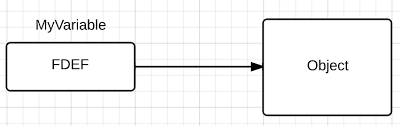
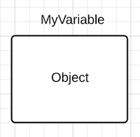

# 了解指针和内存分配

> [Understanding Pointers and Memory Allocation](https://www.ardanlabs.com/blog/2013/07/understanding-pointers-and-memory.html)


在 Go 语言团队提供的文档中，你将找到有关指针和内存分配的大量信息。这是该文档的链接：

http://golang.org/doc/faq#Pointers

首先需要了解的是，所有变量都包含一个值。变量的类型将决定我们如何操作它所包含的内存。阅读这篇文章以了解更多信息： [了解 Go 的类型](./013_understanding-type-in-go.md)

在 Go 中，我们可以创建 "value of" 是值本身或地址的变量。当变量的 "value of" 是地址时，变量被认为是指针。

在下图中，我们有一个名为 myVariable 的变量。myVariable 的 "value of" 是相同类型值的地址。myVariable 被视为指针变量。



在下图中，myVariable 的 "value of" 是值本身，而不是对值的引用。



要访问值的属性，我们使用选择器运算符。选择器运算符允许我们访问值中的特定字段。语法始终为 Value.FieldName，其中句点 (.) 是选择器运算符。

在 C 语言中，我们需要根据变量类型使用不同的选择器运算符。如果变量的 "value of" 是值，我们使用句点 (.)，地址则我们使用箭头 (->)。

在 Go 中，你无需担心使用哪种类型的选择器运算符。无论变量是值还是指针，我们都只使用句点 (.)。编译器负责访问该值的底层细节。

那么为什么这一切都很重要呢？当我们开始使用函数来抽象和分解逻辑时，这一点变得很重要。最终，你需要将变量传递给这些函数，并且你需要知道你传递的是什么。

在 Go 中，变量通过值传递给函数。这意味着指定的每个变量的 "value of" 都被复制到栈帧中以供该函数访问。在这个例子中，我们调用了一个函数，该函数应该改变 main 中的值。

```
package main

import (
    "fmt"
    "unsafe"
)

type MyType struct {
    Value1 int
    Value2 string
}

func main() {
    // Allocate an value of type MyType
    myValue := MyType{10, "Bill"}

    // Create a pointer to the memory for myValue
    // For Display Purposes
    pointer := unsafe.Pointer(&myValue)

    // Display the address and values
    fmt.Printf("Addr: %v Value1 : %d Value2: %s\n",
        pointer,
        myValue.Value1,
        myValue.Value2)

    // Change the values of myValue
    ChangeMyValue(myValue)

    // Display the address and values
    fmt.Printf("Addr: %v Value1 : %d Value2: %s\n",
        pointer,
        myValue.Value1,
        myValue.Value2)
}

func ChangeMyValue(myValue MyType) {
    // Change the values of myValue
    myValue.Value1 = 20
    myValue.Value2 = "Jill"

    // Create a pointer to the memory for myValue
    pointer := unsafe.Pointer(&myValue)

    // Display the address and values
    fmt.Printf("Addr: %v Value1 : %d Value2: %s\n",
        pointer,
        myValue.Value1,
        myValue.Value2)
}
```

这是程序的输出：

```
Addr: 0x2101bc000 Value1 : 10 Value2: Bill
Addr: 0x2101bc040 Value1 : 20 Value2: Jill
Addr: 0x2101bc000 Value1 : 10 Value2: Bill
```

那么出了什么问题呢？函数对 main 的 myValue 所做的更改在函数调用后没有被保留。main 中 myValue 变量的 "value of" 不包含对该值的引用，它不是指针。main 中 myValue 变量的 "value
of" 就是值。当我们将 main 中的 myValue 变量的 "value of" 传递给函数时，该值的副本被放置在栈帧上。该函数正在更改它自己的值。一旦函数终止，栈帧就会被弹出，副本严格上说已经消失了。main 中 myValue
变量的 "value of" 从未被触及。

为了解决这个问题，我们可以分配内存以获取引用。那么 main 中 myValue 变量的 "value of" 将是值的地址，一个指针变量。然后我们可以修改函数以接受 "value of" 为地址时作为参数。

```
package main

import (
    "fmt"
    "unsafe"
)

type MyType struct {
    Value1 int
    Value2 string
}

func main() {
    // Allocate an value of type MyType
    myValue := &MyType{10, "Bill"}

    // Create a pointer to the memory for myValue
    //  For Display Purposes
    pointer := unsafe.Pointer(myValue)

    // Display the address and values
    fmt.Printf("Addr: %v Value1 : %d Value2: %s\n",
        pointer,
        myValue.Value1,
        myValue.Value2)

    // Change the values of myValue
    ChangeMyValue(myValue)

    // Display the address and values
    fmt.Printf("Addr: %v Value1 : %d Value2: %s\n",
        pointer,
        myValue.Value1,
        myValue.Value2)
}

func ChangeMyValue(myValue *MyType) {
    // Change the values of myValue
    myValue.Value1 = 20
    myValue.Value2 = "Jill"

    // Create a pointer to the memory for myValue
    pointer := unsafe.Pointer(myValue)

    // Display the address and values
    fmt.Printf("Addr: %v Value1 : %d Value2: %s\n",
        pointer,
        myValue.Value1,
        myValue.Value2)
}
```

当我们使用 & 运算符赋值时，会返回一个引用。这意味着 main 中 myValue 变量的 "value of" 现在是一个指针变量，其值是刚刚赋值的地址。当我们将 main 中的 myValue 变量的 "value of"
传递给函数时，函数 myValue 变量现在包含该值的地址，而不是值的副本。我们现在有两个指向同一个值的指针。main 中的 myValue 变量和函数中的 myValue 变量。

如果我们再次运行该程序，该函数现在正在按照我们希望的方式工作。它改变了 main 中的值。

```
Addr: 0x2101bc000 Value1 : 10 Value2: Bill
Addr: 0x2101bc000 Value1 : 20 Value2: Jill
Addr: 0x2101bc000 Value1 : 20 Value2: Jill
```

在函数调用期间，不再将值复制到栈帧上，而是复制值的地址。该函数现在通过局部指针变量引用相同的值并更改值。

"Effective Go" 文档中有一个关于内存分配的精彩章节，其中包括数组、切片和映射的工作原理：

http://golang.org/doc/effective_go.html#allocation_new

让我们谈谈关键字 new 和 make。

new 关键字用于在内存中赋值指定类型的值。内存分配被清零。无法在调用 new 时进一步初始化内存。换句话说，在使用 new 时，你不能为指定类型的属性指定特定值。

如果要在赋值时指定值，请使用复合字面量。它们有两种风格，有没有指定字段名称。

```
// Allocate an value of type MyType
// Values must be in the correct order
myValue := MyType{10, "Bill"}


// Allocate a value of type MyType
// Use labeling to specify the values
myValue := MyType{
    Value1: 10,
    Value2: "Bill",
}
```

make 关键字仅用于赋值和初始化切片、映射和通道。Make 不返回引用，它返回为操作新切片、映射或通道而创建和初始化的数据结构的 "value of"。此数据结构包含对用于操作切片、映射或通道的其他数据结构的引用。

将映射按值语义传递给函数是如何工作的。看这个示例代码：

```
package main

import (
    "fmt"
    "unsafe"
)

type MyType struct {
    Value1 int
    Value2 string
}

func main() {
    myMap := make(map[string]string)
    myMap["Bill"] = "Jill"

    pointer := unsafe.Pointer(&myMap)
    fmt.Printf("Addr: %v Value : %s\n", pointer, myMap["Bill"])

    ChangeMyMap(myMap)
    fmt.Printf("Addr: %v Value : %s\n", pointer, myMap["Bill"])

    ChangeMyMapAddr(&myMap)
    fmt.Printf("Addr: %v Value : %s\n", pointer, myMap["Bill"])
}

func ChangeMyMap(myMap map[string]string) {
    myMap["Bill"] = "Joan"

    pointer := unsafe.Pointer(&myMap)

    fmt.Printf("Addr: %v Value : %s\n", pointer, myMap["Bill"])
}

// Don’t Do This, Just For Use In This Article
func ChangeMyMapAddr(myMapPointer *map[string]string) {
    (*myMapPointer)["Bill"] = "Jenny"

    pointer := unsafe.Pointer(myMapPointer)

    fmt.Printf("Addr: %v Value : %s\n", pointer, (*myMapPointer)["Bill"])
}
```

这是程序的输出：

```
Addr: 0x21015b018 Value : Jill
Addr: 0x21015b028 Value : Joan
Addr: 0x21015b018 Value : Joan
Addr: 0x21015b018 Value : Jenny
Addr: 0x21015b018 Value : Jenny
```

我们创建了一个映射并添加了一个名为 "Bill" 的键来分配 "Jill" 的值。然后我们将该映射传递给 ChangeMyMap 函数。请记住，myMap 变量不是指针，其 "value of"
是一个数据结构，在函数调用期间被复制到栈帧中。因为 myMap 的 "value of" 是一个包含对映射内部的引用的数据结构，所以该函数可以使用其数据结构的副本对映射进行更改，这些更改将在函数调用后被 main 看到。

如果你查看输出，你会发现当我们按值传递映射时，该函数拥有自己的映射数据结构副本。你可以看到对映射所做的更改会在函数调用后得到保留。在 main 中，我们发现映射键为 "Bill" 的值被改变了。

这是不必要的，但 ChangeMyMapAddr 函数显示了如何在 main 中传递和使用对 myMap 变量的引用。Go 团队再次确保传递映射变量的 "value of" 可以毫无问题地执行。请注意，当我们想要访问映射时，需要进行解引用
myMapPointer 变量。这是因为 Go 编译器不允许我们通过指针变量直接访问映射。解引用指针变量相当于拥有一个 "value of" 为值的变量。

我花时间写这篇文章是因为有时候你会混淆变量的 "value of"。如果你的变量的 "value of" 是一个很大的值，并且你将该变量的 "value of"
传递给一个函数，那么你将在堆栈上制作该变量的一个大副本。除非您有非常特殊的用例，否则您要确保将地址传递给您的函数。

映射、切片和通道是不同的。你可以按值传递这些变量而无需担心。当我们将映射变量传递给函数时，我们复制的是数据结构而不是整个映射。

我建议你阅读 [Effective Go](http://golang.org/doc/effective_go.html) 文档。自从我开始使用 Go
编程以来，我已经多次阅读该文档。随着我获得更多经验，我会回去再次阅读此文档,总是接受一些以前对我没有意义的新事物。
