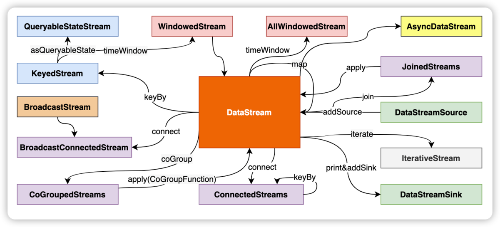
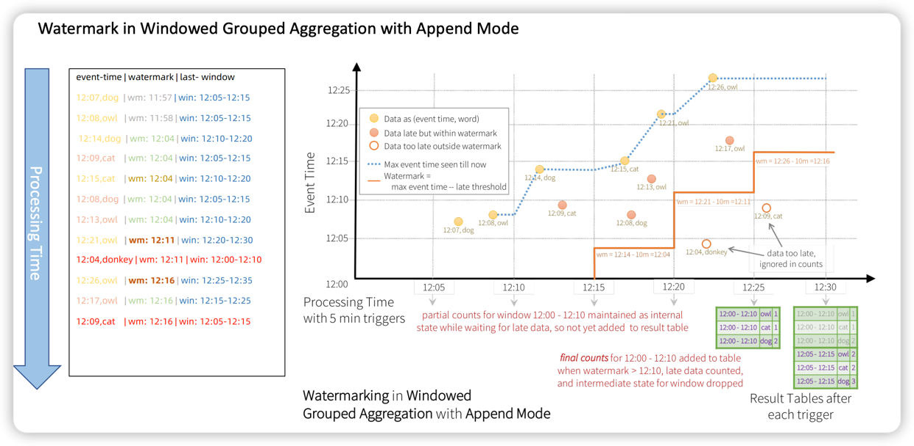
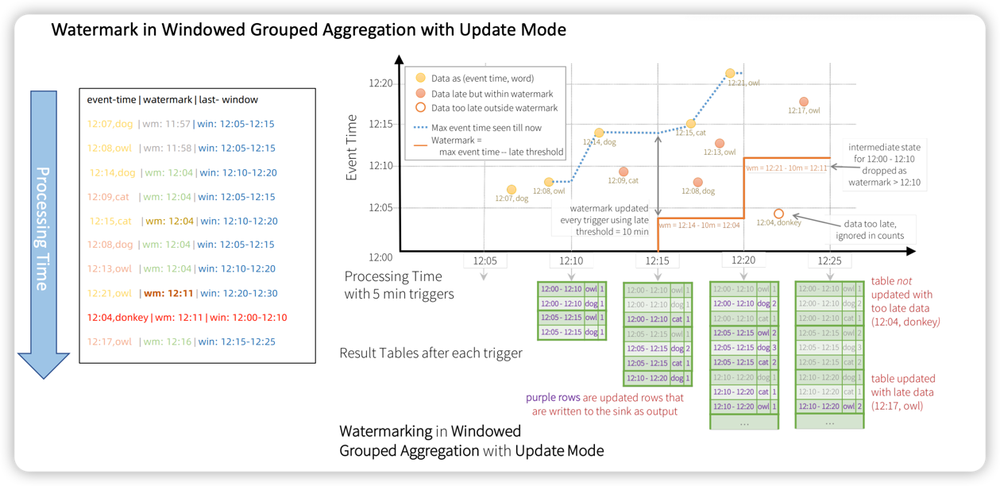
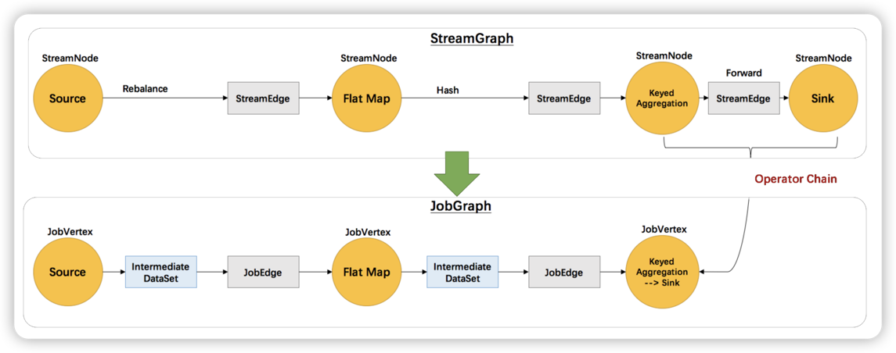
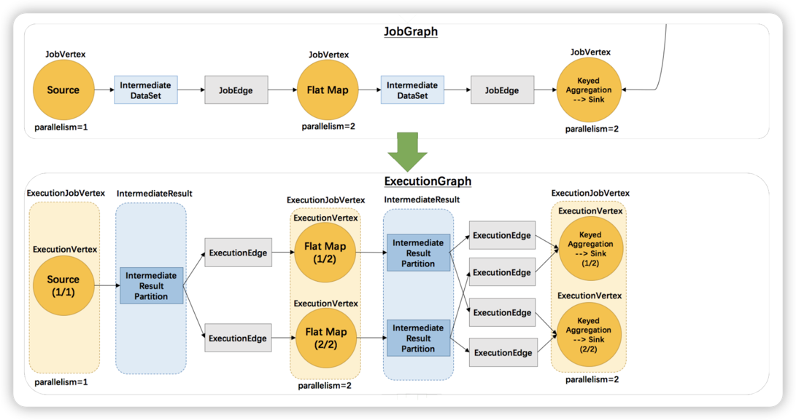

## 分布式流处理模型

- 数据从上一个 Operation 节点直接 Push 到下一个 Operation 节点
- 各节点可以分布在不同的 Task 线程中运行，数据在 Operation 之间传递
- 具有 Shuffle 过程，但是数据不像 MapReduce 模型，Reduce 从 Map 端拉取数据
- 实现框架有 Apache Storm 和 Apache Flink 以及 Apache Beam

## DataStream 主要转换操作

- 基于单数据处理
    - map：一对一转换
    - flatMap：一对多转换
    - filter：过滤
- Window 操作
    - timeWindowAll：时间窗口
    - countWindowAll：计数窗口
    - windowAll：自定义窗口
    - timeWindow：时间窗口（Keyed DataStream）
    - countWindow：计数窗口（Keyed DataStream）
    - window：自定义窗口（Keyed DataStream）
- 多流合并
    - join：关联操作
    - connect：连接操作
    - coGroup：关联操作
    - union：合并操作
    - intervalJoin：间接join操作（Keyed DataStream）
- 单流切分
    - split：切分操作
    - sideOutput：旁路输出

## 时间概念

- Event Time：事件发生的时间
- Ingestion Time：数据进入系统的时间
- Processing Time：数据被处理的时间

## Watermark 和 窗口

- 用于标记 Event Time 的进度
- 跟随 DataStream Event-Time变动，并自身携带 TimeStamp
- 用于触发窗口计算
- 用于触发延迟数据的处理
- Watermark = Max EventTime - Late Threshold
- Late Threshold 越高，数据处理延迟越高，但是系统吞吐量越高
- 窗口触发条件：Watermark >= Window End Time
- Watermark 的主要目的是告诉窗口不再会有比当前 Watermark 更晚的数据到达

