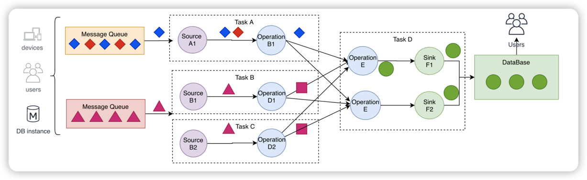

## 分布式流处理模型

- 数据从上一个 Operation 节点直接 Push 到下一个 Operation 节点
- 各节点可以分布在不同的 Task 线程中运行，数据在 Operation 之间传递
- 具有 Shuffle 过程，但是数据不像 MapReduce 模型，Reduce 从 Map 端拉取数据
- 实现框架有 Apache Storm 和 Apache Flink 以及 Apache Beam

