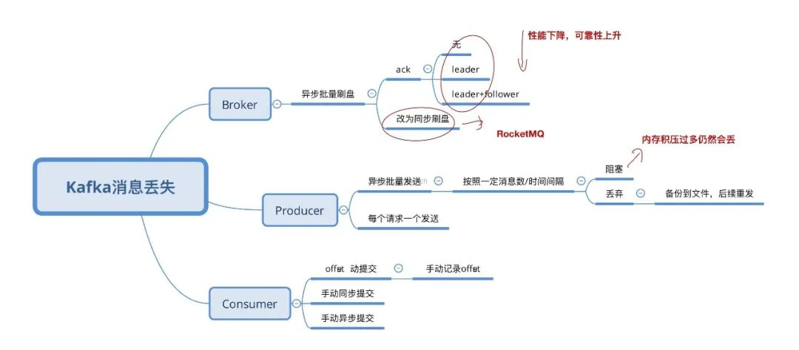

# 常见问题

## Kafka 会不会丢消息？怎么处理的?

### [Go 操作 Kafka 如何保证无消息丢失](https://mp.weixin.qq.com/s/qaDfrlc1UR8_q6SGGaGB0Q)

## 如何保证消息不被重复消费？

Kafka 实际上有个 offset 的概念，就是每个消息写进去，都有一个 offset，代表消息的序号，然后 consumer 消费了数据之后，**
每隔一段时间**（定时定期），会把消费过的消息的 offset 提交一下，表示“已经消费过了，下次要是重启啥的，就让继续从上次消费到的
offset 来继续消费吧”。

凡事总有意外，生产经常遇到的，就是有时候重启系统，看怎么重启了，如果碰到点着急的，直接 kill 进程了，再重启。这会导致 consumer
有些消息处理了，但是没来得及提交 offset。重启之后，少数消息会再次消费一次。

**保证消息队列消费的幂等性**

- 这个数据要写库，先根据主键查一下，如果这数据都有了，就别插入了，update 一下
- 写 Redis，那没问题了，反正每次都是 set，天然幂等性
- 让生产者发送每条数据的时候，里面加一个全局唯一的 id，类似订单 id 之类的东西，然后这里消费到了之后，先根据这个 id 去 Redis
  里查一下，之前消费过吗？如果没有消费过，就处理，然后这个 id 写 Redis。如果消费过了，那就别处理了，保证别重复处理相同的消息即可
- 基于数据库的唯一键来保证重复数据不会重复插入多条
