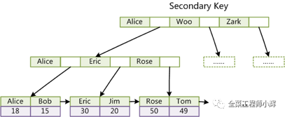
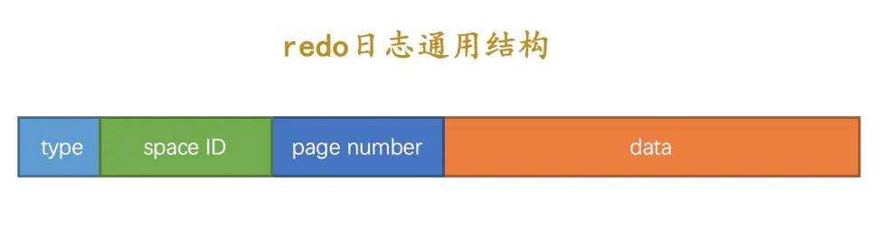

# Mysql

## 整体架构

### 安装和启动

- **安装：**

  推荐使用Docker安装：  `docker run --name mysql -e MYSQL_ROOT_PASSWORD=root mysql:5.7`

- **服务端启动**

    - `mysqld`： MySQL 服务端程序，运行这个可执行文件就可以直接启动一个服务端进程
    - `mysqld_safe`：启动脚本，它会间接调用 `mysqld`，而且还顺便启动了另外一个监控进程，这个监控进程在 MySQL
      服务端进程挂了之后可以帮助重启它。另外，使用`mysqld_safe` 启动 MySQL 服务端进程时，它会记录服务端出错信息和其他诊断信息，从而方便后续排查错误原因。
    - `mysql.server`：启动脚本，它会间接调用 `mysqld_safe`

  一般使用 `mysql.server start` 和 `mysql.server stop`

### 连接原理

- **mysql 命令解析**

  `mysql -h主机名 -P端口号 -u用户名 -p密码`  （也可以将密码省略通过交互的方式来更安全的传输密码）

- **数据库连接**

  基于 TCP 连接进行通信

- **数据库连接状态**

  连接后无操作的话，会进入休眠状态（`show processlist;`），时间太长会自动断开（默认8小时）

- **长连接与短连接**

    - 长连接是指连接成功后，如果客户端持续有请求，则一直使用同一个连接（为了提升数据库并发性，可以建立一个数据库连接池）
    - 短连接则是指每次执行完很少的几次查询就断开连接，下次查询再重新建立一个

### 查询语句

1. **建立连接：** 通过连接器建立与服务端的连接
2. **查询缓存：** 一般不怎么使用（查询语句要完全一致、数据表更新后缓存失效导致维护成本过高）
3. **分析器：** 对 SQL 语句做词法分析
4. **优化器：**
   生成执行计划，主要的工作是数据表包含索引的时候，判定是否使用索引，以及使用哪些索引效率最高（扫描行数最少）（可以通过  `explain`
   语句查看它的执行计划）
5. **执行器：** 在根据执行计划执行 SQL 查询语句时，会先**验证权限**，有相应的权限才会继续执行，否则会报权限错误

### 更新语句

- **执行流程**

    1. **建立连接**
    2. **分析器**
    3. **优化器**
    4. **执行器**
        1. 执行器通过 API 接口将更新数据传递给存储引擎执行更新操作；
        2. 存储引擎在拿到更新数据后，先将其更新到内存，同时将这个更新操作记录到 redo log，此时 redo log 处于 `prepare`
           状态，然后告知执行器执行完成了，随时可以提交事务；
        3. 执行器生成这个操作的 binlog，并把 binlog 写入磁盘；
        4. 执行器调用引擎的提交事务接口，引擎把刚刚写入的 redo log 改成 `commit` 状态，更新完成。

- **日志写入**

  WAL 技术（Write-Ahead Logging），即先写日志，再写磁盘。

    - redo log（重做日志）：循环写（后面的记录会覆盖前面的），InnoDB使用。
    - binlog（归档日志）：增量写（一直追加写入）

### 数据库存储文件

- **自带的数据库**

    - `information_schema` 保存着 MySQL 服务端维护的所有其他数据库信息，比如表、视图、列、索引等元数据
    - `mysql` 保存着 MySQL 服务端的用户和权限信息，以及一些存储过程、日志信息
    - `performance_schema` 保存着 MySQL 服务端运行过程中的一些状态信息，来提供性能监控和问题排查
    - `sys` 通过视图（数据库视图，不是那种可视化视图）的形式把 `information_schema` 和 `performance_schema` 结合起来，方便了解
      MySQL 服务器的一些性能信息

- **字符集和排序规则**

  排序规则格式：  ` 字符集_语言_后缀`

    - `字符集` 表示字符对应的编码字符集
    - `语言` 表示使用的自然语言，比如 `spanish`、`polish` 等，`general` 则是通用的
    - `后缀` 一般是 `ci` ，表示排序比较的时候字符不区分大小写，如果是 `cs` 则表示区分大小写，上图中还可以看到 `bin`
      后缀，表示以二进制格式比较，通常我们都使用 `ci`。

- **数据库所在的数据目录：** `show variables like 'datadir';`

- **数据表对应的磁盘文件**

    - MyISAM 引擎对应的磁盘文件：
        - `posts_mi.frm` 保存的是 `posts_mi` 表的表结构
        - `posts_mi.MYI` 保存的是 `posts_mi` 表的索引信息
        - `posts_mi.MYD` 保存的是 `posts_mi` 表的所有数据记录
    - InnoDB 引擎对应的磁盘文件
        - 共享表空间文件：`ibdata1`
        - 私有表空间文件：`表名.ibd`

### 引擎

#### InnoDB存储引擎

nnoDB是事务型数据库的首选引擎，支持事务安全表（ACID），支持行锁定和外键。

主键索引：

辅助索引：

使用 **InnoDB存储引擎** MySQL将创建一个名为 `ibdata1 `的10MB大小的自动扩展数据文件，以及两个名为`ib_logfile0`
和`ib_logfile1`的5MB大小的日志文件

> InnoDB 主键索引中既存储了主健值，又存储了行数据
>
> 辅助索引是在叶子节点中保存主键值，通过这个主键值来回表查询到一条完整记录

- 灾难恢复性好
- 支持事务
- 使用行级锁
- 支持外键关联
- 支持热备份
- 对于InnoDB引擎中的表，其数据的物理组织形式是簇表（Cluster Table），主键索引和数据是在一起的，数据按主键的顺序物理分布
- 实现了缓冲管理，不仅能缓冲索引也能缓冲数据，并且会自动创建散列索引以加快数据的获取
- 支持热备份

#### MyISAM引擎

MyISAM基于ISAM存储引擎，并对其进行扩展，拥有较高的插入、查询速度，但不支持事务。

使用**MyISAM引擎**创建数据库，将产生3个文件：`.frm`文件存储表定义、`.MYD(MYData)` 文件存储数据、 `.MYI(MYIndex)` 文件存储索引

> 索引文件仅保存记录所在页的指针（物理位置），通过这些指针来读取页，进而读取被索引的行，同时，每个叶子也保存了指向下一个叶子的指针，从而方便叶子节点的范围遍历。
>
> 在 MyISAM 中，主键索引和辅助索引在结构上没有任何区别（主键索引要求 key 是唯一的）

- 不支持事务
- 使用表级锁，并发性差
- 主机宕机后，MyISAM表易损坏，灾难恢复性不佳
- 可以配合锁，实现操作系统下的复制备份、迁移
- 只缓存索引，数据的缓存是利用操作系统缓冲区来实现的。可能引发过多的系统调用且效率不佳
- 数据紧凑存储，因此可获得更小的索引和更快的全表扫描性能

#### MEMORY存储引擎

MEMORY存储引擎将表中的数据存储到内存中，未查询和引用其他表数据提供快速访问。

- MEMORY表的每个表可以有多达32个索引，每个索引16列，以及500字节的最大键长度
- MEMORY存储引擎执行HASH和BTREE缩影
- 可以在一个MEMORY表中有非唯一键值
- MEMORY表使用一个固定的记录长度格式
- MEMORY不支持BLOB或TEXT列
- MEMORY支持AUTO_INCREMENT列和对可包含NULL值的列的索引
- MEMORY表在所由客户端之间共享（就像其他任何非TEMPORARY表）
- MEMORY表内存被存储在内存中，内存是MEMORY表和服务器在查询处理时的空闲中，创建的内部表共享
- 当不再需要MEMORY表的内容时，要释放被MEMORY表使用的内存，应该执行`DELETE FROM`或`TRUNCATE TABLE`，或者删除整个表（使用DROP
  TABLE）

## 索引->查询优化

### 底层数据结构

**索引是帮助数据库高效获取数据的数据结构。**

- 应用层次
    - 普通索引：即一个索引只包含单个列，一个表可以有多个单列索引
    - 唯一索引：索引列的值必须唯一，但允许有空值
    - 复合索引：一个索引包含多个列

- 表记录的排列顺序和索引的排列顺序是否一致

    - 聚集索引：顺序一致，以主键创建的索引

      > 在叶子节点存储的是表中的数据。查询速度快，新增速度慢（每次插入要重排）。

    - 非聚集索引：顺序不一致，以非主键创建的索引（也叫做二级索引）

      > 在叶子节点存储的是主键和索引列，使用非聚集索引查询数据时，需要拿到叶子上的主键再去表中查找数据（回表）

- 储存结构

    - Btree 索引（B+tree，B-tree)：MySQL采用 B+ 树
    - 哈希索引：本质上就是把键值换算成新的哈希值，根据这个哈希值来定位

    - full-index 全文索引
    - RTree

#### Btree 索引

**B 树（B- 树）**

- 关键字分布在整棵树的所有节点。
- 任何一个关键字 **出现且只出现在一个节点中**。
- 搜索有可能在 **非叶子节点** 结束。
- 其搜索性能等价于在关键字全集内做一次二分查找

**B+ 树**

- 非叶子节点的子树指针与关键字个数相同。
- 非叶子节点的子树指针 P[i]，指向关键字属于 **[k[i],K[i+1])** 的子树（**注意：区间是前闭后开**)。
- **为所有叶子节点增加一个链指针**。
- **所有关键字都在叶子节点出现**。

**相对 B 树，B+ 树做索引的优势**

- **B+ 树的磁盘读写代价更低** （内部没有指向关键字具体信息的指针）
- **B+ 树的查询效率更加稳定** （数据都在叶子节点，每次查询路径长度一致）
- **B+ 树只需要去遍历叶子节点就可以实现整棵树的遍历**

MongoDB 的索引为什么选择 B 树，而 MySQL 的索引是 B+ 树？

因为 MongoDB 不是传统的关系型数据库，而是以 Json 格式作为存储的 NoSQL
非关系型数据库，目的就是高性能、高可用、易扩展。摆脱了关系模型，所以 **范围查询和遍历查询的需求就没那么强烈了**。

#### 哈希索引

哈希索引就是采用一定的哈希算法，只需一次哈希算法即可立刻定位到相应的位置，速度非常快。

缺点：

- 没办法利用索引完成排序
- 不能进行多字段查询
- 在有大量重复键值的情况下，哈希索引的效率也是极低的（出现哈希碰撞问题）
- 不支持范围查询

#### 索引失效

- 违反最左匹配原则
- 在索引列上做任何操作
- 使用不等于（!= 、<>）
- like 中以通配符开头 (’%abc’)
- 字符串不加单引号索引失效
- or 连接索引失效
- order by 或 group by 导致的违反最左前缀法则

### 索引类型

- 主键索引：通常都是自增的，可以直接插入到最后面，直接储存完整的数据记录（索引即数据）

- 唯一索引和普通索引：储存所属记录的主键索引值，避免数据冗余，但是会造成二次查询（回表）

- 联合索引：不同于专门为多个字段设置索引，联合索引只会维护一棵 B+ 树，这棵 B+ 树的叶子节点数据记录会按照联合索引包含的**
  所有字段**进行排序

  > 把只包含索引的查询称为**覆盖索引**

**维护代价**

- 空间上的代价：每个索引都对应着一棵 B+ 树，每棵 B+ 树的每个叶子节点都是一个数据页，数据页默认的大小是 16
  KB，因此维护索引需要额外的存储空间；
- 时间上的代价：插入、修改、删除记录这些数据库写入操作都会引起索引 B+ 树的调整和自平衡，甚至产生页分裂和页合并，这些操作都需要额外的时间成本，会对数据库性能造成一定的损耗。

### EXPLAIN 语句解析

- `id`：查询序列号，标识执行顺序。SQL 语句中出现了几个 SELECT 关键字，就会分配几个查询 id，一般对于单表查询和连接查询，`id`
  值都是 1，对于联合查询和子查询，`id` 值会有多个；
- `select_type`：查询类型，主要是用于区分普通查询、联合查询、子查询等，其中 `SIMPLE` 表示普通查询（包含连接查询）、`UNION`
  表示联合查询、`SUBQUERY` 表示子查询；
- `table`：要执行查询的数据表；
- `partitions`：表分区（通常不会用到，可忽略）；
- `type`：SQL
  查询优化的重要指标，表示执行计划用到的索引类型，性能由高到低依次为：`system` > `const` > `eq_ref` > `ref` > `range` > `index` > `ALL`
  （以下是常见的类型值，不是所有）：
    - `system` 表示系统表查询或者 MyISAM、Memory 引擎表中只包含一条记录；
    - `const` 表示常量查询，通常主键索引或者唯一索引的单表等值匹配查询就是这种类型；
    - `eq_ref` 在连接查询中，被驱动表的主键索索引或唯一索引等值匹配会使用这个类型；
    - `ref` 通常对应二级索引的等值匹配查询，比如 b = 10000；
    - `range` 表示范围匹配；
    - `index` 表示索引树扫描，通常 count 查询会应用这个计划；
    - `ALL` 表示全表扫描，性能最差，通过对于没有设置索引的列进行过滤就会进行全表扫描。
- `possible_keys`：查询过程中有可能用到的索引；
- `key`：查询时实际使用的索引，如果为 NULL，则表示没有使用索引；
- `key_len`：索引长度，越小越好，整型通常是 4，字符串类型根据创建索引时指定的长度设定；
- `ref`：表示表的连接匹配条件，即哪些列或常量被用于查找索引列上的值，对于 `const` 类型单表等值匹配而言，其值是 `const`
  ，对于连接查询而言，就是被连接的列；
- `rows`：返回估算的结果集行数，不一定准确；
- `filtered`：表示返回结果的行数占需读取行数的百分比，越大越好；
- `extra`：展示一些额外信息（以下只是常见的额外信息，不是所有）：
    - `Using index` 表示使用了覆盖索引；
    - `Using where` 表示使用了 where 子句来过滤结果集；
    - `Using filesort` 表示查询过程中使用了文件排序，使用非索引列进行排序时出现，非常消耗性能，排序、分组查询时通常会用到；
    - `Using temporary` 表示查询过程中使用了临时表，分组、联合查询时通常会用到；
    - `Using join buffer` 表示连接查询时使用了 join buffer；
    - `Start temporary, End temporary` 表示 IN 子查询转化为 semijoin 时使用了 DuplicateWeedout 策略；
    - `LooseScan` 表示 IN 子查询转化为 semijoin 时使用了 LooseScan 策略；
    - `FirstMatch` 表示 IN 子查询转化为 semijoin 时使用了 FirstMatch 策略。

### 分页、排序、分组

- 分页优化：可以通过 `limit` 来对未命中索引的查询进行优化
- 排序查询：命中索引后可以直接通过顺序或者倒序返回排序结果（结果集较少的话在内存中完成）
- 分组查询：命中索引后直接返回结果（底层已经排好序了）

### 内外连接查询

不管是内连接还是外连接，都是先根据驱动表上设置的查询条件到驱动表匹配记录，然后再根据从驱动表匹配的记录逐个去被驱动表根据被驱动表设置的查询条件进行匹配，然后将匹配记录放入结果集，直到最后一条驱动表匹配记录在被驱动表完成匹配，将最终结果集返回给客户端。这种查询有一个形象的名字
—— **嵌套循环连接（Nested-Loop Join）**。

- 对于内连接而言，驱动表（`JOIN` 关键字前面的表）按照查询条件匹配的结果集在被驱动表（`JOIN`
  关键字后面的表）找不到对应的匹配记录，则对应的记录不会出现在最终结果集中；
- 对于外连接而言，则没有这个约束，对于左连接而言，只要驱动表（`LEFT JOIN`
  前面的表）按照查询条件匹配到结果，则对应记录就会出现在最终结果集中，如果被驱动表（`LEFT JOIN` 后面的表，可能有多个）匹配记录为空，则会以
  NULL 填充；
- 右连接与左连接相反，`RIGHT JOIN` 之后的表是驱动表，之前的表是被驱动表，不管被驱动表是否匹配到记录，只要驱动表匹配到记录，就会出现在最终结果集中，被驱动表为空的话也以
  NULL 填充。

### 子查询

。。。

## 事务

### Buffer Pool

InnoDB 在 MySQL 服务端启动时，向操作系统申请一片连续的内存空间，当数据库查询需要访问某个数据页的数据时（如果命中索引的话，可以通过
B+ 树快速定位索引值所在的数据页，否则的话需要全表扫描定位），则将整个数据页的数据加载到这片内存空间，即便只是操作一条记录，也会这么做，因为数据页是
MySQL 维护表记录的基本单位，然后我们就可以在内存中对数据进行读写操作了，读写操作完成后，也不会立即释放对应的内存空间，而是缓存起来，方便下次使用，避免磁盘
IO。对于这片内存空间，有一个专有的名词 —— **Buffer Pool**，中文译作缓冲池。

**简介**

-

配置缓冲池大小：`SET GLOBAL innodb_buffer_pool_size=1073741824; # 1GB`      `系统可用内存 - 系统正常运行内存 - (峰值时的连接数 * 每个连接需要的内存)`

- 查看 Buffer Pool
  信息：`SHOW ENGINE INNODB STATUS\G`  [字段释义](https://dev.mysql.com/doc/refman/8.0/en/innodb-buffer-pool.html#innodb-buffer-pool-monitoring)

**底层操作**

- 缓存页装载原理

  MySQL 将所有的空闲缓存页对应控制块存放到一个称之为空闲（free）链表的地方，在 MySQL
  刚启动的时候，所有的缓存页都是空闲的，因此所有的控制块都会添加到这个空闲链表，以后每次从磁盘加载数据页到 Buffer
  Pool，就从这个空闲链表中取一个空闲的缓存页装载，并且把缓存页对应的控制块信息填上（表空间、页号等），然后从空闲链接移除这个缓存页对应的控制块节点即可。并且以表空间
    + 页号为 key，缓存页地址为 value 维护一个哈希表，下次需要加载数据页时，先根据这个 key 从哈希表查询对应 value
      是否存在，如果存在，则从
      Buffer Pool 读取数据，否则从磁盘空间加载，重复上述步骤

- 缓存页刷新算法

  LRU（Last Recently Used）算法淘汰老的缓存页 —— 在底层维护了一个 LRU
  链表：将新加载的缓存页放到链表头部，每次某个缓存页被读取，也将其移动到链表头部，这样一来，最近不常使用的缓存页就自然下沉到链表尾部了。当
  Buffer Pool 没有剩余空间存放新加载的数据页时，覆盖链表尾部的缓存页即可。MySQL 为了优化性能，提供了预读机制：将热数据放到了一个名为
  young 的区域，将冷数据放到了一个名为 old 的区域，把 LRU 链表一分为二，young 区域位于链表头部，old 区域位于链表尾部，预读的数据页会先放到
  old 区域的头部，这样，就不会影响 LRU 算法淘汰缓存命中率低的缓存页的机制

- 缓存页更新同步

  为了提升系统性能，对 MySQL 表记录的更新操作（包括插入、修改、删除）也是在已加载到 Buffer Pool
  中的缓存页中完成的，更新后的缓存页就和磁盘上的数据页数据不一致了，这样的缓存页被称之为脏页。

### 事务简介

1. 开启事务： `BEGIN` 或者 `START TRANSACTION`
2. 执行 SQL 更新操作：执行对应 SQL 更新语句
3. 提交事务： `COMMIT`
4. 回滚事务： `ROLLBACK`

**ACID 特性**

- **原子性（Atomicity）**：即数据库事务中的一系列 SQL 操作是一个不可分割的整体，要么都执行成功，要么都执行失败，不存在部分执行成功部分执行失败的情况。
- **一致性（Consistency）**：事务开始前和结束后，数据库的完整性约束和业务逻辑的一致性不能被破坏，事务提交成功后，意味着数据库从一个状态迁移到另一个状态，而事务执行失败回滚后，需要保持原有状态不被破坏。
- **隔离性（Isolation）**：不同事务之间的操作是相互隔离的，事务 A 不应该影响事务 B 的状态和操作，MySQL
  数据库事务支持不同的隔离级别（默认是可重复读），并且通过锁机制来保证隔离性。
- **持久性（Durability）**：事务一旦提交，则其操作结果会永久性的保存下来，MySQL 会通过 redo 日志来保证即便事务提交之后出现宕机故障，也能恢复相应数据。

### redo 日志保证事务的持久性

为了确保数据库事务的持久性，又不能将事务提交后更改的缓存页（脏页）立即同步到磁盘中， MySQL 提供了 redo
日志功能，作为折中方案，我们会将数据库某条记录的更改以 redo 日志的方式持久化到磁盘，之后需要进行数据恢复时，通过对应的 redo
日志来恢复数据即可。

`type`：类型、 `space ID`： 空间ID、`page number`：页号、`data`：具体修改的数据

**redo 日志写入**

- 事务与redo日志的关联：在 MySQL 底层，将数据页的一次原子访问的过程称之为一个 Mini-Transaction，每个 Mini-Transaction都会维护一组
  redo日志（一条SQL语句可能对应多个Mini-Transaction）

- redo日志内存缓冲区：MySQL 会在内存中通过 redo log block（类似 Buffer Pool 中的缓存页）来存放 redo 日志，每个 block 的大小是
  512，和缓存页存放在 Buffer Pool 类似，这些 redo log block 存放在 MySQL 服务器启动时申请的 redo log buffer
  这片连续的内存空间中（默认大小是 16MB）。

  这些 redo 日志何时会被同步到磁盘？

    - redo log buffer 空间不足时，一般在超过其空间容量一半时刷新；
    - 事务提交时，这样一来，系统崩溃后，即便缓存页数据没有同步到磁盘，也可以通过 redo 日志恢复，从而确保事务的持久性；
    - 后台有一个线程，大约每秒都会刷新一次；
    - 正常关闭 MySQL 服务器时。

- redo日志磁盘文件：mysql磁盘目录下的两个文件 `ib_logfile0` 和 `ib_logfile1` 为redo 日志对应的磁盘文件（默认大小上限为48m，每组两个，循环覆盖）

- checkpoint：redo 日志底层通过 checkpoint 机制来处理循环覆盖问题

    1. 计算一下当前系统中可以被覆盖的 redo 日志对应的 LSN 值最大是多少，并将其赋值给 `checkpoint_lsn`；
    2. 将 `checkpoint_lsn` 和对应的 redo 日志文件组偏移量（比如 `0`、`1`，对应 `ib_logfile` 后面的值）以及此次 checkpint
       的编号写到 redo 日志文件的管理信息中。
    3. 记录完 checkpoint 的信息后，就可以在需要循环覆盖时覆盖掉 `checkpoint_lsn` 之前的 redo 日志了

**通过redo 日志恢复数据**

在 redo 日志中，由于 `checkpoint_lsn`
之前的数据已经同步到磁盘，所以在系统崩溃重启恢复数据时不需要关心，需要从 `checkpoint_lsn` 之后的位置开始读取 redo
日志恢复数据页即可。

性能优化：

- 基于 redo 日志的 `space ID` 和 `page number` 属性计算出哈希值作为 key，将对应 redo 日志作为 value 构建哈希表。这样一来，表空间
  ID 和页号相同的 redo 日志就可以被放到哈希表的同一个槽里，如果有多个这样的 redo 日志，那么它们之间使用链表连接起来（按照
  redo 日志生成时间进行排序，这样才能正常恢复）。这样做的好处是恢复数据页时，可以一次恢复一个数据页上的所有条记录，从而尽可能避免随机磁盘
  IO；
- 每个数据页都有一个 File Header 结构，里面有一个称之为 `FIL_PAGE_LSN` 的属性，该属性记载了最近一次修改页面时对应的 `lsn`
  值，如果在做了某次 checkpoint 之后有脏页被刷新到磁盘中，那么该页对应的 `FIL_PAGE_LSN` 代表的 `lsn`
  值肯定大于 `checkpoint_lsn` 的值，我们可以跳过这样的已同步页面加快数据恢复速度。

### undo 日志保证事务的原子性

MySQL 底层为了能够回滚事务里面的数据库更新操作，会将与之相对的撤销操作记录到 undo 日志里面，然后当我们执行 ROLLBACK
回滚时，就可以根据这些 undo 日志将对应的变更撤销（改回原来的状态）。

**undo 日志写入**

当我们开启一个事务后，执行到第一条增、删、改更新语句时，MySQL 就会为其分配一个全局唯一的自增事务 ID。在同一个事务中，所有记录的事务
ID 都是一样的，这样我们就可以通过事务 ID 将同一个事务的所有 undo 日志记录串联起来了。（这个事务 ID
同时也会被写入聚簇索引记录的 `trx_id` 字段中，这样数据表记录也和事务 ID 建立起了关联）

undo 日志不同于 binlog 和 redo 日志，不是存放在独立的磁盘文件的，而是存放在数据库表空间的 `FIL_PAGE_UNDO_LOG` 页面中，这些
undo 日志会按照生成顺序分配编号，然后按照更新语句的类型存放到不同位置不同内存结构中：

- INSERT 语句：对于 INSERT 语句来说，对应的回滚操作最简单，将该记录删除就好了。
    - `next`：下一条 undo 日志开始的页面地址；
    - `type`：本条 undo 日志的类型，对于 INSERT 语句是 `TRX_UNDO_INSERT_REC`；
    - `undo no`：本条 undo 日志的编号；
    - `table id`：本条 undo 日志对应记录所在的数据表 ID（每张数据表会分配一个唯一的 table id）；
    - `Primary Key`：对应记录的主键 ID，可能包含多个列，因此这里有一个箭头指向详细的主键信息（`len` 表示长度，`col` 表示列名）；
    - `start`：表示本条 undo 日志开始的页面地址。
- DELETE 语句：将要删除的记录进行 `delete_mark` 标记为 1，事务提交之后，通过专门的线程将这些待删除记录真正删除掉。
    - 。。。
    - `old trx_id`：指向旧的事务ID
    - `roll_pointer`：指向旧的 undo log
- UPDATE 语句：
    - 不更新主键：
        - 如果更新前后存储空间没有任何变化，则使用原地更新
        - 否则要先删除旧的记录，再插入新的记录，这里的删除也不同于上面介绍的两阶段删除，而是真正删除
    - 更新主键：
        1. 将旧记录进行 delete mark 操作：这里又不同于上面的删除，是 delete mark 操作，因为别的事务可能也在访问这条记录，不能真正删除它；
        2. 根据更新后各列的值创建一条新记录，并将其插入到聚簇索引中。

**通过undo 日志回滚数据库**

每个数据库事务会创建多个 undo 页面链表，系统中同时可能存在多个数据库事务，所以系统中也会同时存在非常多的 undo
页面链表，为了管理这些页面链表，MySQL 底层提供了一个名为 **Rollback Segment Header** 的页面，在这个页面中存放了各个 undo
页面链表的 frist undo 页面页号，并且把这些页号称之为 undo slot。

MySQL 规定每个 Rollback Segment Header 页面都对应着一个段，这个段就称为 Rollback Segment，中文译作**回滚段**
，与其他段不同的是，回滚段中只有一个 Rollback Segment Header 页面。

> 一个回滚段支持的 undo slot 数量是有限的，默认最多是 1024 个，如果都被占用，则新事务将因无法获取新的 undo
> 页面链表而报错，事务本身也会自动回滚，为了解决这个限制，提高系统并发量，MySQL 底层现在支持多达 128 个回滚段（128 * 1024 =
> 131072）

1. 有事务需要分配 undo 页面链表时，就从回滚段的第一个 undo slot 开始，看看该 undo slot 的值是不是 FIL_NULL（默认值）
    - 如果是 FIL_NULL，那么在表空间中新创建一个段（也就是 Undo Log Segment），然后从段里申请一个页面作为 undo 页面链表的
      first undo 页面，然后把该 undo slot 的值设置为刚刚申请的这个页面的页号，这样也就意味着这个 undo slot 被分配给了这个事务。
    - 如果不是 FIL_NULL，说明该 undo slot 已经指向了一个 undo 页面链表，也就是说这个 undo slot 已经被别的事务占用了，那就跳到下一个
      undo slot，判断该 undo slot 的值是不是 FIL_NULL，重复上面的步骤。
2. 事务回滚时，只需要根据事务 ID 获取到对应的 undo 页面链表，读取里面的 undo 日志进行撤销操作即可
3. 事务提交后，相应的 undo slot 会根据条件判断是被其他事务重用还是释放掉，从而腾出空间给新的事务

### 并发事务和事务隔离级别

- **脏写：** 事务 B 修改了事务 A 修改过但尚未提交的数据，就意味着发生了**脏写**（反之亦然）
- **脏读：** 事务 B 读取到了事务 A 修改过但未提交的数据，就意味着发生了**脏读**（反之亦然）
- **不可重复读：** 事务 B 能够读取事务 A 提交过的修改数据，就意味着发生了**不可重复读**（反之亦然）
- **幻读：** 事务 B 先通过指定条件查询出一些记录，然后事务 A 又向该表插入了符合同样条件的记录；事务 B 再次按照同样条件查询时，能够把事务
  A 插入的记录也读取出来，就意味着发生了**幻读**（反之亦然）

| 隔离级别                   | 脏读    | 不可重复读 | 幻读    |
|------------------------|-------|-------|-------|
| 读未提交（Read uncommitted） | 可以出现  | 可以出现  | 可以出现  |
| 读提交（Read committed）    | 不允许出现 | 可以出现  | 可以出现  |
| 可重复读（Repeatable read）  | 不允许出现 | 不允许出现 | 可以出现  |
| 序列化（Serializable ）     | 不允许出现 | 不允许出现 | 不允许出现 |

- 未提交读（Read Uncommitted）：允许脏读，也就是可能读取到其他会话中未提交事务修改的数据；
- 提交读（Read Committed）：只能读取到已经提交的数据，即允许不可重复读（Oracle 等多数数据库默认都是该级别）；
- 可重复读（Repeated Read）：在同一个事务中相同条件的查询结果都是事务开始时保持一致的，这是 MySQL InnoDB 引擎的默认级别，在这种级别下
  MySQL通过 `next-key locks` 机制来避免幻读；
- 序列化（Serializable）：完全串行化读写数据，每次读都需要获得表级共享锁，读写相互都会阻塞，虽然事务隔离性最好，但是性能太差，故而一般不会设置这个隔离级别。

### MySQL中的锁

InnoDB 实现了两种类型的行级锁：

- **共享锁** （也称为 S 锁）：允许事务读取一行数据

  `select * from tableName where... lock in share mode;`   手动加 S 锁

- **独占锁** （也称为 X 锁）：允许事务删除或更新一行数据

  `select * from tableName where... for update`; 手动加 X 锁

  > S 锁和 S 锁是 **兼容** 的，X 锁和其它锁都 **不兼容**

为了实现多粒度的锁机制，InnoDB 还有两种内部使用的 **意向锁** ，由 InnoDB 自动添加，且都是表级别的锁：

- **意向共享锁** （IS）：事务即将给表中的各个行设置共享锁，事务给数据行加 S 锁前必须获得该表的 IS 锁

- **意向排他锁** （IX）：事务即将给表中的各个行设置排他锁，事务给数据行加 X 锁前必须获得该表 IX 锁
  | **锁类型** | **X** | **IX** | **S** | **IS** |
  | :--------- | :---- | :----- | :---- | :----- |
  | **X**      | 冲突 | 冲突 | 冲突 | 冲突 |
  | **IX**     | 冲突 | 兼容 | 冲突 | 兼容 |
  | **S**      | 冲突 | 冲突 | 兼容 | 兼容 |
  | **IS**     | 冲突 | 兼容 | 兼容 | 兼容 |

**行锁的算法：**

- **Record Locks：** 该锁为索引记录上的锁，如果表中没有定义索引，InnoDB 会默认为该表创建一个隐藏的聚簇索引，并使用该索引锁定记录
- **Gap Locks：** 该锁会锁定一个范围，但是不括记录本身。可以通过修改隔离级别为 `READ COMMITTED`
  或者配置 `innodb_locks_unsafe_for_binlog` 参数为 `ON`
- **Next-key Locks：** 该锁就是 Record Locks 和 Gap Locks 的组合，即锁定一个范围并且锁定该记录本身。InnoDB 使用 Next-key
  Locks 解决幻读问题。需要注意的是，如果索引有唯一属性，则 InnnoDB 会自动将 Next-key Locks 降级为 Record Locks。

**死锁：**

**死锁** 是指两个或两个以上的进程在执行过程中，由于竞争资源或者由于彼此通信而造成的一种阻塞的现象，若无外力作用，它们都将无法推进下去。此时称系统处于死锁状态或系统产生了死锁，这些永远在互相等待的进程称为死锁进程。

InnoDB 引擎采取的是 `wait-for graph` 等待图的方法来自动检测死锁，如果发现死锁会自动回滚一个事务。

**锁的优化建议：**

- 合理设计索引，让 InnoDB 在索引键上面加锁的时候尽可能准确，尽可能的缩小锁定范围，避免造成不必要的锁定而影响其他 Query 的执行。
- 尽可能减少基于范围的数据检索过滤条件，避免因为间隙锁带来的负面影响而锁定了不该锁定的记录。
- 尽量控制事务的大小，减少锁定的资源量和锁定时间长度。
- 在业务环境允许的情况下，尽量使用较低级别的事务隔离，以减少 MySQL 因为实现事务隔离级别所带来的附加成本。

### 主从复制

**用途：**

- 读写分离：防止锁表后无法读表
- 做数据的热备
- 架构的扩展

**类型：**

MySQL默认使用基于语句的复制，当基于语句的复制会引发问题的时候就会使用基于行的复制，MySQL会自动进行选择。

- 基于SQL语句的复制（SBR）
- 基于行的复制（RBR）
- 混合模式复制（MBR）
- 全局事务标识符 GTID（GTID）

**过程：**

1. 在Slave服务器上执行start slave命令开启主从复制开关，开始进行主从复制。
2. 此时，Slave服务器的IO线程会通过在master上已经授权的复制用户权限请求连接Master服务器，并请求从执行binlog日志文件中的指定位置（日志文件名和位置就是在配置主从复制服务时执行change
   master命令指定的）之后开始发送binlog日志内容。
3. Master服务器接收来自Slave服务器的IO线程的请求后，其上负责复制的IO线程会根据Slave服务器的IO线程请求的信息分批读取指定binlog
   日志文件指定位置之后的binlog日志信息，然后返回给Slave端的IO线程。返回的信息中除了binlog日志内容外，还有在Master服务器端记录的IO线程。返回的信息中除了binlog中的下一个指定更新位置。
4. 当Slave服务器的IO线程获取到Master服务器上IO线程发送的日志内容、日志文件及位置点后，会将binlog日志内容依次写到Slave端自身的Relay
   Log（即中继日志）文件（Mysql-relay-bin.xxx）的最末端，并将新的binlog文件名和位置记录到master-info文件中，以便下一次读取master端新binlog日志时能告诉Master服务器从新binlog日志的指定文件及位置开始读取新的binlog日志内容
5. Slave服务器端的SQL线程会实时检测本地Relay Log 中IO线程新增的日志内容，然后及时把Relay LOG
   文件中的内容解析成sql语句，并在自身Slave服务器上按解析SQL语句的位置顺序执行应用这样sql语句，并在relay-log.info中记录当前应用中继日志的文件名和位置点

## 推荐阅读

[高性能 MySQL 实战](https://xueyuanjun.com/books/high-performance-mysql)

[IBM数据库文章](https://developer.ibm.com/zh/technologies/databases/articles/os-mysql-transaction-isolation-levels-and-locks/)

