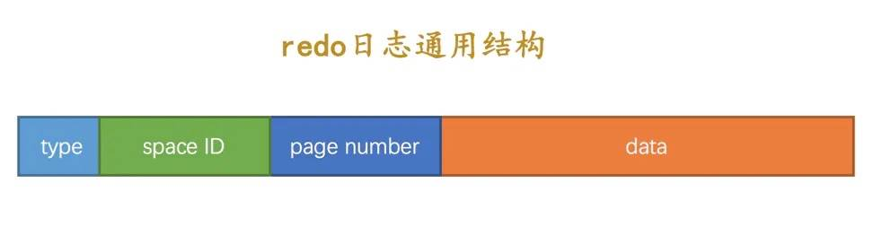

# 事务

## Buffer Pool

InnoDB 在 MySQL 服务端启动时，向操作系统申请一片连续的内存空间，当数据库查询需要访问某个数据页的数据时（如果命中索引的话，可以通过
B+ 树快速定位索引值所在的数据页，否则的话需要全表扫描定位），则将整个数据页的数据加载到这片内存空间，即便只是操作一条记录，也会这么做，因为数据页是
MySQL 维护表记录的基本单位，然后我们就可以在内存中对数据进行读写操作了，读写操作完成后，也不会立即释放对应的内存空间，而是缓存起来，方便下次使用，避免磁盘
IO。对于这片内存空间，有一个专有的名词 —— **Buffer Pool**，中文译作缓冲池。

**简介**

-

配置缓冲池大小：`SET GLOBAL innodb_buffer_pool_size=1073741824; # 1GB`      `系统可用内存 - 系统正常运行内存 - (峰值时的连接数 * 每个连接需要的内存)`

- 查看 Buffer Pool
  信息：`SHOW ENGINE INNODB STATUS\G`  [字段释义](https://dev.mysql.com/doc/refman/8.0/en/innodb-buffer-pool.html#innodb-buffer-pool-monitoring)

**底层操作**

- 缓存页装载原理

  MySQL 将所有的空闲缓存页对应控制块存放到一个称之为空闲（free）链表的地方，在 MySQL
  刚启动的时候，所有的缓存页都是空闲的，因此所有的控制块都会添加到这个空闲链表，以后每次从磁盘加载数据页到 Buffer
  Pool，就从这个空闲链表中取一个空闲的缓存页装载，并且把缓存页对应的控制块信息填上（表空间、页号等），然后从空闲链接移除这个缓存页对应的控制块节点即可。并且以表空间
    + 页号为 key，缓存页地址为 value 维护一个哈希表，下次需要加载数据页时，先根据这个 key 从哈希表查询对应 value
      是否存在，如果存在，则从
      Buffer Pool 读取数据，否则从磁盘空间加载，重复上述步骤

- 缓存页刷新算法

  LRU（Last Recently Used）算法淘汰老的缓存页 —— 在底层维护了一个 LRU
  链表：将新加载的缓存页放到链表头部，每次某个缓存页被读取，也将其移动到链表头部，这样一来，最近不常使用的缓存页就自然下沉到链表尾部了。当
  Buffer Pool 没有剩余空间存放新加载的数据页时，覆盖链表尾部的缓存页即可。MySQL 为了优化性能，提供了预读机制：将热数据放到了一个名为
  young 的区域，将冷数据放到了一个名为 old 的区域，把 LRU 链表一分为二，young 区域位于链表头部，old 区域位于链表尾部，预读的数据页会先放到
  old 区域的头部，这样，就不会影响 LRU 算法淘汰缓存命中率低的缓存页的机制

- 缓存页更新同步

  为了提升系统性能，对 MySQL 表记录的更新操作（包括插入、修改、删除）也是在已加载到 Buffer Pool
  中的缓存页中完成的，更新后的缓存页就和磁盘上的数据页数据不一致了，这样的缓存页被称之为脏页。

## 事务简介

1. 开启事务： `BEGIN` 或者 `START TRANSACTION`
2. 执行 SQL 更新操作：执行对应 SQL 更新语句
3. 提交事务： `COMMIT`
4. 回滚事务： `ROLLBACK`

**ACID 特性**

- **原子性（Atomicity）**：即数据库事务中的一系列 SQL 操作是一个不可分割的整体，要么都执行成功，要么都执行失败，不存在部分执行成功部分执行失败的情况。
- **一致性（Consistency）**：事务开始前和结束后，数据库的完整性约束和业务逻辑的一致性不能被破坏，事务提交成功后，意味着数据库从一个状态迁移到另一个状态，而事务执行失败回滚后，需要保持原有状态不被破坏。
- **隔离性（Isolation）**：不同事务之间的操作是相互隔离的，事务 A 不应该影响事务 B 的状态和操作，MySQL
  数据库事务支持不同的隔离级别（默认是可重复读），并且通过锁机制来保证隔离性。
- **持久性（Durability）**：事务一旦提交，则其操作结果会永久性的保存下来，MySQL 会通过 redo 日志来保证即便事务提交之后出现宕机故障，也能恢复相应数据。

## redo 日志保证事务的持久性

为了确保数据库事务的持久性，又不能将事务提交后更改的缓存页（脏页）立即同步到磁盘中， MySQL 提供了 redo
日志功能，作为折中方案，我们会将数据库某条记录的更改以 redo 日志的方式持久化到磁盘，之后需要进行数据恢复时，通过对应的 redo
日志来恢复数据即可。

`type`：类型、 `space ID`： 空间ID、`page number`：页号、`data`：具体修改的数据

**redo 日志写入**

- 事务与redo日志的关联：在 MySQL 底层，将数据页的一次原子访问的过程称之为一个 Mini-Transaction，每个 Mini-Transaction都会维护一组
  redo日志（一条SQL语句可能对应多个Mini-Transaction）

- redo日志内存缓冲区：MySQL 会在内存中通过 redo log block（类似 Buffer Pool 中的缓存页）来存放 redo 日志，每个 block 的大小是
  512，和缓存页存放在 Buffer Pool 类似，这些 redo log block 存放在 MySQL 服务器启动时申请的 redo log buffer
  这片连续的内存空间中（默认大小是 16MB）。

  这些 redo 日志何时会被同步到磁盘？

    - redo log buffer 空间不足时，一般在超过其空间容量一半时刷新；
    - 事务提交时，这样一来，系统崩溃后，即便缓存页数据没有同步到磁盘，也可以通过 redo 日志恢复，从而确保事务的持久性；
    - 后台有一个线程，大约每秒都会刷新一次；
    - 正常关闭 MySQL 服务器时。

- redo日志磁盘文件：mysql磁盘目录下的两个文件 `ib_logfile0` 和 `ib_logfile1` 为redo 日志对应的磁盘文件（默认大小上限为48m，每组两个，循环覆盖）

- checkpoint：redo 日志底层通过 checkpoint 机制来处理循环覆盖问题

    1. 计算一下当前系统中可以被覆盖的 redo 日志对应的 LSN 值最大是多少，并将其赋值给 `checkpoint_lsn`；
    2. 将 `checkpoint_lsn` 和对应的 redo 日志文件组偏移量（比如 `0`、`1`，对应 `ib_logfile` 后面的值）以及此次 checkpint
       的编号写到 redo 日志文件的管理信息中。
    3. 记录完 checkpoint 的信息后，就可以在需要循环覆盖时覆盖掉 `checkpoint_lsn` 之前的 redo 日志了

**通过redo 日志恢复数据**

在 redo 日志中，由于 `checkpoint_lsn`
之前的数据已经同步到磁盘，所以在系统崩溃重启恢复数据时不需要关心，需要从 `checkpoint_lsn` 之后的位置开始读取 redo
日志恢复数据页即可。

性能优化：

- 基于 redo 日志的 `space ID` 和 `page number` 属性计算出哈希值作为 key，将对应 redo 日志作为 value 构建哈希表。这样一来，表空间
  ID 和页号相同的 redo 日志就可以被放到哈希表的同一个槽里，如果有多个这样的 redo 日志，那么它们之间使用链表连接起来（按照
  redo 日志生成时间进行排序，这样才能正常恢复）。这样做的好处是恢复数据页时，可以一次恢复一个数据页上的所有条记录，从而尽可能避免随机磁盘
  IO；
- 每个数据页都有一个 File Header 结构，里面有一个称之为 `FIL_PAGE_LSN` 的属性，该属性记载了最近一次修改页面时对应的 `lsn`
  值，如果在做了某次 checkpoint 之后有脏页被刷新到磁盘中，那么该页对应的 `FIL_PAGE_LSN` 代表的 `lsn`
  值肯定大于 `checkpoint_lsn` 的值，我们可以跳过这样的已同步页面加快数据恢复速度。

## undo 日志保证事务的原子性

MySQL 底层为了能够回滚事务里面的数据库更新操作，会将与之相对的撤销操作记录到 undo 日志里面，然后当我们执行 ROLLBACK
回滚时，就可以根据这些 undo 日志将对应的变更撤销（改回原来的状态）。

**undo 日志写入**

当我们开启一个事务后，执行到第一条增、删、改更新语句时，MySQL 就会为其分配一个全局唯一的自增事务 ID。在同一个事务中，所有记录的事务
ID 都是一样的，这样我们就可以通过事务 ID 将同一个事务的所有 undo 日志记录串联起来了。（这个事务 ID
同时也会被写入聚簇索引记录的 `trx_id` 字段中，这样数据表记录也和事务 ID 建立起了关联）

undo 日志不同于 binlog 和 redo 日志，不是存放在独立的磁盘文件的，而是存放在数据库表空间的 `FIL_PAGE_UNDO_LOG` 页面中，这些
undo 日志会按照生成顺序分配编号，然后按照更新语句的类型存放到不同位置不同内存结构中：

- INSERT 语句：对于 INSERT 语句来说，对应的回滚操作最简单，将该记录删除就好了。
    - `next`：下一条 undo 日志开始的页面地址；
    - `type`：本条 undo 日志的类型，对于 INSERT 语句是 `TRX_UNDO_INSERT_REC`；
    - `undo no`：本条 undo 日志的编号；
    - `table id`：本条 undo 日志对应记录所在的数据表 ID（每张数据表会分配一个唯一的 table id）；
    - `Primary Key`：对应记录的主键 ID，可能包含多个列，因此这里有一个箭头指向详细的主键信息（`len` 表示长度，`col` 表示列名）；
    - `start`：表示本条 undo 日志开始的页面地址。
- DELETE 语句：将要删除的记录进行 `delete_mark` 标记为 1，事务提交之后，通过专门的线程将这些待删除记录真正删除掉。
    - 。。。
    - `old trx_id`：指向旧的事务ID
    - `roll_pointer`：指向旧的 undo log
- UPDATE 语句：
    - 不更新主键：
        - 如果更新前后存储空间没有任何变化，则使用原地更新
        - 否则要先删除旧的记录，再插入新的记录，这里的删除也不同于上面介绍的两阶段删除，而是真正删除
    - 更新主键：
        1. 将旧记录进行 delete mark 操作：这里又不同于上面的删除，是 delete mark 操作，因为别的事务可能也在访问这条记录，不能真正删除它；
        2. 根据更新后各列的值创建一条新记录，并将其插入到聚簇索引中。

**通过undo 日志回滚数据库**

每个数据库事务会创建多个 undo 页面链表，系统中同时可能存在多个数据库事务，所以系统中也会同时存在非常多的 undo
页面链表，为了管理这些页面链表，MySQL 底层提供了一个名为 **Rollback Segment Header** 的页面，在这个页面中存放了各个 undo
页面链表的 frist undo 页面页号，并且把这些页号称之为 undo slot。

MySQL 规定每个 Rollback Segment Header 页面都对应着一个段，这个段就称为 Rollback Segment，中文译作**回滚段**
，与其他段不同的是，回滚段中只有一个 Rollback Segment Header 页面。

> 一个回滚段支持的 undo slot 数量是有限的，默认最多是 1024 个，如果都被占用，则新事务将因无法获取新的 undo
> 页面链表而报错，事务本身也会自动回滚，为了解决这个限制，提高系统并发量，MySQL 底层现在支持多达 128 个回滚段（128 * 1024 =
> 131072）

1. 有事务需要分配 undo 页面链表时，就从回滚段的第一个 undo slot 开始，看看该 undo slot 的值是不是 FIL_NULL（默认值）
    - 如果是 FIL_NULL，那么在表空间中新创建一个段（也就是 Undo Log Segment），然后从段里申请一个页面作为 undo 页面链表的
      first undo 页面，然后把该 undo slot 的值设置为刚刚申请的这个页面的页号，这样也就意味着这个 undo slot 被分配给了这个事务。
    - 如果不是 FIL_NULL，说明该 undo slot 已经指向了一个 undo 页面链表，也就是说这个 undo slot 已经被别的事务占用了，那就跳到下一个
      undo slot，判断该 undo slot 的值是不是 FIL_NULL，重复上面的步骤。
2. 事务回滚时，只需要根据事务 ID 获取到对应的 undo 页面链表，读取里面的 undo 日志进行撤销操作即可
3. 事务提交后，相应的 undo slot 会根据条件判断是被其他事务重用还是释放掉，从而腾出空间给新的事务

## 并发事务和事务隔离级别

- **脏写：** 事务 B 修改了事务 A 修改过但尚未提交的数据，就意味着发生了**脏写**（反之亦然）
- **脏读：** 事务 B 读取到了事务 A 修改过但未提交的数据，就意味着发生了**脏读**（反之亦然）
- **不可重复读：** 事务 B 能够读取事务 A 提交过的修改数据，就意味着发生了**不可重复读**（反之亦然）
- **幻读：** 事务 B 先通过指定条件查询出一些记录，然后事务 A 又向该表插入了符合同样条件的记录；事务 B 再次按照同样条件查询时，能够把事务
  A 插入的记录也读取出来，就意味着发生了**幻读**（反之亦然）

| 隔离级别                   | 脏读    | 不可重复读 | 幻读    |
|------------------------|-------|-------|-------|
| 读未提交（Read uncommitted） | 可以出现  | 可以出现  | 可以出现  |
| 读提交（Read committed）    | 不允许出现 | 可以出现  | 可以出现  |
| 可重复读（Repeatable read）  | 不允许出现 | 不允许出现 | 可以出现  |
| 序列化（Serializable ）     | 不允许出现 | 不允许出现 | 不允许出现 |

- 未提交读（Read Uncommitted）：允许脏读，也就是可能读取到其他会话中未提交事务修改的数据；
- 提交读（Read Committed）：只能读取到已经提交的数据，即允许不可重复读（Oracle 等多数数据库默认都是该级别）；
- 可重复读（Repeated Read）：在同一个事务中相同条件的查询结果都是事务开始时保持一致的，这是 MySQL InnoDB 引擎的默认级别，在这种级别下
  MySQL通过 `next-key locks` 机制来避免幻读；
- 序列化（Serializable）：完全串行化读写数据，每次读都需要获得表级共享锁，读写相互都会阻塞，虽然事务隔离性最好，但是性能太差，故而一般不会设置这个隔离级别。
