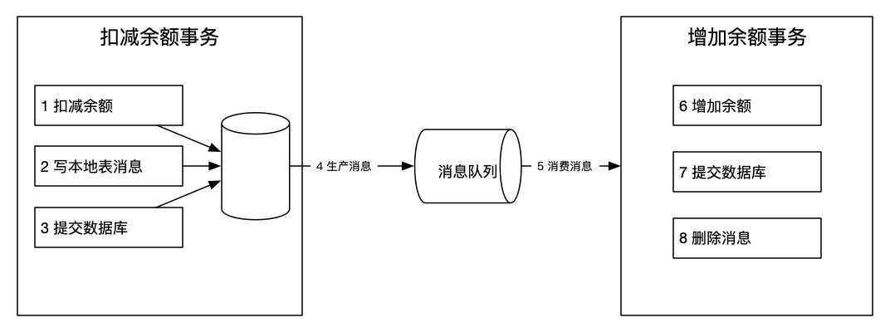
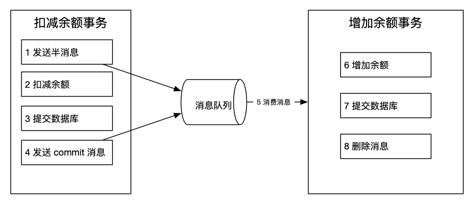
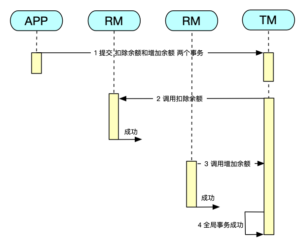
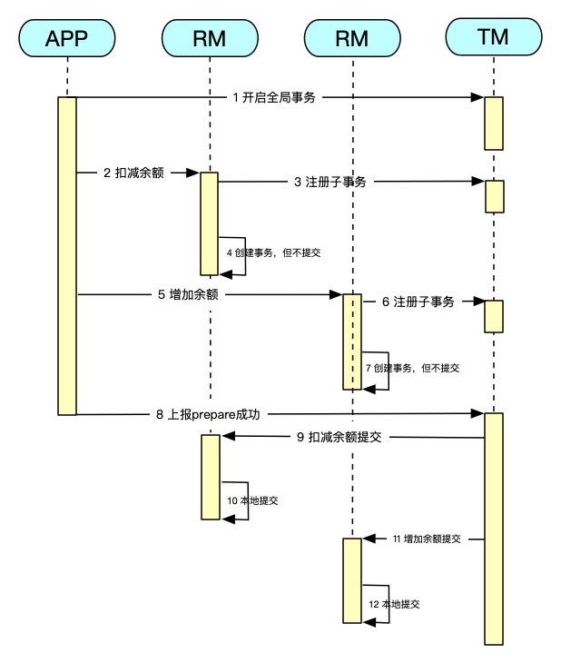
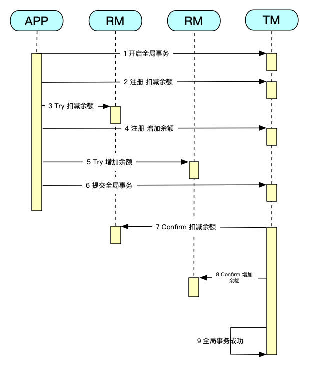

# 分布式事务

[思维导图](/mind.html?path=/data-system/mysql/分布式事务)

分布式事务涉及多个节点，是一个典型的分布式系统，与单机系统有非常大的差别。
一个分布式系统最多只能同时满足一致性、可用性和分区容错性这三项中的两项，这被称为CAP理论。（一般保证P和A，舍弃C）

- **一致性（Consistency）** 分布式系统中的所有数据备份，在同一时刻是否同样的值。

  在分布式系统中，如果能够做到针对一个数据项的更新操作执行成功后，所有的用户都能读取到最新的值，那么这样的系统就被认为具有强一致性（或严格的一致性）。

- **可用性（Availability）** 在集群中一部分节点故障后，集群整体是否还能响应客户端的读写请求。

- **分区容错性（Partition tolerance）** 分布式系统中的节点（进程或者计算机）分布在不同的机架上，每个机架都有一个独立的网络分区，当某个网络分区发生故障后，系统整体是否还能继续工作。

**BASE理论**

BASE是Basically Available（基本可用）、Soft state（软状态）和Eventually consistent（最终一致性）三个短语的简写。
BASE理论是对CAP中一致性和可用性权衡的结果，其来源于对大规模互联网分布式实践的总结，是基于CAP定理逐步演化而来的。
其核心思想是即使无法做到强一致性，但每个应用都可以根据自身的业务特点，采用适当的方式来使系统达到最终一致性。

## 本地消息表

本地消息表是指在本地数据库中创建一个消息表，用于记录分布式事务的消息。
将写本地消息和业务操作放在同一个事务中，保证本地消息表和业务操作的原子性。
然后生产消息到消息队列中，由下游消费者消费并维护消息。

- 不支持回滚

## 事务消息

因为本地消息表需要生产者额外创建消息表，还需要对消息表进行轮询，所以引入了事务消息。
事务消息方案与本地消息表机制非常类似，区别主要在于原先相关的本地表操作替换成了一个反查接口。

- 不支持回滚

## SAGA

SAGA核心思想是将分布式事务拆分为多个小的、局部的事务，每个局部事务都有对应的补偿操作。
如果每个局部事务都成功提交完成，那么全局事务就正常完成，如果某个步骤失败，则通过错误重试以及补偿事务（回滚）来保证整个分布式事务的一致性。

- 并发度高
- 开发量较大，需要定义正常操作以及补偿操作
- 一致性较弱，对于转账，可能发生A用户已扣款，最后转账又失败的情况

## XA

XA协议的核心思想是将分布式事务分为两个阶段：准备阶段和提交阶段。
在准备阶段，事务的各个参与方（资源管理器）会执行事务的准备工作，并向协调者（事务管理器）报告准备状态。
在提交阶段，如果所有参与方都成功准备，协调者会要求所有参与方提交事务，从而保证分布式事务的一致性。

- 对资源进行了长时间的锁定，并发度低

## TCC

TCC模式的核心思想是将分布式事务分解为三个阶段：尝试（Try）、确认（Confirm）和取消（Cancel）。
每个阶段都由各个参与方（服务）执行相应的业务逻辑。
尝试阶段用于预留资源，确认阶段用于提交事务，取消阶段用于回滚事务。

- 并发度高（Try检测和预留资源，不进行锁定）
- 开发量较大，需要提供Try/Confirm/Cancel接口
- 一致性较好，不会发生SAGA已扣款最后又转账失败的情况

## 推荐阅读

- [分布式事务理论](https://dtm.pub/practice/theory.html)
- [分布式事务最经典的七种解决方案](https://segmentfault.com/a/1190000040321750)