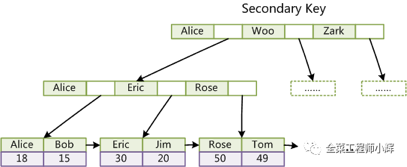
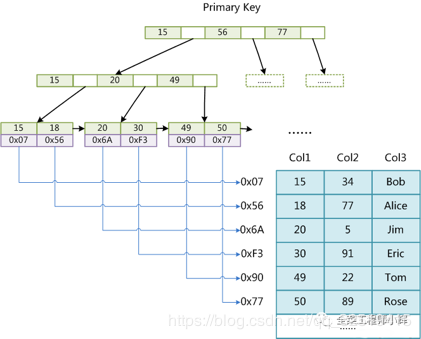
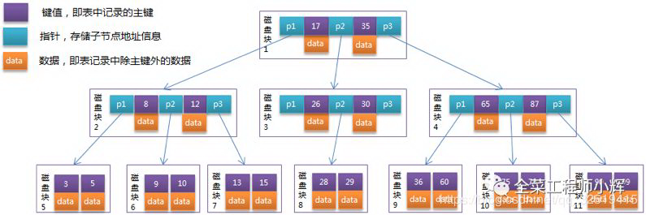

# 引擎

## InnoDB

nnoDB是事务型数据库的首选引擎，支持事务安全表（ACID），支持行锁定和外键。

主键索引：

辅助索引：

使用 **InnoDB存储引擎** MySQL将创建一个名为 `ibdata1 `的10MB大小的自动扩展数据文件，以及两个名为`ib_logfile0`
和`ib_logfile1`的5MB大小的日志文件

> InnoDB 主键索引中既存储了主健值，又存储了行数据
>
> 辅助索引是在叶子节点中保存主键值，通过这个主键值来回表查询到一条完整记录

- 灾难恢复性好
- 支持事务
- 使用行级锁
- 支持外键关联
- 支持热备份
- 对于InnoDB引擎中的表，其数据的物理组织形式是簇表（Cluster Table），主键索引和数据是在一起的，数据按主键的顺序物理分布
- 实现了缓冲管理，不仅能缓冲索引也能缓冲数据，并且会自动创建散列索引以加快数据的获取
- 支持热备份

## MyISAM引擎

MyISAM基于ISAM存储引擎，并对其进行扩展，拥有较高的插入、查询速度，但不支持事务。

使用**MyISAM引擎**创建数据库，将产生3个文件：`.frm`文件存储表定义、`.MYD(MYData)` 文件存储数据、 `.MYI(MYIndex)` 文件存储索引

> 索引文件仅保存记录所在页的指针（物理位置），通过这些指针来读取页，进而读取被索引的行，同时，每个叶子也保存了指向下一个叶子的指针，从而方便叶子节点的范围遍历。
>
> 在 MyISAM 中，主键索引和辅助索引在结构上没有任何区别（主键索引要求 key 是唯一的）

- 不支持事务
- 使用表级锁，并发性差
- 主机宕机后，MyISAM表易损坏，灾难恢复性不佳
- 可以配合锁，实现操作系统下的复制备份、迁移
- 只缓存索引，数据的缓存是利用操作系统缓冲区来实现的。可能引发过多的系统调用且效率不佳
- 数据紧凑存储，因此可获得更小的索引和更快的全表扫描性能

#### MEMORY存储引擎

MEMORY存储引擎将表中的数据存储到内存中，未查询和引用其他表数据提供快速访问。

- MEMORY表的每个表可以有多达32个索引，每个索引16列，以及500字节的最大键长度
- MEMORY存储引擎执行HASH和BTREE缩影
- 可以在一个MEMORY表中有非唯一键值
- MEMORY表使用一个固定的记录长度格式
- MEMORY不支持BLOB或TEXT列
- MEMORY支持AUTO_INCREMENT列和对可包含NULL值的列的索引
- MEMORY表在所由客户端之间共享（就像其他任何非TEMPORARY表）
- MEMORY表内存被存储在内存中，内存是MEMORY表和服务器在查询处理时的空闲中，创建的内部表共享
- 当不再需要MEMORY表的内容时，要释放被MEMORY表使用的内存，应该执行`DELETE FROM`或`TRUNCATE TABLE`，或者删除整个表（使用DROP
  TABLE）

## 索引->查询优化

### 底层数据结构

**索引是帮助数据库高效获取数据的数据结构。**

- 应用层次
    - 普通索引：即一个索引只包含单个列，一个表可以有多个单列索引
    - 唯一索引：索引列的值必须唯一，但允许有空值
    - 复合索引：一个索引包含多个列

- 表记录的排列顺序和索引的排列顺序是否一致

    - 聚集索引：顺序一致，以主键创建的索引

      > 在叶子节点存储的是表中的数据。查询速度快，新增速度慢（每次插入要重排）。

    - 非聚集索引：顺序不一致，以非主键创建的索引（也叫做二级索引）

      > 在叶子节点存储的是主键和索引列，使用非聚集索引查询数据时，需要拿到叶子上的主键再去表中查找数据（回表）

- 储存结构

    - Btree 索引（B+tree，B-tree)：MySQL采用 B+ 树
    - 哈希索引：本质上就是把键值换算成新的哈希值，根据这个哈希值来定位

    - full-index 全文索引
    - RTree

#### Btree 索引

**B 树（B- 树）**

- 关键字分布在整棵树的所有节点。
- 任何一个关键字 **出现且只出现在一个节点中**。
- 搜索有可能在 **非叶子节点** 结束。
- 其搜索性能等价于在关键字全集内做一次二分查找

**B+ 树**

- 非叶子节点的子树指针与关键字个数相同。
- 非叶子节点的子树指针 P[i]，指向关键字属于 **[k[i],K[i+1])** 的子树（**注意：区间是前闭后开**)。
- **为所有叶子节点增加一个链指针**。
- **所有关键字都在叶子节点出现**。

**相对 B 树，B+ 树做索引的优势**

- **B+ 树的磁盘读写代价更低** （内部没有指向关键字具体信息的指针）
- **B+ 树的查询效率更加稳定** （数据都在叶子节点，每次查询路径长度一致）
- **B+ 树只需要去遍历叶子节点就可以实现整棵树的遍历**

MongoDB 的索引为什么选择 B 树，而 MySQL 的索引是 B+ 树？

因为 MongoDB 不是传统的关系型数据库，而是以 Json 格式作为存储的 NoSQL
非关系型数据库，目的就是高性能、高可用、易扩展。摆脱了关系模型，所以 **范围查询和遍历查询的需求就没那么强烈了**。

#### 哈希索引

哈希索引就是采用一定的哈希算法，只需一次哈希算法即可立刻定位到相应的位置，速度非常快。

缺点：

- 没办法利用索引完成排序
- 不能进行多字段查询
- 在有大量重复键值的情况下，哈希索引的效率也是极低的（出现哈希碰撞问题）
- 不支持范围查询

#### 索引失效

- 违反最左匹配原则
- 在索引列上做任何操作
- 使用不等于（!= 、<>）
- like 中以通配符开头 (’%abc’)
- 字符串不加单引号索引失效
- or 连接索引失效
- order by 或 group by 导致的违反最左前缀法则

### 索引类型

- 主键索引：通常都是自增的，可以直接插入到最后面，直接储存完整的数据记录（索引即数据）

- 唯一索引和普通索引：储存所属记录的主键索引值，避免数据冗余，但是会造成二次查询（回表）

- 联合索引：不同于专门为多个字段设置索引，联合索引只会维护一棵 B+ 树，这棵 B+ 树的叶子节点数据记录会按照联合索引包含的**
  所有字段**进行排序

  > 把只包含索引的查询称为**覆盖索引**

**维护代价**

- 空间上的代价：每个索引都对应着一棵 B+ 树，每棵 B+ 树的每个叶子节点都是一个数据页，数据页默认的大小是 16
  KB，因此维护索引需要额外的存储空间；
- 时间上的代价：插入、修改、删除记录这些数据库写入操作都会引起索引 B+ 树的调整和自平衡，甚至产生页分裂和页合并，这些操作都需要额外的时间成本，会对数据库性能造成一定的损耗。
