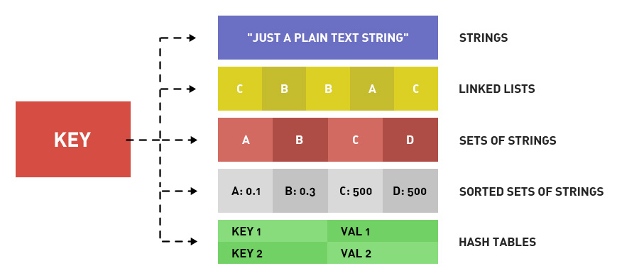

# Redis

## 基础

### 数据类型



#### STRINGS

- 存储的数据：单个数据，最简单的数据存储类型，也是最常用的数据存储类型
- 存储数据的格式：一个存储空间保存一个数据
- 存储内容：通常使用字符串，如果字符串以整数的形式展示，可以作为数字操作使用

```shell
APPEND key value                  # append a value to a key
BITCOUNT key [start end]          # count set bits in a string
SET key value                     # set value in key
SETNX key value                   # set if not exist value in key
SETRANGE key offset value         # overwrite part of a string at key starting at the specified offset
STRLEN key                        # get the length of the value stored in a key
MSET key value [key value ...]    # set multiple keys to multiple values
MSETNX key value [key value ...]  # set multiple keys to multiple values, only if none of the keys exist
GET key                           # get value in key
GETRANGE key start end            # get substring of stored value from start to end offsets (both inclusive)
MGET key [key ...]                # get the values of all the given keys
INCR key                          # increment value in key
INCRBY key increment              # increment the integer value of a key by the given amount
INCRBYFLOAT key increment         # increment the float value of a key by the given amount
DECR key                          # decrement the integer value of key by one
DECRBY key decrement              # decrement the integer value of a key by the given number
DEL key                           # delete key

EXPIRE key 120                    # key will be deleted in 120 seconds
TTL key                           # returns the number of seconds until a key is deleted
```

#### LISTS

- 数据存储需求：存储多个数据，并对数据进入存储空间的顺序进行区分
- 需要的存储结构：一个存储空间保存多个数据，且通过数据可以体现进入顺序
- list类型：保存多个数据，底层使用双向链表存储结构实现

```shell
RPUSH key value [value ...]           # put the new value at the end of the list
RPUSHX key value                      # append a value to a list, only if the exists
LPUSH key value [value ...]           # put the new value at the start of the list
LRANGE key start stop                 # give a subset of the list
LINDEX key index                      # get an element from a list by its index
LINSERT key BEFORE|AFTER pivot value  # insert an element before or after another element in a list
LLEN key                              # return the current length of the list
LPOP key                              # remove the first element from the list and returns it
LSET key index value                  # set the value of an element in a list by its index
LREM key number_of_occurrences value  # delete occurrences of value if the list stored in key
LTRIM key start stop                  # trim a list to the specified range
RPOP key                              # remove the last element from the list and returns it
RPOPLPUSH source destination          # remove the last element in a list, prepend it to another list and return it
BLPOP key [key ...] timeout           # remove and get the first element in a list, or block until one is available
BRPOP key [key ...] timeout           # remove and get the last element in a list, or block until one is available
```

#### SETS

- 新的存储需求：存储大量的数据，在查询方面提供更高的效率
- 需要的存储结构：能够保存大量的数据，高效的内部存储机制，便于查询
- set类型：与hash存储结构完全相同，仅存储键，不存储值（nil），并且值是不允许重复的

```shell
SADD key member [member ...]     # add the given value to the set
SCARD key                        # get the number of members in a set
SREM key member [member ...]     # remove the given value from the set
SISMEMBER myset value            # test if the given value is in the set.
SMEMBERS myset                   # return a list of all the members of this set
SUNION key [key ...]             # combine two or more sets and returns the list of all elements
SINTER key [key ...]             # intersect multiple sets
SMOVE source destination member  # move a member from one set to another
SPOP key [count]                 # remove and return one or multiple random members from a set
```

#### SORTED SETS

- 新的存储需求：数据排序有利于数据的有效展示，需要提供一种可以根据自身特征进行排序的方式
- 需要的存储结构：新的存储模型，可以保存可排序的数据
- sorted_set类型：在set的存储结构基础上添加可排序字段

```shell
ZADD key [NX|XX] [CH] [INCR] score member [score member ...]  # add one or more members to a sorted set, or update its score if it already exists

ZCARD key                           # get the number of members in a sorted set
ZCOUNT key min max                  # count the members in a sorted set with scores within the given values
ZINCRBY key increment member        # increment the score of a member in a sorted set
ZRANGE key start stop [WITHSCORES]  # returns a subset of the sorted set
ZRANK key member                    # determine the index of a member in a sorted set
ZREM key member [member ...]        # remove one or more members from a sorted set
ZREMRANGEBYRANK key start stop      # remove all members in a sorted set within the given indexes
ZREMRANGEBYSCORE key min max        # remove all members in a sorted set, by index, with scores ordered from high to low
ZSCORE key member                   # get the score associated with the given member in a sorted set

ZRANGEBYSCORE key min max [WITHSCORES] [LIMIT offset count]  # return a range of members in a sorted set, by score
```

#### HASHES

- 新的存储需求：对一系列存储的数据进行编组，方便管理，典型应用存储对象信息
- 需要的存储结构：一个存储空间保存多个键值对数据
- hash类型：底层使用哈希表结构实现数据存储

```shell
HGET key field          # get the value of a hash field
HGETALL key             # get all the fields and values in a hash
HSET key field value    # set the string value of a hash field
HSETNX key field value  # set the string value of a hash field, only if the field does not exists

HMSET key field value [field value ...]  # set multiple fields at once

HINCRBY key field increment  # increment value in hash by X
HDEL key field [field ...]   # delete one or more hash fields
HEXISTS key field            # determine if a hash field exists
HKEYS key                    # get all the fields in a hash
HLEN key                     # get the number of fields in a hash
HSTRLEN key field            # get the length of the value of a hash field
HVALS key                    # get all the values in a hash
```

### 通用指令

#### KEY通用指令

```shell
del key									#删除指定key
exists key							#获取key是否存在
type key								#获取key的类型
expire key seconds			#为指定key设置有效期
pexpire key milliseconds
expireat key timestamp
pexpireat key milliseconds-timestamp
ttl key									#获取key的有效时间
pttl key
persist key							#切换key从时效性转换为永久性
keys pattern						#查询key    *任意数量的任意符号  ?一个任意符号  []一个指定符号   
rename key newkey				#为key改名
renamenx key newkey
sort										#对所有key排序
help @generic						#其他key通用操作
```

#### DB基本操作

```shell
select index						#切换数据库
move key db							#数据移动
dbsize									#数据清除
flushdb
flushall
```

## 高级

### 持久化

#### RDB

**优点**

- RDB是一个紧凑压缩的二进制文件，存储效率较高
- RDB内部存储的是redis在某个时间点的数据快照，非常适合用于数据备份，全量复制等场景
- RDB恢复数据的速度要比AOF快很多
- 应用：服务器中每X小时执行bgsave备份，并将RDB文件拷贝到远程机器中，用于灾难恢复

**缺点**

- RDB方式无论是执行指令还是利用配置，无法做到实时持久化，具有较大的可能性丢失数据
- bgsave指令每次运行要执行fork操作创建子进程，要牺牲掉一些性能
- Redis的众多版本中未进行RDB文件格式的版本统一，有可能出现各版本服务之间数据格式无法兼容现象

```shell
save										#手动执行一次保存操作
bgsave									#手动启动后台保存操作，但不是立即执行
debug reload						#服务器运行过程中重启
shutdown save						#关闭服务器时指定保存数据
#conf文件配置选项
save second changes			#满足限定时间范围内key的变化数量达到指定数量即进行持久化
```

#### AOF

将数据的操作过程进行保存，日志形式，存储操作过程，存储格式复杂，关注点在数据的操作过程

- **always** 每次写入操作均同步到AOF文件中，**数据零误差**，**性能较低**，不建议使用。
- **everysec** 每秒将缓冲区中的指令同步到AOF文件中，数据准确性较高，**性能较高**，建议使用，也是默认配置，在系统突然宕机的情况下丢失1秒内的数据
- **no** 由操作系统控制每次同步到AOF文件的周期，整体过程**不可控**

```shell
bgrewriteaof												#手动重写
#conf文件配置选项
appendonly yes|no										#AOF功能开启
appendfsync always|everysec|no			#AOF写数据策略
appendfilename filename							#AOF持久化文件名
dir																	#AOF持久化文件保存路径

auto-aof-rewrite-min-size size			#自动重写
auto-aof-rewrite-percentage percentage
```

### 事务

redis事务就是一个命令执行的队列，将一系列预定义命令包装成一个整体（一个队列）。当执行时，一次性

按照添加顺序依次执行，中间不会被打断或者干扰。

```shell
multi																#开启事务
discard															#取消事务
exec																#执行事务
```

语法错误（指命令书写格式有误）——整体事务中所有命令均不会执行。包括那些语法正确的命令。

运行错误（指命令格式正确，但是无法正确的执行。例如对list进行incr操作）——能够正确运行的命令会执行，运行错误的命令不会被执行。

### 锁

```shell
watch key1 [key2……]							#对 key 添加监视锁，在执行exec前如果key发生了变化，终止事务执行
unwatch													#取消对所有 key 的监视
```

#### **分布式锁**

```shell
setnx lock-key value						#使用 setnx 设置一个公共锁
del															#释放锁	
expire lock-key second					#添加时间限定，到时不释放，放弃锁
pexpire lock-key milliseconds
```

### 删除策略

内存中的数据可以通过TTL指令获取其状态

- XX ：具有时效性的数据
- -1 ：永久有效的数据
- -2 ：已经过期的数据 或 被删除的数据 或 未定义的数据

#### 定时删除

创建一个定时器，当key设置有过期时间，且过期时间到达时，由定时器任务立即执行对键的删除操作

- 优点：节约内存，到时就删除，快速释放掉不必要的内存占用
- 缺点：CPU压力很大，无论CPU此时负载量多高，均占用CPU，会影响redis服务器响应时间和指令吞吐量
- 总结：用处理器性能换取存储空间（拿时间换空间）

#### 惰性删除

数据到达过期时间，不做处理。等下次访问该数据时——如果未过期，返回数据。发现已过期，删除，返回不存在。

- 优点：节约CPU性能，发现必须删除的时候才删除
- 缺点：内存压力很大，出现长期占用内存的数据
- 总结：用存储空间换取处理器性能 **expireIfNeeded()** （拿时间换空间）

#### 定期删除

周期性轮询redis库中的时效性数据，采用随机抽取的策略，利用过期数据占比的方式控制删除频度

- 特点1：CPU性能占用设置有峰值，检测频度可自定义设置
- 特点2：内存压力不是很大，长期占用内存的冷数据会被持续清理
- 总结：周期性抽查存储空间（随机抽查，重点抽查）


#### 逐出算法

Redis使用内存存储数据，在执行每一个命令前，会调用**freeMemoryIfNeeded()**检测内存是否充足。如

果内存不满足新加入数据的最低存储要求，redis要临时删除一些数据为当前指令清理存储空间。

注意：逐出数据的过程不是100%能够清理出足够的可使用的内存空间，如果不成功则反复执行。当对所

有数据尝试完毕后，如果不能达到内存清理的要求，将出现错误信息。

**相关配置**

- **maxmemory**——最大可使用内存（占用物理内存的比例，默认值为0，表示不限制。生产环境中根据需求设定，通常设置在50%以上）
- **maxmemory-samples**——每次选取待删除数据的个数（选取数据时并不会全库扫描，导致严重的性能消耗，降低读写性能。因此采用随机获取数据的方式作为待检测删除数据）
- **maxmemory-policy**——删除策略（达到最大内存后的，对被挑选出来的数据进行删除的策略）
- **server.db[i].expires**——检测易失数据
    - volatile-lru：挑选最近最少使用的数据淘汰
    - volatile-lfu：挑选最近使用次数最少的数据淘汰
    - volatile-ttl：挑选将要过期的数据淘汰
    - volatile-random：任意选择数据淘汰
- **server.db[i].dict**——检测全库数据
    - allkeys-lru：挑选最近最少使用的数据淘汰
    - allkeys-lfu：挑选最近使用次数最少的数据淘汰
    - allkeys-random：任意选择数据淘汰
- 放弃数据驱逐
    - no-enviction（驱逐）：禁止驱逐数据（redis4.0中默认策略），会引发错误OOM（Out Of Memory）

### 核心配置

#### 服务器

- **daemonize** yes**|**no —— 设置服务器以守护进程的方式运行
- **bind** 127.0.0.1 —— 绑定主机地址
- **port** 6379 —— 设置服务器端口
- **databases** 16 —— 设置数据库数量

#### 日志配置

- **loglevel** debug**|verbose|**notice**|**warning —— 设置服务器以指定日志记录级别
- **logfile** 端口号.log —— 日志记录文件名

注意：日志级别开发期设置为verbose即可，生产环境中配置为notice，简化日志输出量，降低写日志IO的频度

#### 客户端配置

- **maxclients** 0 —— 设置同一时间最大客户端连接数，默认无限制。当客户端连接到达上限，Redis会关闭新的连接
- **timeout** 300 —— 客户端闲置等待最大时长，达到最大值后关闭连接。如需关闭该功能，设置为 0

#### **多服务器快捷配置**

- **include** /path/server-端口号.conf —— 导入并加载指定配置文件信息，用于快速创建redis公共配置较多的redis实例配置文件，便于维护

### 高级数据类型

#### **Bitmaps**

```shell
getbit key offset									#获取指定key对应偏移量上的bit值
setbit key offset value						#设置指定key对应偏移量上的bit值，value只能是1或0
bitop op destKey key1 [key2...]		#对指定key按位进行交、并、非、异或操作，并将结果保存到destKey中
bitcount key [start end]					#统计指定key中1的数量
```

#### **HyperLogLog**

基数是数据集去重后元素个数。HyperLogLog 是用来做基数统计的，运用了LogLog的算法。

- 用于进行基数统计，不是集合，不保存数据，只记录数量而不是具体数据
- 核心是基数估算算法，最终数值存在一定误差
- 误差范围：基数估计的结果是一个带有 0.81% 标准错误的近似值
- 耗空间极小，每个hyperloglog key占用了12K的内存用于标记基数
- pfadd命令不是一次性分配12K内存使用，会随着基数的增加内存逐渐增大
- Pfmerge命令合并后占用的存储空间为12K，无论合并之前数据量多少

```shell
pfadd key element [element ...]						#添加数据
pfcount key [key ...]											#统计数据
pfmerge destkey sourcekey [sourcekey...]	#合并数据
```

#### **GEO**

```shell
geoadd key longitude latitude member [longitude latitude member ...]		#添加坐标点
geopos key member [member ...]						#获取坐标点
geodist key member1 member2 [unit]				#计算坐标点距离

#添加坐标点
georadius key longitude latitude radius m|km|ft|mi [withcoord] [withdist] [withhash] [count count]
#获取坐标点
georadiusbymember key member radius m|km|ft|mi [withcoord] [withdist] [withhash] [count count]
#计算经纬度
geohash key member [member ...]
```

## 集群

### 主从复制

主从复制即将master中的数据即时、有效的复制到slave中

- 读写分离：master写、slave读，提高服务器的读写负载能力
- 负载均衡：基于主从结构，配合读写分离，由slave分担master负载，并根据需求的变化，改变slave的数量，通过多个从节点分担数据读取负载，大大提高Redis服务器并发量与数据吞吐量
- 故障恢复：当master出现问题时，由slave提供服务，实现快速的故障恢复
- 数据冗余：实现数据热备份，是持久化之外的一种数据冗余方式
- 高可用基石：基于主从复制，构建哨兵模式与集群，实现Redis的高可用方案

#### **流程**

1. **建立连接阶段（即准备阶段）**——建立slave到master的连接，使master能够识别slave，并保存slave端口号

    1. 设置master的地址和端口，保存master信息
    2. 建立socket连接
    3. 发送ping命令（定时器任务）
    4. 身份验证
    5. 发送slave端口信息

   

2. **数据同步阶段**——在slave初次连接master后，复制master中的所有数据到slave **&&** 将slave的数据库状态更新成master当前的数据库状态

    1. 请求同步数据
    2. 创建RDB同步数据
    3. 恢复RDB同步数据
    4. 请求部分同步数据
    5. 恢复部分同步数据

   

3. **命令传播阶段**  ——
   当master数据库状态被修改后，导致主从服务器数据库状态不一致，此时需要让主从数据同步到一致的状态，同步的动作称为命令传播 **
   &&**  master将接收到的数据变更命令发送给slave，slave接收命令后执行命令

    - 网络闪断闪连 忽略
    - 短时间网络中断 部分复制
    - 长时间网络中断 全量复制


```shell
#主从连接（slave连接master）
slaveof <masterip> <masterport>									#客户端发送命令
redis-server -slaveof <masterip> <masterport>		#启动服务器参数
slaveof <masterip> <masterport>									#服务器配置

#主从断开连接
slaveof no one																	#客户端发送命令

#授权访问
requirepass <password>													#master客户端发送命令设置密码
config set requirepass <password>								#master配置文件设置密码
config get requirepass
auth <password>																	#slave客户端发送命令设置密码
masterauth <password>														#slave配置文件设置密码
redis-server –a <password>											#slave启动服务器设置密码
```

#### 心跳机制

进入命令传播阶段候，master与slave间需要进行信息交换，使用心跳机制进行维护，实现双方连接保持在线

- master心跳：
    - 指令：PING
    - 周期：由repl-ping-slave-period决定，默认10秒
    - 作用：判断slave是否在线
    - 查询：INFO replication 获取slave最后一次连接时间间隔，lag项维持在0或1视为正常
- slave心跳任务
    - 指令：REPLCONF ACK {offset}
    - 周期：1秒
    - 作用1：汇报slave自己的复制偏移量，获取最新的数据变更指令
    - 作用2：判断master是否在线

**注意事项**：

- 当slave多数掉线，或延迟过高时，master为保障数据稳定性，将拒绝所有信息同步操作
- slave数量由slave发送**REPLCONF ACK**命令做确认
- slave延迟由slave发送**REPLCONF ACK**命令做确认

#### 备注

**数据同步阶段master说明**

1. 如果master数据量巨大，数据同步阶段应避开流量高峰期，避免造成master阻塞，影响业务正常执行
2. 复制缓冲区大小设定不合理，会导致数据溢出。如进行全量复制周期太长，进行部分复制时发现数据已经存在丢失的情况，必须进行第二次全量复制，致使
   slave陷入死循环状态`**repl-backlog-size** 1mb`
3. master单机内存占用主机内存的比例不应过大，建议使用50%-70%的内存，留下30%-50%的内存用于执行bgsave命令和创建复制缓冲区

**数据同步阶段slave说明**

1. 为避免slave进行全量复制、部分复制时服务器响应阻塞或数据不同步，
   建议关闭此期间的对外服务 `**slave-serve-stale-data** *yes***|***no*`
2. 数据同步阶段，master发送给slave信息可以理解master是slave的一个客户端，主动向slave发送命令
3. 多个slave同时对master请求数据同步，master发送的RDB文件增多，会对带宽造成巨大冲击，如果master带宽不足，因此数据同步需要根据业务需求，适量错峰
4. slave过多时，建议调整拓扑结构，由一主多从结构变为树状结构，中间的节点既是master，也是slave。注意使用树状结构时，由于层级深度，导致深度越高的slave与最顶层master间数据同步延迟较大，数据一致性变差，应谨慎选择

**部分复制的三个核心要素**

服务器的运行 id（run id）

- 概念：服务器运行ID是每一台服务器每次运行的身份识别码，一台服务器多次运行可以生成多个运行id
- 组成：运行id由40位字符组成，是一个随机的十六进制字符
- 作用：运行id被用于在服务器间进行传输，识别身份（如果想两次操作均对同一台服务器进行，必须每次操作携带对应的运行id，用于对方识别）
- 实现方式：运行id在每台服务器启动时自动生成的，master在首次连接slave时，会将自己的运行ID发送给slave，slave保存此ID，通过info
  Server命令，可以查看节点的runid

主服务器的复制积压缓冲区

-

概念：复制缓冲区，又名复制积压缓冲区，是一个先进先出（FIFO）的队列，用于存储服务器执行过的命令，每次传播命令，master都会将传播的命令记录下来，并存储在复制缓冲区（复制缓冲区默认数据存储空间大小是1M，由于存储空间大小是固定的，当入队元素的数量大于队列长度时，最先入队的元素会被弹出，而新元素会被放入队列）

- 组成：
    - 偏移量（offset）
    - 字节值
- 工作原理：
    - 通过offset区分不同的slave当前数据传播的差异
    - master记录已发送的信息对应的offset
    - slave记录已接收的信息对应的offset
- 由来：每台服务器启动时，如果开启有AOF或被连接成为master节点，即创建复制缓冲区
- 作用：用于保存master收到的所有指令（仅影响数据变更的指令，例如set，select）
- 数据来源：当master接收到主客户端的指令时，除了将指令执行，会将该指令存储到缓冲区中

主从服务器的复制偏移量

- 概念：一个数字，描述复制缓冲区中的指令字节位置
- 分类：
    - master复制偏移量：记录发送给所有slave的指令字节对应的位置（多个）
    - slave复制偏移量：记录slave接收master发送过来的指令字节对应的位置（一个）
- 数据来源：
    - master端：发送一次记录一次
    - slave端：接收一次记录一次
- 作用：同步信息，比对master与slave的差异，当slave断线后，恢复数据使用

#### 常见问题

**全量复制1**

- 问题：伴随着系统的运行，master的数据量会越来越大，一旦master重启，runid将发生变化，会导致全部slave的全量复制操作
- 内部优化调整方案：
    1. master内部创建master_replid变量，使用runid相同的策略生成，长度41位，并发送给所有slave
    2. 在master关闭时执行命令 `shutdown save`，进行RDB持久化,将runid与offset保存到RDB文件中（通过redis-check-rdb命令可以查看该信息）
    3. master重启后加载RDB文件，恢复数据。重启后，将RDB文件中保存的repl-id与repl-offset加载到内存中（通过info命令可以查看该信息）
- 作用：本机保存上次runid，重启后恢复该值，使所有slave认为还是之前的master

**全量复制2**

- 问题现象：网络环境不佳，出现网络中断，slave不提供服务
- 问题原因：复制缓冲区过小，断网后slave的offset越界，触发全量复制
- 最终结果：slave反复进行全量复制
- 解决方案：修改复制缓冲区大小 `repl-backlog-size`
    1. 测算从master到slave的重连平均时长second
    2. 获取master平均每秒产生写命令数据总量write_size_per_second
    3. 最优复制缓冲区空间 = 2 * second * write_size_per_second

**频繁的网络中断1**

- 问题现象：master的CPU占用过高 或 slave频繁断开连接
- 问题原因：
    - slave每1秒发送REPLCONF ACK命令到master
    - 当slave接到了慢查询时（keys * ，hgetall等），会大量占用CPU性能
    - master每1秒调用复制定时函数replicationCron()，比对slave发现长时间没有进行响应
- 最终结果： master各种资源（输出缓冲区、带宽、连接等）被严重占用
- 解决方案：通过设置合理的超时时间，确认是否释放slave `repl-timeout`

**频繁的网络中断2**

- 问题现象：slave与master连接断开
- 问题原因：
    - master发送ping指令频度较低
    - master设定超时时间较短
    - ping指令在网络中存在丢包
- 解决方案：提高ping指令发送的频度`repl-ping-slave-period`（超时时间repl-time的时间至少是ping指令频度的5到10倍，否则slave很容易判定超时）

**数据不一致**

- 问题现象：多个slave获取相同数据不同步
- 问题原因：网络信息不同步，数据发送有延迟
- 解决方案：
    - 优化主从间的网络环境，通常放置在同一个机房部署，如使用阿里云等云服务器时要注意此现象
    - 监控主从节点延迟（通过offset）判断，如果slave延迟过大，暂时屏蔽程序对该slave的数据访问`slave-serve-stale-data yes|no`
      开启后仅响应info、slaveof等少数命令（慎用，除非对数据一致性要求很高）

### 哨兵

哨兵(sentinel)
是一个分布式系统，用于对主从结构中的每台服务器进行监控，当出现故障时通过投票机制选择新的master并将所有slave连接到新的master。（哨兵也是一台redis服务器，只是不提供数据服务。通常哨兵配置数量为单数）

- 监控：
    - 不断的检查master和slave是否正常运行
    - master存活检测、master与slave运行情况检测
- 通知：当被监控的服务器出现问题时，向其他（哨兵间，客户端）发送通知。
- 自动故障转移：断开master与slave连接，选取一个slave作为master，将其他slave连接到新的master，并告知客户端新的服务器地址

```shell
redis-sentinel sentinel-端口号.conf			#启动哨兵
```

| **配置项**                                          | **范例**                                           | **说明**                                            |
|--------------------------------------------------|--------------------------------------------------|---------------------------------------------------|
| sentinel auth-pass <name> <password>             | sentinel auth-pass mymaster itcast               | 连接服务器口令                                           |
| sentinel monitor <name><address><port><主从服务器总量>  | sentinel monitor mymaster 192.168.194.131 6381 1 | 设置哨兵监听的主服务器信息，最后的参数决定了最终参与选举的服务器数量                |
| sentinel down-after-milliseconds <name><毫秒数（整数）> | sentinel down-after-milliseconds mymaster 3000  | 指定哨兵在监控Redis服务时，判定服务器挂掉的时间周期，默认30秒 ，也是主从切换的启动条件之一 |
| sentinel failover-timeout <name><毫秒数（整数）>        | sentinel failover-timeout mymaster 9000          | 指定出现故障后，故障切换的最大超时时间，超过该值，认定切换失败，默认3分钟             |
| sentinel notification-script <服务名称><脚本路径>        |                                                  | 服务器无法正常联通时，设定的执行脚本，通常调试使用。                        |

#### 工作原理

哨兵在进行主从切换过程中经历三个阶段

- **监控**  ——用于同步各个节点的状态信息
    - 获取各个sentinel的状态（是否在线）
    - 获取master的状态
        - master属性
            - runid
            - role：master
        - 各个slave的详细信息
    - 获取所有slave的状态（根据master中的slave信息）
        - slave属性
            - runid
            - role：slave
            - master_host、master_port
            - offset
            - ...
- **通知**  ——保持联通
- **故障转移**  ——
    - 服务器列表中挑选备选master
        - 在线的
        - 响应慢的
        - 与原master断开时间久的
        - 优先原则
            - 优先级
            - offset
            - runid
    - 发送指令
        - 向新的master发送slaveof no one
        - 向其他slave发送slaveof 新masterIP端口

### 集群

#### 目的

- 分散单台服务器的访问压力，实现负载均衡
- 分散单台服务器的存储压力，实现可扩展性
- 降低单台服务器宕机带来的业务灾难

#### 设计

**数据储存设计**

- 通过算法设计，计算出key应该保存的位置
- 将所有的存储空间计划切割成16384份，每台主机保存一部分每份代表的是一个存储空间，不是一个key的保存空间
- 将key按照计算出的结果放到对应的存储空间
- 增强可扩展性

**集群内部通讯设计**

- 各个数据库相互通信，保存各个库中槽的编号数据
- 一次命中，直接返回
- 一次未命中，告知具体位置

#### 搭建

- 原生安装（单条命令）
    - 配置服务器（3主3从）
    - 建立通信（Meet）
    - 分槽（Slot）
    - 搭建主从（master-slave）
- 工具安装（批处理）

**配置信息**

```yaml
cluster-enabled yes|no                                #添加节点
cluster-config-file <filename>                #cluster配置文件名
cluster-node-timeout <milliseconds>        #节点服务响应超时时间
cluster-migration-barrier <count>            #master连接的slave最小数量
```

**操作命令**

```shell
cluster nodes													#查看集群节点信息
cluster replicate <master-id>					#进入一个从节点 redis，切换其主节点
cluster meet ip:port									#发现一个新节点，新增主节点
cluster forget <id>										#忽略一个没有solt的节点
cluster failover											#手动故障转移

redis-trib.rb add-node								#添加节点
redis-trib.rb del-node								#删除节点
redis-trib.rb reshard									#重新分片
```

## 企业级解决方案

### 缓存预热

- 表现：服务器启动后迅速宕机
- 问题排查：
    - 请求数量较高
    - 主从之间数据吞吐量较大，数据同步操作频度较高
- 解决方案：
    - 前期准备工作：
        1. 日常例行统计数据访问记录，统计访问频度较高的热点数据
        2. 利用LRU数据删除策略，构建数据留存队列
    - 准备工作：
        1. 将统计结果中的数据分类，根据级别，redis优先加载级别较高的热点数据
        2. 利用分布式多服务器同时进行数据读取，提速数据加载过程
        3. 热点数据主从同时预热
    - 实施：
        1. 使用脚本程序固定触发数据预热过程
        2. 如果条件允许，使用了CDN（内容分发网络），效果会更好
- 总结：缓存预热就是系统启动前，提前将相关的缓存数据直接加载到缓存系统。避免在用户请求的时候，先查询数据库，然后再将数据缓存的问题！用户直接查询事先被预热的缓存数据！

### 缓存雪崩

- **问题表现**

    1. 系统平稳运行过程中，忽然数据库连接量激增
    2. 应用服务器无法及时处理请求

    3. 大量408，500错误页面出现

    4. 客户反复刷新页面获取数据

    5. 数据库崩溃

    6. 应用服务器崩溃

    7. 重启应用服务器无效

    8. Redis服务器崩溃

    9. Redis集群崩溃

    10. 重启数据库后再次被瞬间流量放倒

- **问题排查**

    1. 在一个较短的时间内，缓存中较多的key集中过期
    2. 此周期内请求访问过期的数据，redis未命中，redis向数据库获取数据

    3. 数据库同时接收到大量的请求无法及时处理

    4. Redis大量请求被积压，开始出现超时现象

    5. 数据库流量激增，数据库崩溃

    6. 重启后仍然面对缓存中无数据可用

    7. Redis服务器资源被严重占用，Redis服务器崩溃

    8. Redis集群呈现崩塌，集群瓦解

    9. 应用服务器无法及时得到数据响应请求，来自客户端的请求数量越来越多，应用服务器崩溃

    10. 应用服务器，redis，数据库全部重启，效果不理想

- **问题分析**

    - 短时间内大量key集中过期

- **解决方案（道）**

    - 更多的页面静态化处理
    - 构建多级缓存架构（nginx缓存+redis缓存+ehcache缓存）
    - 检测MySQL严重耗时业务进行优化
    - 灾难预警机制（监控redis服务器性能指标）
        - CPU占用、CPU使用率
        - 内存容量
        - 查询平均响应时间
        - 线程数
    - 限流、降级（短时间范围内牺牲一些客户体验，限制一部分请求访问，降低应用服务器压力，待业务低速运转后再逐步放开访问）

- **解决方案（术）**

    - LRU与LFU切换
    - 数据有效期策略调整
        - 根据业务数据有效期进行分类错峰，A类90分钟，B类80分钟，C类70分钟
        - 过期时间使用固定时间+随机值的形式，稀释集中到期的key的数量
    - 超热数据使用永久key
    - 定期维护（自动+人工）—— 对即将过期数据做访问量分析，确认是否延时，配合访问量统计，做热点数据的延时
    - 加锁（慎用！）

- **总结** ——缓存雪崩就是瞬间过期数据量太大，导致对数据库服务器造成压力。如能够有效避免过期时间集中，可以有效解决雪崩现象的出现（约40%），配合其他策略一起使用，并监控服务器的运行数据，根据运行记录做快速调整。

### 缓存击穿

- **问题表现**

    1. 系统平稳运行过程中

    2. 数据库连接量瞬间激增

    3. Redis服务器无大量key过期

    4. Redis内存平稳，无波动

    5. Redis服务器CPU正常

    6. 数据库崩溃

- **问题排查**

    1. Redis中某个key过期，该key访问量巨大
    2. 多个数据请求从服务器直接压到Redis后，均未命中
    3. Redis在短时间内发起了大量对数据库中同一数据的访问

- **问题分析**

    - 单个key高热数据过期

- **解决方案（术）**

    - 预先设定
        - 以电商为例，每个商家根据店铺等级，指定若干款主打商品，在购物节期间，加大此类信息key的过期时长
    - 现场调整
        - 监控访问量，对自然流量激增的数据延长过期时间或设置为永久性key
    - 后台刷新数据
        - 启动定时任务，高峰期来临之前，刷新数据有效期，确保不丢失
    - 二级缓存
        - 设置不同的失效时间，保障不会被同时淘汰就行
    - 加锁
        - 分布式锁，防止被击穿，但是要注意也是性能瓶颈，慎重！

- **总结**

    -
  缓存击穿就是单个高热数据过期的瞬间，数据访问量较大，未命中redis后，发起了大量对同一数据的数据库访问，导致对数据库服务器造成压力。应对策略应该在业务数据分析与预防方面进行，配合运行监控测试与即时调整策略，毕竟单个key的过期监控难度较高，配合雪崩处理策略即可。

### 缓存穿透

- **问题表现**

    1. 系统平稳运行过程中

    2. 应用服务器流量随时间增量较大

    3. Redis服务器命中率随时间逐步降低

    4. Redis内存平稳，内存无压力

    5. Redis服务器CPU占用激增

    6. 数据库服务器压力激增

    7. 数据库崩溃

- **问题排查**

    1. Redis中大面积出现未命中
    2. 出现非正常URL访问

- **问题分析**

    1. 获取的数据在数据库中也不存在，数据库查询未得到对应数据
    2. Redis获取到null数据未进行持久化，直接返回
    3. 下次此类数据到达重复上述过程
    4. 出现黑客攻击服务器

- **解决方案（术）**

    - 缓存null
        - 对查询结果为null的数据进行缓存（长期使用，定期清理），设定短时限，例如30-60秒，最高5分钟
    - 白名单策略
        - 提前预热各种分类数据id对应的bitmaps，id作为bitmaps的offset，相当于设置了数据白名单。当加载正常数据时，放行，加载异常数据时直接拦截（效率偏低）
        - 使用布隆过滤器（有关布隆过滤器的命中问题对当前状况可以忽略）
    - 实时监控
        - 实时监控redis命中率（业务正常范围时，通常会有一个波动值）与null数据的占比，根据倍数不同，启动不同的排查流程。然后使用黑名单进行防控（运营）
            - 非活动时段波动：通常检测3-5倍，超过5倍纳入重点排查对象
            - 活动时段波动：通常检测10-50倍，超过50倍纳入重点排查对象
    - key加密
        - 问题出现后，临时启动防灾业务key，对key进行业务层传输加密服务，设定校验程序，过来的key校验例如每天随机分配60个加密串，挑选2到3个，混淆到页面数据id中，发现访问key不满足规则，驳回数据访问

- **总结**

    - 缓存击穿访问了不存在的数据，跳过了合法数据的redis数据缓存阶段，每次访问数据库，导致对数据库服务器造成压力。通常此类数据的出现量是一个较低的值，当出现此类情况以毒攻毒，并及时报警。应对策略应该在临时预案防范方面多做文章。
    - 无论是黑名单还是白名单，都是对整体系统的压力，警报解除后尽快移除。

### 性能监控指标

- 性能指标：performance
  | Name | Description |
  | ------------------------- | ------------------------ |
  | Latency | Redis响应一个请求的时间 |
  | Instantaneous_ops_per_sec | 平均每秒处理请求总数 |
  | hit rate（calculated） | 缓存命中率（计算出来的） |

- 内存指标：memory
  | Name | Description |
  | ----------------------- | -------------------------------------------- |
  | used_memory | 已使用内存 |
  | mem_fragmentation_ratio | 内存碎片率 |
  | evicted_keys | 由于最大内存限制被移除的key的数量 |
  | blocked_clients | 由于BLPOP、BRPOP、BRPOPLPUSH而被阻塞的客户端 |

- 基本活动指标：basic activity
  | Name | Description |
  | -------------------------- | ------------------------ |
  | connected_clients | 客户端连接数 |
  | connected_slaves | Slave数量 |
  | master_last_io_seconds_ago | 最近一次主从交互后的秒数 |
  | keyspace | 数据库中的key值总数 |

- 持久性指标：persistence
  | Name | Description |
  | --------------------------- | ---------------------------------- |
  | rdb_last_save_time | 最后一次持久化到磁盘的时间戳 |
  | rdb_changes_since_last_save | 自最后一次持久化以来数据库的更改数 |

- 错误指标：error
  | Name | Description |
  | ------------------------------ | ------------------------------------- |
  | rejected_connections | 由于到达maxclient限制而被拒绝的连接数 |
  | Keyspace_misses | key值查找失败的次数 |
  | master_link_down_since_seconds | 主从断开持续时间（秒） |

### 监控方式

- 工具
    - Cloud Insight Redis
    - Prometheus
    - Redis-stat
    - Redis-faina
    - RedisLive
    - zabbix
- 命令
    - benchmark
    - redis cli
        - monitor
        - showlog


