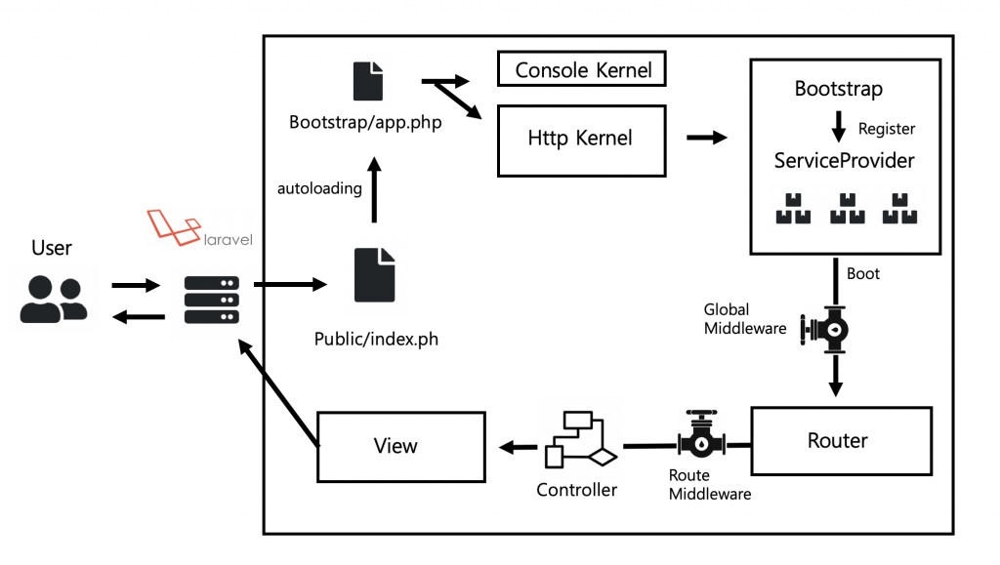

# laravel8参考手册

## 入门指南

### 新版特性

- Laravel Jetstream
- 模型工厂类
- 迁移文件压缩
- 任务批处理
- 访问频率限制优化
- 队列功能优化
- 动态 Blade 组件
- Tailwind 分页视图
- 时间相关的测试辅助函数
- `artisan serve` 命令优化
- 事件监听器优化
- 其他 bug 修复和可用性优化

### 安装

```shell
//通过 Composer 创建项目
composer create-project --prefer-dist laravel/laravel laravel8-lab "8.*"
```

### 目录结构

```txt
www  WEB部署目录（或者子目录）
├─app							      
│  ├─Console            包含应用程序的所有自定义 Artisan 命令
│  ├─Exceptions					包含应用程序的异常处理
│  ├─Http								包含控制器，中间件和表单请求
│  ├─Providers					包含应用程序的所有服务提供者
│  └─User.php           
│
├─bootstrap  						
│  ├─cache              框架生成的用来提升性能的文件
│  └─app.php        		框架引导文件
│ 
├─config                应用配置目录
│  
├─database 							数据填充和迁移文件以及模型工厂类存放目录
│  
├─public                WEB目录（对外访问目录）
│  ├─index.php          入口文件
│  └─.htaccess          用于apache的重写
│
├─resources  						视图和未编译的资源文件存放目录
│  
├─routes                路由定义目录
│  
├─storage               编译后文件及框架生成文件的存放目录
│  
├─tests   							自动化测试文件存放目录
│  
├─vendor                第三方类库目录（Composer依赖库）
│  
├─composer.json         composer 定义文件
```

## 核心架构

### 请求周期



1. Laravel 应用的所有请求入口都是 `public/index.php` 文件，所有请求都会被 web 服务器导向这个文件
2. `index.php` 文件载入 Composer 生成的自动加载设置，然后从 `bootstrap/app.php` 脚本获取 Laravel 应用实例，Laravel
   的第一个动作就是创建**服务容器**实例。
3. 请求被发送到 HTTP 内核或 Console 内核（分别用于处理 Web 请求和 Artisan 命令），这取决于进入应用的请求类型。
    - HTTP内核位于`app/Http/Kernel.php`
        - 继承自 `Illuminate\Foundation\Http\Kernel` 类，该类定义了一个 `bootstrappers`
          数组，这个数组中的类在请求被执行前运行，这些 `bootstrappers` 配置了错误处理、日志、检测应用环境以及其它在请求被处理前需要执行的任务
        - 定义了一系列所有请求在处理前需要经过的 HTTP 中间件，这些中间件处理 HTTP 会话的读写、判断应用是否处于维护模式、验证
          CSRF 令牌等等
        - `handle` 方法签名相当简单：获取一个 `Request`，返回一个 `Response`，可以把该内核想象作一个代表整个应用的大黑盒子，输入
          HTTP 请求，返回 HTTP 响应
4. 内核启动过程中最重要的动作之一就是为应用载入服务提供者，应用的所有服务提供者都被配置在 `config/app.php`
   配置文件的 `providers` 数组中
    1. 所有提供者（数据库、队列、验证器，以及路由组件...）的 `register` 方法被调用
    2. 所有提供者被注册之后，`boot` 方法被调用
5. 一旦应用被启动并且所有的服务提供者被注册，`Request` 将会被交给路由器进行分发，路由器将会分发请求到路由或控制器，同时运行所有路由指定的中间件

### 服务容器

Laravel 服务容器是一个用于管理类依赖和执行依赖注入的强大工具。依赖注入听上去很花哨，其实质是通过构造函数或者某些情况下通过「setter」方法将类依赖注入到类中。

**绑定**

如果一个类没有基于任何接口那么就没有必要将其绑定到容器。容器并不需要被告知如何构建对象，因为它会使用 PHP 的反射服务自动解析出具体的对象。

```php
//简单绑定
$this->app->bind('HelpSpot\API', function ($app) {
    return new HelpSpot\API($app->make('HttpClient'));
});
//绑定一个只会解析一次的类或接口到容器，然后接下来对容器的调用将会返回同一个对象实例
$this->app->singleton('HelpSpot\API', function ($app) {
    return new HelpSpot\API($app->make('HttpClient'));
});
//绑定一个已存在的对象实例到容器，随后调用容器将总是返回给定的实例
$api = new HelpSpot\API(new HttpClient);
$this->app->instance('HelpSpot\API', $api);
```

**解析**

- make方法：`$this->app->make('HelpSpot\API');`
- 辅助函数resolve：`resolve('HelpSpot\API');`
- makeWith方法：`$this->app->makeWith('HelpSpot\API', ['id' => 1]);`
- 自动注入

### 服务提供者

服务提供者是 Laravel 应用启动的中心，你自己的应用以及所有 Laravel 的核心服务都是通过服务提供者启动（注册服务，包括注册服务容器绑定、事件监听器、中间件甚至路由）。

- 通过 Artisan 命令 `make:provider` 即可生成一个新的提供者`php artisan make:provider TestServiceProvider`
    - **register**
      方法只绑定服务到服务容器，而不要做其他事情，否则，一不小心就可能用到一个尚未被加载的服务提供者提供的服务（在任何服务提供者方法中，都可以通过 `$app`
      属性来访问服务容器）
    - **boot**方法在所有服务提供者被注册以后才会被调用
- 所有服务提供者都是通过配置文件 `config/app.php` 中进行注册，该文件包含了一个列出所有服务提供者名字的 `providers`
  数组，要注册你自己的服务提供者，只需要将其追加到该数组中即可
- 延迟加载：需要实现 `\Illuminate\Contracts\Support\DeferrableProvider` 接口并定义一个 `provides` 方法，`provides`
  方法会返回通过服务提供者注册的服务容器绑定

### 门面

门面为应用服务容器中的绑定类提供了一个「静态」接口。

> 危险就是类范围蠕变

Laravel 自带的门面，以及我们创建的自定义门面，都会继承自 `Illuminate\Support\Facades\Facade`
基类。门面类只需要实现一个方法：`getFacadeAccessor`。正是 `getFacadeAccessor` 方法定义了从容器中解析什么，然后 `Facade`
基类使用魔术方法 `__callStatic()` 从你的门面中调用解析对象。

### 契约

契约是指框架提供的一系列定义核心服务的接口。 例如，`Illuminate\Contracts\Queue\Queue`
契约定义了队列任务需要实现的方法，`Illuminate\Contracts\Mail\Mailer` 契约定义了发送邮件所需要实现的方法。

不同于门面不需要再构造器中进行类型提示，契约允许你在类中定义显式的依赖。

## 基础组件

### 路由

**默认路由文件**

所有 Laravel 路由都定义在位于 `routes`
目录下的路由文件中，这些文件通过框架自动加载，相应逻辑位于 `app/Providers/RouteServiceProvider` 类。

- `routes/web.php` 文件定义了 Web 界面的路由，这些路由被分配到了 `web` 中间件组，从而可以使用 Session 和 CSRF 保护等功能
- `routes/api.php` 中的路由是无状态的，这是因为被分配到了 `api` 中间件组（所有路由会被自动添加 `/api` 前缀）

**访问频率限制**

Laravel
内置了功能强大且支持自定义的访问频率限制服务，你可以使用该功能来限制给定路由/路由群组的流量。这可以在应用自带的 `RouteServiceProvider`
中完成。

**跨域资源共享**

Laravel 现在可以自动通过配置值响应 CORS OPTIONS 请求，所有 CORS 设置都可以在配置文件 `cors.php` 中进行，并且 OPTIONS
请求默认会被 `HandleCors` 中间件处理（该中间件默认被包含在 Laravel 全局中间件栈中）。

### 中间件

中间件为过滤进入应用的 HTTP 请求提供了一套便利的机制。

- 创建中间件：`php artisan make:middleware CheckName`

    - 请求之前的中间件：业务代码在`$next($request)` 之前
    - 请求之后的中间件：业务代码在`$next($request)` 之后

- 注册中间件：

    - **全局中间件：** 将相应的中间件类添加到 `app/Http/Kernel.php` 的数组属性 `$middleware` 中即可

    - **中间件组：** 中间件组的目的只是让一次分配给路由多个中间件的实现更加方便

      > Laravel 自带了开箱即用的 `web` 和 `api` 两个中间件组（可以参照使用）

    - **指定路由中间件：** 应该在 `app/Http/Kernel.php` 文件中分配给该中间件一个 `key`，该类的 `$routeMiddleware` 属性包含了
      Laravel 自带的中间件，要添加你自己的中间件，只需要将其追加到后面并为其分配一个 `key`。中间件在 HTTP Kernel
      中被定义后，可以使用 `middleware` 方法将其分配到路由。

### CSRF防护

跨站请求伪造（CSRF）是一种通过伪装授权用户的请求来攻击授信网站的恶意漏洞。

Laravel 通过自带的 CSRF 保护中间件让避免应用遭到跨站请求伪造攻击变得简单：Laravel 会自动为每一个被应用管理的有效用户会话生成一个
CSRF “令牌”，然后将该令牌存放在 Session 中，该令牌用于验证授权用户和发起请求者是否是同一个人。

任何时候在 Laravel 应用中定义 HTML 表单，都需要在表单中引入 CSRF 令牌字段，这样 CSRF 保护中间件才能够对请求进行验证。

> 运行测试时 CSRF 中间件会自动禁止

### 控制器

控制器用于将相关的 HTTP 请求封装到一个类中进行处理，这些控制器类存放在 `app/Http/Controllers` 目录下。

- **创建控制器：**`php artisan make:controller UserController`

    - 单一动作控制器：在这个控制器中定义 `__invoke` 方法（在 PHP 中当尝试以调用函数的方式调用一个对象时，`__invoke()`
      方法会被自动调用）

- **控制器中间件：**可以在路由处单独分配，也可以在构造函数处设置

- **资源控制器：**构建基于资源的 RESTful 控制器`php artisan make:controller PostController --resource`

    - 嵌套资源：在路由定义中使用「.」符号

- **依赖注入：**Laravel 使用**服务容器**解析所有的 Laravel 控制器，因此，可以在控制器的**构造函数**
  中注入任何依赖，这些依赖会被自动解析并注入到控制器实例中

    - 方法注入：除了构造函数注入之外，还可以在控制器的动作方法中进行依赖注入

- **路由缓存：**

  > 路由缓存不会作用于基于闭包的路由。要使用路由缓存，必须将闭包路由转化为控制器路由。

    - 生成路由缓存：`php artisan route:cache`
    - 移除路由缓存：`php artisan route:clear`

### 请求

- **访问请求示例：**在控制器中获取当前 HTTP 请求实例，需要在构造函数或方法中对 `Illuminate\Http\Request`
  类进行依赖注入，这样当前请求实例会被服务容器自动注入

    - 路由参数：将路由参数置于其它依赖之后即可
    - 请求路径：`$request->path();`
    - 请求url：`$request->url(); || $request->fullUrl();`
    - 请求方法：`$request->method();`

- **获取请求输入：**

    - 所有输入值：`$request->all();`

    - 单个输入值：`$request->input('name');`

    - 从查询字符串中获取输入：`$request->query('name');`

    - 动态属性：`$request->name;`

    - JSON输入值：`$request->input('user');`

    - 获取布尔输入值：`$request->boolean('check')`

    - 部分数据：`$request->only(['username']); || $request->except(['password']);`

    - 判断是否存在：`$request->has('name');`

    - **上一次请求输入：**

        - 将输入储存到session中：`$request->flash(); || $request->flashExcept('password');   `
        - 将输入储存到session然后重定向：`
          return redirect('form')->withInput($request->except('password'));`
        - 取出上次请求数据：`$username = $request->old('username');`

    - **Cookie：**

        - 从请求中取出Cookie：`$request->cookie('name'); || Cookie::get('name');`

        -
      添加Cookie到响应：`return response()->cookie('key','value','duration')  || Cookie::queue('key','value','duration);`

        - 生成Cookie实例：`cookie('key','value','duration');`

          > 该 Cookie 只有在添加到响应实例上才会发送到客户端

        -
      提前让Cookie过期：`return response()->withCookie(Cookie::forget('name')); || Cookie::queue(Cookie::forget('name'));`

- **文件上传：**

    - 获取上传的文件：`$request->file('photo'); || $request->photo;`
        - 判断是否出错：`$request->file('photo')->isValid();`
        - 文件路径&拓展名：`$request->photo->path(); & $request->photo->extension();`
    - 保存上传的文件：`$request->file('photo')->store('path');`

- **配置信任代理：**

    - 如果你的应用运行在一个会中断 TLS/SSL 证书的负载均衡器之后，你会注意到有的时候应用不会生成 HTTPS
      链接，通常这是因为应用是从负载均衡器从80端口转发过来的流量，所以不知道应该生成安全加密链接
    - 要解决这个问题可以使用 `App\Http\Middleware\TrustProxies`
      中间件，该中间件允许你快速自定义需要被应用信任的负载均衡器或代理。被信任的代理位于这个中间件的 `$proxies`
      属性列表，除了配置信任代理之外，还可以配置代理发送的带有请求来源信息的消息头
    - 如果你在使用 Amazon AWS 或者其他云服务提供的负载均衡，并不知道均衡器真实的 IP 地址，这种情况下，可以使用 `*`
      通配符信任所有代理

### 响应

- **创建响应：**

    - 字符串&数组：直接 return 即可（其中数组还有**Eloquent集合**会自动转化为JSON）
    - Response对象：`return response('Hello World', 200);`
    - 添加响应头：通过`header`方法或者`withHeaders`方法添加
    - 缓存控制器中间件：Laravel 内置了一个 `cache.headers` 中间件，用于快速设置路由分组的 `Cache-Control` 头
    - Cookie：在请求中有详细说明
    - Cookie&加密： `App\Http\Middleware\EncryptCookies` 中的 `$except` 属性可以使 Cookie不加密

- **重定向：**

    - 重定向到命名路由：`return redirect()->route('login');`
    - 重定向到控制器动作：`return redirect()->action([HomeController::class, 'index']);`
    - 重定向到外部域名：`return redirect()->away('https://laravel.com');`
    - 带一次性Session数据的重定向：在请求中有详细说明

- **其他相应类型：**

    - 视图响应：`return view();`

    - JSON响应：`return response()->json(); || return response()->jsonp();`

    - 文件下载：`return response()->download($pathToFile, $name, $headers);`

        - 流式下载：将给定操作的字符串响应转化为可下载的响应而不用将操作内容写入磁盘

          `return response()->streamDownload(function () {}, $name);`

    - 文件响应：浏览文件而不是下载`return response()->file($pathToFile);`

- **响应宏：**定义一个自定义的可以在多个路由和控制器中复用的响应，可以使用 `Response` 门面上的 `macro` 方法？？？

### 视图

- **创建视图：**
    - 视图文件存放在 `resources/views` 目录
    - 引用方式：`return view('admin.profile', $data);`
    - 判断存在：`View::exists('admin.profile');`
- **传递数据到视图：** 直接通过view方法传递数据
    - 视图间共享数据：在某个服务提供者的 `boot` 方法中调用 `share` 方法`View::share();`
- **视图Composer：** 视图 Composer 是当视图被渲染时的回调函数或类方法。如果你有一些数据要在视图每次渲染时都做绑定，可以使用视图
  Composer 将逻辑组织到一个单独的地方。？？？
- **视图性能优化：** 默认情况下，视图会按需编译。预编译`php artisan view:cache` 清除`php artisan view::clear`

### URL生成

- **生成URL：** `url` 辅助函数可用于为应用生成任意 URL，并且生成的 URL 会自动使用当前请求的 `scheme`（HTTP or HTTPS）
  和 `host` 属性

- **访问当前URL：** `url()->current(); || url()->full();`

- **命名路由URL：** `Route::get('')->name('get.show');` route辅助函数可以生成指向该路由的URL ` route('get.show');`

  > 当路由的 URL 改变了，`route` 函数调用不需要做任何更改

- **签名URL：**

  > 与命名路由相映射，这些 URL 会将「签名」哈希追加到查询字符串后面，以便 Laravel 验证 URL 在创建之后没有被篡改

    - 创建：`URL::signedRoute('unsubscribe', ['user' => 1]);`

    - 验证：

      ```php
      Route::get('/unsubscribe/{user}', function (Request $request) {
          if (! $request->hasValidSignature()) {
              abort(401);
          }
          
          // ...
      })->name('unsubscribe');
      ```

- **控制器动作URL：** `action` 辅助函数用于为控制器动作生成 URL `action([HomeController::class, 'index']);`

- **参数默认值：** 可以将 `URL::defaults` 方法放在中间件中来指定默认值

### Session

Laravel 并没有使用 PHP 内置的 Session 功能，而是自己实现了一套更加灵活更加强大的 Session
机制，核心逻辑请参考 `Illuminate\Session\Middleware\StartSession` 这个中间件，因此在 Laravel
应用中不要试图通过 `$_SESSION` 方式去获取应用的 Session 值，这是徒劳的。

在 Laravel 的控制器构造函数中是无法获取应用 Session 数据的，这是因为 Laravel 的 Session 通过 `StartSession`
中间件启动，既然是中间件就会在服务容器注册所有服务之后执行，而控制器们的构造函数都是在容器注册服务的时候执行的，所以这个时候
Session 尚未启动，有何来的获取数据呢？解决办法是将获取 Session 数据逻辑后置或者在构造函数中引入在 `StartSession` 之后执行的中间件。

- **驱动预备知识：**

    - 数据库：当使用 `database` 作为 Session 驱动时，需要设置表包含 Session 字段

      ```php
      Schema::create('sessions', function ($table) {
          $table->string('id')->unique();
          $table->unsignedInteger('user_id')->nullable();
          $table->string('ip_address', 45)->nullable();
          $table->text('user_agent')->nullable();
          $table->text('payload');
          $table->integer('last_activity');
      });
      ```

      或者使用`php artisan session:table; php artisan migrate`

    - Redis：

        1. 通过 Composer 安装 `predis/predis` 包
        2. 在 `database` 配置文件中配置 Redis 连接
        3. 在 `config/session.php` 中配置 Session 驱动为 `redis`

- **使用Session：**

    - 获取数据：
        - Request实例：`$request->session->get('key');`
        - 全局Session辅助函数：`session('key',default);`
        - 获取所有Session数据：`$request->session->all();`
        - 获取&删除数据：`$request->session()->pull('key', 'default');`
        - 判断Session是否存在指定项：存在  `$request->session->exists('key');`
          存在且不为空  `$request->session->has('key');`
    - 储存数据：
        - 存储：`$request->session()->put('key', 'value'); || session(['key' => 'value']);`
        - 推送数据到Session：`$request->session()->push('user.name', 'session');`
    - 一次性数据：在 Session 中存储只在下个请求中有效的数据
        - 一次性：`$request->session->flash('key', 'value');`
        - 将所有一次性数据保存到下次请求：`$request->session->reflash();`
        - 保留部分一次性数据到下次请求：`$request->session->keep(['key']);`
    - 删除数据：`$request->session->forget(['key1', 'key2']); || $request->session->flush();`
    - 重新生成SessionID

- **Session阻塞：**

  > 要使用 Session 阻塞功能，Laravel 应用必须使用支持**原子锁**的缓存驱动。目前，支持原子锁的缓存驱动包括 `memcached`
  、`dynamodb`、`redis` 以及 `database`。此外，不能使用 `cookie` Session 驱动。

    - 限制给定 Session 并发请求：在路由定义之后链接 `block` 方法调用即可

- **自定义Session驱动：**

    - 实现驱动：自定义 Session 驱动需要实现 `SessionHandlerInterface` 接口，该接口包含少许我们需要实现的方法
    - 注册驱动：在某个**服务提供者**的`boot`方法中调用 `Session` 门面上的 `extend` 方法

### 验证

- **快速入门：**
    1. 定义路由
    2. 创建控制器
    3. 编写验证逻辑`$request->validate(['title'=>'required']);`
    4. 显示验证错误信息
- **表单请求验证：**
    - 创建表单请求： `php artisan make:request StoreBlogPost`
    - 授权表单请求
    - 自定义错误信息
    - 自定义验证属性
- **手动创建验证器：**
    - 使用 `Validator` 门面手动创建一个验证器实例 `Validator::make('', []);`
    - 自动重定向：`Validator::make('', [])->validator();`
    - 命名错误包
    - 验证钩子之后
- **处理错误消息：** `$validator->errors();`
    - 自定义错误信息：
        - 传递自定义信息作为第三个参数给 `Validator::make` 方法
        - 添加消息到 `resources/lang/xx/validation.php` 语言文件的 `custom` 数组
- **验证规则大全：**
    - ...
- **添加条件规则：**
    - 当字段包含特定值时跳过验证：如果另一个字段包含给定值的话，你可能不想要验证给定字段，这可以通过 `exclude_if` 规则来实现
    - 存在时验证：只有某个字段存在的情况下进行验证检查，通过 `sometimes` 规则来实现
    - 复杂条件验证
- **验证数组输入：** 类似前面
- **自定义验证规则：**
    - 使用Rule对象：`php artisan make:rule Uppercase`
    - 使用闭包
    - 使用扩展

### 错误处理

Laravel 默认已经为我们配置好了错误和异常处理，我们在 `App\Exceptions\Handler` 类中触发异常并将响应返回给用户。

- **异常处理器：**
    - 报告异常
    - 渲染异常
    - 可报告&可渲染的异常
- **HTTP异常：**
    - 自定义HTTP错误页面：`php artisan vendor:publish --tag=laravel-errors`

### 日志

- **配置：** 默认情况下，Laravel 使用 `stack` 通道来记录日志信息，`stack` 通道被用于聚合多个日志通道到单个通道

    - 配置通道名称：默认情况下，Monolog 通过与当前环境匹配的「通道名称」实例化，要改变这个值，添加 `name` 项到通道配置

    - 有效通道列表：
      | 名称 | 描述 |
      | ------------ | ------------------------------------------------------------ |
      | `stack`      | 用于创建「多通道」通道的聚合器 |
      | `single`     | 基于单文件/路径的日志通道（`StreamHandler`） |
      | `daily`      | 基于 `RotatingFileHandler` 的 Monolog 驱动，以天为维度对日志进行分隔 |
      | `slack`      | 基于 `SlackWebhookHandler` 的 Monolog 驱动 |
      | `papertrail` | 基于 `SyslogUdpHandler` 的 Monolog 驱动 |
      | `syslog`     | 基于 `SyslogHandler` 的 Monolog 驱动 |
      | `errorlog`   | 基于 `ErrorLogHandler` 的 Monolog 驱动 |
      | `monolog`    | Monolog 改成驱动，可以使用所有支持的 Monolog 处理器 |
      | `custom`     | 调用指定改成创建通道的驱动 |

- **写入日志信息：** `Log::...`  **emergency**、**alert**、**critical**、**error**、**warning**、 **notice**、**info** 和 **
  debug**

    - 写入指定通道：`Log::channel('single')->error();`

- **高级Monolog通道自定义**

- **创建Monolog处理器通道**

## 前端开发

### Blade模板引擎

Blade 是由 Laravel 提供的非常简单但功能强大的模板引擎，不同于其他流行的 PHP 模板引擎，Blade 在视图中并不约束你使用 PHP
原生代码。所有的 Blade 视图最终都会被编译成原生 PHP 代码并缓存起来直到被修改，这意味着对应用的性能而言 Blade 基本上是零开销。Blade
视图文件使用 `.blade.php` 文件扩展并存放在 `resources/views` 目录下。

- **模板继承：**

    - 定义布局
    - 继承布局

- **数据显示：** `{{}}` 通过两个花括号包裹变量来显示数据或是PHP原生函数（使用`htmlentities` 转义）

    - 显示原生数据：`{!! $name !!}`
    - 渲染JSON内容：`@json` 指令接收和 `json_encode` 函数一样的参数
    - HEML实体编码：默认情况下，Blade（以及辅助函数 `e`）会对 HTML 实体进行双重编码

- **流程控制：**

    - 认证指令：`@auth` 和 `@guest` 指令可用于快速判断当前用户是否登录

    - Session指令：使用 `@hasSection` 指令判断某个 section 中是否有内容

    - 环境指令：`@production` 指令检查是否在生产环境运行， `@env` 指令判断是否在指定环境运行

    - If语句： `@if` , `@elseif` , `@else` , `@endif` , `@unless` , `@isset` , `@empty`

    - Switch语句：  `@switch`，`@case`，`@break`，`@default`

    - 循环：和原生基本一样

    - $loop变量：
      | 属性 | 描述 |
      | ------------------ | ---------------------------- |
      | `$loop->index`     | 当前循环迭代索引 (从0开始)   |
      | `$loop->iteration` | 当前循环迭代 (从1开始)       |
      | `$loop->remaining` | 当前循环剩余的迭代 |
      | `$loop->count`     | 迭代数组元素的总数量 |
      | `$loop->first`     | 是否是当前循环的第一个迭代 |
      | `$loop->last`      | 是否是当前循环的最后一个迭代 |
      | `$loop->even`      | 是否是当前循环的偶数迭代 |
      | `$loop->odd`       | 是否是当前循环的奇数迭代 |
      | `$loop->depth`     | 当前循环的嵌套层级 |
      | `$loop->parent`    | 嵌套循环中的父级循环变量 |

- **表单：**

    - CSRF字段：使用 Blade 指令 `@csrf` 来生成令牌字段
    - 方法字段：Blade 指令 `@method` 可用于创建
    - 验证错误：`@error` 指令可用于快速检查给定属性是否存在验证错误消息

- **组件：**

    - 基于类的组件：

        1. `php artisan make:component Alert`
        2. 注册组件：通常会自动发现组件。构建一个使用 Blade 组件的扩展包时，则需要在扩展包服务提供者的 `boot` 方法中注册组件
        3. 显示组件：`<x-alert/>`
        4. 传递数据到组件：
            1. `<x-alert type="error" :message="$message"/>`
            2. 在组件类构造函数中定义组件的必要数据
            3. 在渲染组的视图模板中，你可以通过输出变量名显示组件公开属性的内容

        - 命名风格：组件类构造函数参数需要使用小驼峰命名风格（`camelCase`），而在 HTML
          属性中引用该参数时则需要使用短划线命名风格（`kebab-case`）
        - 组件方法：任何组件类中的公开方法也可以直接在组件模板中执行
        - 插槽

    - 匿名组件：匿名组件使用的是单视图文件，并没有与之关联的类

    - 动态组件：

- **包含子视图：**Blade 的 `@include` 指令允许你很轻松地在一个视图中包含另一个 Blade 视图，所有父级视图中变量在被包含的子视图中依然有效

- **堆栈：**

- **服务注入：**

- **扩展Blade：**

### 本地化

语言字符串默认存放在 `resources/lang` 目录中，该目录包含了应用支持的每种语言的子目录

### 前端脚手架

Laravel 提供的 Tailwind CSS 和 Livewire/Inertia 脚手架位于 `laravel/jetstream` Composer 软件包中，可以使用 Composer
安装：`composer require laravel/jetstream`

一旦安装了 `laravel/jetstream` 软件包，您就可以使用 Artisan 命令 `jetstream:install` 来安装前端脚手架：

```shell
// 生成基础脚手架...
php artisan jetstream:install livewire
php artisan jetstream:install inertia

// 生成支持团队的脚手架...
php artisan jetstream:install --teams
```

### 通过MIX编译前端资源

[Laravel Mix](https://github.com/JeffreyWay/laravel-mix) 提供了一套流式 API，使用一些通用的 CSS 和 JavaScript 预处理器为
Laravel 应用定义 Webpack 构建步骤。

- 安装MIX：`npm install`
- 运行MIX：`npm run dev`（运行所有Mix任务）`npm run production`（运行所有Mix任务并减少输出）

## 安全系列

### 登录认证

通俗点说，在进行登录认证的时候，要做两件事，一个是从数据库存取用户数据，一个是把用户登录状态保存起来，在 Laravel 的底层实现中，通过
Provider 存取数据，通过 Guard 存储用户认证信息，前者主要和数据库打交道，后者主要和 Session 打交道（API 例外）。

**认证原理**

1. 使用 Web 浏览器认证的时候，需要用户通过登录表单提供用户名和密码作为凭证
2. 如果这些凭证是正确的，Laravel 应用会在用户 Session 中存储该认证用户的信息
3. 然后将包含 Session ID 的 Cookie 通过响应头发送给客户端浏览器，以便后续该浏览器发起的 HTTP 请求可以通过 Session
   与指定用户关联起来
4. 服务端获取到带有 Session Cookie 的请求后，会基于 Session ID 获取 Session 数据，由于之前在 Session
   中存储了认证用户信息，所以通过这种机制就可以将发起该请求的用户看作是「认证用户」。

**Jetstream / Fortify**

- **Laravel Fortify：** 是一个针对 Laravel 项目开发的开箱即用认证后端
- **Laravel Jetstream：** 是一个 UI 扩展包，除了提供基于浏览器的 Cookie
  认证外，还内置集成了 [Laravel Sanctum](https://github.com/laravel/sanctum) 提供 API 令牌认证

**Laravel API 认证服务**

Laravel 官方提供了两个可选的扩展包帮助你管理 API 令牌和认证带有 API 令牌的请求：

- **Passport：** Passport 是一个 OAuth2 认证服务商，提供了多个 OAuth2「授权类型」以便颁发不同类型的访问令牌
- **Sanctum：** 是一个混合了 Web/API 认证的扩展包，可用于管理应用的整个认证流程

****

- **快速入门：**

    - 路由：Laravel 官方提供的 `laravel/jetstream` 扩展包提供了完整的用户认证功能支持，其中包含了用户认证需要的所有路由和视图代码

      ```php
      composer require laravel/jetstream
      
      // 使用 Livewire + Blade 技术栈开发 Jetstream 组件...
      php artisan jetstream:install livewire
      
      // 使用 Inertia + Vue.js 技术栈开发 Jetstream 组件...
      php artisan jetstream:install inertia
      ```

    - 视图：上述命令会自动创建

    - 认证：走一遍注册登录流程

    - 获取认证用户：`Auth` 门面模式 或者`$request->user();`

    - 路由保护

    - 登录失败次数限制

- **手动认证用户：**  自己实现`Auth` 门面中的一些方法

- **基于HTTP的基本认证：** 帮助用户快速实现登录认证而不用设置专门的登录页面

- **退出：**

    - `Auth::logout();`
    - 让其他设备上的 Session 失效：`Auth::logoutOtherDevices($password);`

- **添加自定义Guard驱动**

- **添加自定义用户提供者**

- **事件**

### 用户授权

Laravel 提供了一个简单的方式来管理授权逻辑以便控制对资源的访问权限。和认证一样，在 Laravel 中实现授权很简单，主要有两种方式：Gate
和 Policy。

可以将 Gate 和 Policy 分别看作路由和控制器，Gate 提供了简单的基于闭包的方式进行授权，而 Policy
和控制器一样，对特定模型或资源上的复杂授权逻辑进行分组。

- **Gate：** Gate 是用于判断用户是否有权进行某项操作的闭包
    - 编写Gate
    - 授权动作
    - Gate响应
    - 拦截Gate检查
- **创建Policy：** Policy（策略）是用于组织基于特定模型或资源的授权逻辑类
    - 生成Policy类：`php artisan make:policy PostPolicy`
    - 注册Policy类：Laravel 自带的 `AuthServiceProvider` 包含了一个 `policies` 属性来映射 Eloquent 模型及与之对应的
      Policy 类
- **编写Policy：**
    - Policy方法：
    - Policy响应
    - ...
- **使用Policy授权动作：**
    - 通过User模型
    - 通过中间件
    - 通过控制器辅助函数
    - 通过Blade模板
    - 提供附加上下文

### 邮箱验证

Laravel 提供了便捷方法来发送和验证邮箱验证请求，但是这个功能是可选的，你可以启用也可以不启用。如果想要快速搭建邮箱验证功能，可以基于
Laravel Jetstream 内置的认证脚手架代码。迁移完数据库后，就可以导航到 `/register` 或者其他 URL 进行体验，Jetstream
提供了完整的用户认证功能，包含邮箱验证支持。

- **准备：**
    - 安装Laravel Jetstream
    - 检查 `App\Models\User` 是否实现了 `Illuminate\Contracts\Auth\MustVerifyEmail` 契约
- **数据库配置：**
    - `users` 表必须包含 `email_verified_at` 字段来存储邮箱地址验证时间
- **路由：** Laravel Jetstream 已经内置了邮箱验证功能所需的所有路由
- **视图**
- **事件**

### 加密

Laravel 的加密器使用 OpenSSL 来提供 AES-256 和 AES-128 加密。强烈建议使用 Laravel 自带的加密设置，不要尝试推出自己“土生土长”的加密算法。所有
Laravel 加密过的值都使用消息授权码（MAC）进行签名以便底层值一经加密就不能修改。

- **配置：** 通过`php artisan key:generate`在 `config/app.php` 中设置 `key` 为 32 位随机字符串
- **基本使用：**
    - 加密：使用 `Crypt` 门面提供的 `encryptString` 方法对数据进行加密，所有加密值都使用 OpenSSL 和 `AES-256-CBC`
      密码（cipher）进行加密。此外，所有加密值都通过一个消息认证码（MAC）来进行签名以防止对加密字符串的任何修改。
    - 解密：你可以使用 `Crypt` 门面提供的 `decryptString` 方法对加密数据进行解密。如果该值不能被解密，例如 MAC
      无效，将会抛出一个`Illuminate\Contracts\Encryption\DecryptException`异常

### 哈希

Laravel 的 `Hash` 门面为存储用户密码提供了安全的 Bcrypt 和 Argon2 哈希算法。

> Bcrypt 是散列密码的绝佳选择，因为其「工作因子」是可调整的，这意味着随着硬件功能的提升，生成哈希所花费的时间也会增加

- **配置：** 应用默认的哈希驱动配置在配置文件 `config/hashing.php` 中，目前支持两个驱动：Bcrypt 和 Argon2
- **基本使用：** 可以调用 `Hash` 门面上的 `make` 方法对存储密码进行哈希
    - 调整Bcrypt工作因子：可以在`config/hashing.php`中调整，也可以单独调整
    - 调整Argon2工作因子：可以在`config/hashing.php`中调整，也可以单独调整
    - 通过哈希验证密码：`check` 方法允许你验证给定原生字符串和给定哈希是否相等
    - 检查密码是否需要被重新哈希：`needsRehash` 方法允许你判断哈希计算器使用的工作因子在上次密码被哈希后是否发生改变

### 重置密码

在使用 Laravel 提供的密码重置功能之前，`User` 模型必须使用了 `Illuminate\Notifications\Notifiable` Trait。

- **数据库相关：**
    - 生成重置令牌表迁移：`password_resets`
- **路由：** Jetstream已内置
- **视图：** 同上
- **功能演示：**
- **自定义：**
    - 自定义密码重置方式：需要重写 `User` 模型上的 `sendPasswordResetNotification` 方法

## 进阶系列

### Artisan控制台

Artisan 是 Laravel 自带的命令行接口，它为我们在开发过程中提供了很多有用的命令。想要查看所有可用的 Artisan
命令，可使用 `list` 命令：`php artisan list`，每个命令都可以用 `help`
指令显示命令描述及命令参数和选项：`php artisan help migrate`

- **Tinker（REPL）：** REPL（Read-Eval-Print Loop，即终端命令行“读取-求值-输出”循环工具）

    - 安装：所有 Laravel 应用默认都包含 Tinker，也可以在需要的时候使用 Composer 手动安装`composer require laravel/tinker`
    - 使用：Tinker 允许你通过命令行与整个 Laravel 应用进行交互，包括 Eloquent ORM、任务、事件等等。要进入 Tinker
      环境，运行 `tinker` 命令即可`php artisan tinker`
    - 命名白名单：默认有 `clear-compiled`、`down`、`env`、`inspire`、`migrate`、`optimize` 和 `up`
      命令。想要在白名单中加入更多命令，可以将它们添加到 `tinker.php` 配置文件的 `commands` 数组
    - 别名黑名单：在 `tinker.php` 的 `dont_alias` 数组中添加这些类来避免会为这些类自动添加别名

- **编写命令：**

    - 生成命令：Artisan 命令 `make:command`会在 `app/Console/Commands` 目录下创建一个新的命令类
    - 命令结构：包括`signature` 和 `description` 属性，`handle`方法
    - 闭包命令：基于闭包的命令和闭包路由之于控制器一样，在 `app/Console/Kernel.php` 文件的 `commands` 方法中，Laravel
      加载了 `routes/console.php` 文件

- **定义期望输入：** `signature` 属性通过一个优雅的、路由风格的语法允许你定义命令的名称、参数以及选项

    - 参数：所有用户提供的参数和选项都包含在花括号里`email:send {user=foo}`
    - 选项：选项前面有两个短划线（`--`）
    - 输入数组：使用字符`*`
    - 输入描述：可以通过冒号将参数和描述进行分隔的方式分配描述到输入参数和选项

- **命令I/O：**

    - 获取输入：使用 `argument` 和 `option` 方法即可
    - 输入提示：`ask`  `secret`  `confirm`  `anticipate`  `choice`
    - 编写输出：要将输出发送到控制台，可以使用 `line`, `info`, `comment`, `question` 和 `error` 方法

- **注册命令：**

    - 由于 Console Kernel 的 `commands` 方法会调用 `load` 方法，所有 `app/Console/Commands` 目录下的命令都会通过 Artisan
      自动注册
    - 还可以在 `app/Console/Kernel.php` 类的 `$commands` 属性中通过手动添加类名的方式来注册命令

- **调用命令：**

    - 可以使用 `Artisan` 门面上的 `call` 方法来实现在路由或控制器中触发 Artisan 命令
    - 使用 `Artisan` 门面上的 `queue` 方法，可以将命令放到队列中，就可以通过后台的**队列工作者**来处理
    - 可以使用 `call` 方法从一个已存在的 Artisan 命令中调用其它命令
    - 可以使用 `callSilent` 方法调用其它控制台命令并阻止其所有输出

- **桩自定义**

  Artisan 控制台提供的 `make`
  命令可用于创建多种类型的类，例如控制器、队列任务、数据库迁移和测试等。这些类都是通过「桩」文件以及命令行传入参数值填充占位符自动生成，大多数时候，不需要要做任何修改，生成的类就可以满足我们的需求，不过，如果你想要修改通过
  Artisan 命令自动生成的文件内容，可以通过执行 `stub:pulish`
  命令来发布最常用的桩文件来对它们进行自定义（桩文件默认都位于依赖包的 `stubs` 目录下）

### 广播

在很多现代 Web 应用中，Web 套接字（WebSockets）被用于实现实时更新的用户接口。当一些数据在服务器上被更新，通常一条消息通过
Websocket 连接被发送给客户端处理。这为我们提供了一个更强大的、更有效的选择来持续拉取应用的更新。

为帮助你构建这样的应用，Laravel 让通过 Websocket 连接广播事件变得简单。广播 Laravel 事件允许你在服务端和客户端 JavaScript
框架之间共享同一事件名。

- **配置：** 应用的所有事件广播配置选项都存放在 `config/broadcasting.php` 配置文件中
    - 广播服务提供者：首先需要注册`App\Providers\BroadcastServiceProvider`，只需要取消 `config/app.php`
      配置文件中 `providers` 数组内对应服务提供者之前的注释即可
    - CSRF令牌：Laravel Echo需要访问当前 Session 的 CSRF 令牌（token），如果有效的话，Echo 将会从 JavaScript
      变量`Laravel.csrfToken` 中获取令牌。
- **驱动预备知识：**
    - Pusher：
        1. `composer require pusher/pusher-php-server "~4.0"`
        2. 在 `config/broadcasting.php` 配置文件中配置你的 Pusher 证书
        3. 使用 Pusher 和 Laravel Echo 的时候，需要在 `resources/js/bootstrap.js` 文件中安装某个 Echo
           实例的时候指定 `pusher` 作为期望的广播
        4. 修改 `.env` 文件中的广播驱动为 `pusher`： `BROADCAST_DRIVER=pusher`
    - Redis：
        1. `composer require predis/predis`
        2. 更新 `.env` 文件中的广播驱动为 `redis`：  `BROADCAST_DRIVER=redis`
        3. Redis 广播使用 Redis 的 pub/sub 功能进行广播；不过，你需要将其和能够接受 Redis 消息的 Websocket 服务器进行配对以便将消息广播到
           Websocket 频道
        4. 当 Redis 广播发布事件时，事件将会被发布到指定的频道上，传递的数据是一个 JSON
           格式的字符串，其中包含了事件名称、负载数据 `data`、以及生成事件 socket ID 的用户
    - Socket.IO
        1. `npm install --save socket.io-client`
        2. 使用 `socket.io` 连接器和 `host` 来实例化 Echo
        3. 运行一个与之兼容的 Socket.IO 服务器
- **概念概览：**
    - `ShouldBroadcast` 接口：实现 `ShouldBroadcast` 接口，Laravel 就会在触发事件时广播该事件
    - 授权频道：用户必须经过授权之后才能监听私有频道，在 `routes/channels.php` 中定义频道授权规则
    - 监听事件广播：在 JavaScript 中监听事件
- **定义广播事件：**
    - 在事件类上实现 `ShouldBroadcast` 接口
        - `broadcastOn` 方法：该方法返回一个事件广播频道或频道数组。这些频道必须是 `Channel`（公共频道）、`PrivateChannel`
          （私有） 或 `PresenceChannel`（私有） 的实例
    - 广播名称：Laravel 会使用事件的类名来广播事件。可以通过在事件中定义 `broadcastAs`
      方法来自定义广播名称（需要注册监听器的时候带上 `.` 前缀字符）
    - 广播数据：所有的 `public` 属性都会按照事件负载（payload）自动序列化和广播。可以通过 `broadcastWith`
      方法自定义你想要通过事件广播的数组数据
    - 广播队列：每个广播事件都会被推送到配置文件 `queue.php`
      中指定的默认队列连接对应的默认队列中。可以通过在事件类上定义一个 `broadcastQueue` 属性来自定义广播使用的队列
    - 广播条件：可以通过添加 `broadcastWhen` 方法到事件类来定义需要条件约束的广播事件
- **授权频道：**
    - 定义授权路由：`Broadcast::routes` 会注册 `/broadcasting/auth` 路由来处理授权请求
    - 定义授权回调：可以通过应用自带的 `routes/channels.php` 文件来定义执行频道授权的逻辑
    - 定义频道类：除了在`routes/channels.php`通过闭包定义授权频道之外，我们还可以使用频道类。使用 `make:channel`
      命令，该命令会将生成的新频道类存放到 `App/Broadcasting` 目录下。
- **广播事件：** 定义好事件并标记其实现 `ShouldBroadcast` 接口后，然后就是使用 `event` 方法触发该事件
    - `event` ，`broadcast` 函数都是将事件分发到服务器端监听器，后者还暴露了 `toOthers` 方法
- **接受广播：**
    - 安装Laravel Echo
    - 监听事件
    - 离开频道
    - 命名空间
- **存在频道：** 存在频道构建于私有频道之上，并且提供了额外功能：获知谁订阅了频道。
    - 授权存在频道
    - 加入存在频道
    - 广播到存在频道
- **客户端事件**
- **通知**

### 缓存

- **配置：** 位于 `config/cache.php`
    - 数据库：使用 `database` 缓存驱动时，你需要设置一张表存储缓存项`php artisan cache:table`
    - Memcached：需要安装PHP Memcached 扩展
    - Redis：需要通过 Composer 安装 `predis/predis` 包（~1.0）
- **缓存使用：** `Cach`门面函数
    - 获取缓存实例
    - 从缓存中获取数据
    - 在缓存中储存数据
    - 从缓存中移除数据
    - 缓存辅助函数
- **缓存标签：** 缓存标签允许你给相关缓存项打上同一个标签以便于后续清除这些缓存值，被打上标签的缓存可以通过传递一个被排序的标签数组来访问
    - 存储被打上标签的缓存项
    - 访问被打上标签的缓存项
    - 移除被打上标签的数据项
- **原子锁：**
    - 驱动准备：
        - 数据库：需要创建一张表来保存缓存锁
    - 管理锁：通过 `Cache::lock` 方法来创建和管理原子锁
    -
  管理跨进程的锁：应该传递锁的域「所有者令牌」到队列任务以便该任务可以使用给定令牌重新实例化锁；也可以使用 `forceRelease`
  方法在不管当前所有者的情况下释放锁
- **添加自定义缓存驱动：**
    - 编写驱动：
    - 注册驱动：
- **缓存事件：** 要在每次缓存操作时执行代码，你可以监听缓存触发的事件

### 集合

- **简介：**`Illuminate\Support\Collection` 类为处理数组数据提供了流式、方便的封装

    - 创建集合：使用辅助函数`collect`
    - 拓展集合：`Collection::macro('name', function () {})`

- **方法列表：**
  | 名称 | 返回值 |
  | ------------------------- | -------------------------------------------- |
  | **all()**                 | 返回集合表示的底层数组 |
  | **avg()  \|\| average()** | 返回所有集合项的平均值 |
  | **chunk()**               | 将一个集合分割成多个小尺寸的小集合 |
  | **collapse()**            | 将一个多维数组集合收缩成一个一维数组 |
  | **collect()**             | 返回一个新的包含当前元素的 `Collection` 实例 |
  | **count()**               | 返回集合中所有项的总数 |
  | **dd()**                  | 打印集合项并结束脚本执行 |
  | ... | |

- **高阶消息传递：** 在集合上执行通用的功能，支持高阶消息传递的方法包括： `average`、`avg`、`contains`、`each`、`every`
  、`filter`、`first`、`flatMap`、`groupBy`、`keyBy`、`map`、`max`、`min`、`partition`、`reject`、`skipUntil`、`skipWhile`、`some`
  、`sortBy`、`sortByDesc`、`sum`、`takeUntil`、`takeWhile` 和 `unique`。

- **懒集合：**

    - 简介：`LazyCollection` 类使用了 PHP 的生成器，从而可以通过极低的内存处理极大的数据集
    - 创建懒集合：`LazyCollection::make();`
    - `Enumerable` 契约：几乎所有的 `Collection` 类方法都对 `LazyCollection`
      类有效，因为这两个类都实现了 `Illuminate\Support\Enumerable` 契约
    - 懒集合方法：
        - tapEach()：在这些集合项从列表中一个一个拉取出来时调用给定回调
        - remember：返回一个新的懒集合，其中包含了所有已经枚举过的值，然后再次枚举的时候不会再从集合中获取它们

### 事件

- **简介：** Laravel 事件提供了简单的观察者模式实现，允许你订阅和监听应用中的事件

- **注册事件/监听器：**

    - 生成事件/监听器类：

        1. 添加监听器和事件到 `EventServiceProvider`
        2. `php artisan event:generate`

    - 手动注册事件：在 `EventServiceProvider` 的 `boot` 方法中手动注册基于闭包的事件

        - 队列化匿名事件监听器：通过 `Illuminate\Events\queueable` 函数调用来进行进一步的操作
        - 通配符事件监听器：使用通配符`*`来注册监听器

    - 事件自动发现：Laravel 使用反射遍历监听器类来发现事件监听器，当 Laravel 发现某个监听器类方法以 `handle`
      开头，将会从方法签名中提取类型提示指定的事件，然后将该方法作为该事件的事件监听器

      > 默认禁止，可以通过重写 `EventServiceProvider` 的 `shouldDiscoverEvents` 方法来开启它

- **定义事件：** 事件类是一个处理与事件相关的简单数据容器

- **定义监听器：** 事件监听器在 `handle` 方法中接收事件实例，`event:generate` 命令将会自动在 `handle`
  方法中导入相应的事件类和类型提示事件。在 `handle` 方法内，你可以执行任何需要的逻辑以响应事件

- **事件监听器队列：**执行耗时任务应该将监听器放到队列，只需要让监听器类实现 `ShouldQueue` 接口即可

    1. 自定义队列连接/队列名称：在监听器类中定义 `$connection`、`$queue` 和 `$delay` 属性
    2. 按条件推送监听器到队列：在监听器中添加一个 `shouldQueue` 方法

    - 手动访问队列：。。。
    - 处理失败任务：。。。

- **分发事件：** 传递事件实例到辅助函数 `event`，这个辅助函数会分发事件到所有注册的监听器

- **事件订阅者：**

    - 编写事件订阅者：事件订阅者是指那些在类本身中订阅多个事件的类，通过事件订阅者你可以在单个类中定义多个事件处理器
        - 定义一个 `subscribe` 方法，该方法中传入一个事件分发器实例。你可以在给定的分发器中调用 `listen` 方法注册事件监听器
        - 或者，订阅者的 `subscribe` 方法可以返回事件与处理器的映射关系数组，这种情况下，事件监听器映射关系会自动注册
    - 注册事件订阅者：使用 `EventServiceProvider` 提供的 `$subcribe` 属性来注册订阅者

### 文件存储

- **简介：** Laravel 集成 Flysystem 以便使用不同驱动简化对文件系统的操作
- **配置：** 文件系统配置文件位于 `config/filesystems.php`
    - 公共磁盘： 用于存储可以被公开访问的文件，`public` 磁盘使用 `local` 驱动并将文件存储在 `storage/app/public`
      目录下，要让这些文件可以通过 Web 浏览器访问到，还需要创建一个软链 `public/storage` 指向 `storage/app/public`
    - 本地驱动：使用 `local` 驱动的时候，所有的文件操作都相对于定义在配置文件 `filesystems` 中的 `root`
      目录，默认情况下，该值设置为 `storage/app` 目录
    - 缓存：要为给定磁盘启用缓存，需要添加 `cache` 指令到磁盘的配置选项，`cache` 配置项应该是一个包含 `disk` 名称、`expire`
      时间（以秒为单位）以及缓存前缀 `prefix` 的数组
- **获取磁盘实例：** 使用 `Storage` 门面和上面配置的任意磁盘进行交互，使用 `Storage` 门面上的 `disk` 方法访问特定磁盘
- **获取文件：** `Storage` 门面相关方法
- **存储文件：** `Storage` 门面相关方法
    - 上传文件： `Storage` 门面上的 `putFile` 方法 || 直接调用 `store` 方法或 `storeAs` 方法
    - 文件可见度：在 Laravel 的 Flysystem 集成中，“可见度”是对不同平台上文件权限的抽象，文件可以被声明成 `public`
      或 `private`，当文件被声明为 `public`，意味着文件可以被其他人访问
- **删除文件：** `Storage::delete();`
- **目录：**  `Storage` 门面相关方法
- **自定义文件系统：** ...

### 辅助函数

- **数组&对象**
    - `Arr::collapse()` 方法将多个数组合并成一个
    - `data_get` 函数使用「.」号从嵌套数组或对象中获取值
    - `data_set` 函数使用「.」号设置嵌套数组或对象的值
    - `data_fill` 函数使用「.」号以嵌套数组或对象的方式设置缺失值
    - ...
- **路径函数**
    - `app_path` 函数返回 `app` 目录的绝对路径
    - `mix` 函数返回带有版本号的Mix文件路径
    - ...
- **字符串函数**
    - `__` 函数会使用本地化文件翻译给定翻译字符串或翻译键
    - `e` 函数在给定字符串上运行 `htmlentities`
    - `Str::length()` 方法会返回给定字符串的长度
    - `Str::random` 方法通过指定长度生成随机字符串
    - `Str::slug` 方法将给定字符串生成 URL 友好的格式
    - ...
- **流式字符串函数：**
  为处理字符串值提供了更加平滑的、面向对象的接口，通过这些函数，你可以将多个字符串操作以方法链的形式进行流式处理    `Str::of('laravel')->upper();`
- **URL函数**
    - `action` 函数为给定控制器动作生成 URL，传递相对于命名空间 `App\Http\Controllers` 的类名即可
    - `asset` 函数使用当前请求的 scheme（HTTP 或 HTTPS）为前端资源生成一个 URL
    - `route` 函数为给定命名路由生成一个URL
    - `secure_asset` 函数使用 HTTPS 为前端资源生成一个 URL
    - `secure_url` 函数为给定路径生成完整的 HTTPS URL
    - `url` 函数为给定路径生成完整URL
- **其他函数**
    - `abort` 函数会抛出一个被异常处理器渲染的 HTTP 异常
    - `auth` 函数返回一个认证器实例
    - `broadcast` 函数广播给定事件到监听器
    - `cache` 函数可以用于从缓存中获取值，如果给定 key 在缓存中不存在，可选的默认值会被返回
    - `collect` 函数会根据提供的数据项创建一个集合
    - `config` 函数获取配置变量的值
    - `dd` 函数输出给定变量值并终止脚本执行
    - `event` 函数分发给定事件到对应监听器
    - ...

### HTTP客户端

- **简介：** Laravel 基于 [Guzzle HTTP 客户端](http://docs.guzzlephp.org/en/stable/)封装了一个优雅的、最小化的
  API，从而方便开发者快速创建 HTTP 请求与其他 Web 应用进行通信
- **创建请求：**
    - 基本使用：`Http` 门面 `get`、`post`、`put`、`patch` 以及 `delete` 方法
    - 请求数据：在 `POST`、`GET` 和 `PATCH` 请求中可以接收数组格式请求数据作为第二个参数
        - GET请求查询字符串：发送 GET 请求时，查询字符串可以直接添加到 URL 或者以键值对数组形式作为 `get` 方法的第二个参数传递
        - 发送表单URL编码请求：想使用 `application/x-www-form-urlencoded`内容类型发送数据，需要在创建请求前调用 `asForm`
          方法
        - 发送原生请求实体：在创建请求前，使用 `withBody` 方法提供原生的请求实体
        - Multi-Part请求：对于文件上传请求，需要以 multi-part 内容类型发起请求，这可以通过在创建请求前调用 `attach` 方法完成
    - 请求头：使用 `withHeaders` 方法添加请求头到请求
    - 认证：使用 `withBasicAuth` 和 `withDigestAuth` 方法设置认证方式。如果你想要快速添加 `Authorization` Bearer Token
      头到请求，可以使用 `withToken` 方法
    - 超时：通过 `timeout` 方法指定等待响应的最大时长（单位：秒）
    - 重试：如果你想要 HTTP 客户端在客户端或服务端发生错误时自动重发请求，可以使用 `retry` 方法。该方法接收两个参数 ——
      重试次数和两次重试之间的时间间隔（ms）
    - 错误处理：
      -
      抛出异常：如果你持有一个响应实例，并且在该响应是客户端或服务端错误的情况下想要抛出一个 `Illuminate\Http\Client\RequestException`
      异常实例，可以使用 `throw` 方法
    - Guzzle选项：
- **测试：**
    - 伪造响应： `HTTP` 门面的 `fake` 方法
        - 伪造指定URL：
        - 伪造响应序列：
        - 伪造回调：
    - 检查请求：在调用 `Http::fake` 之后调用 `Http::assertSent` 方法来实现

### 邮件

- **简介：** Laravel 基于 [SwiftMailer](http://swiftmailer.org/) 库提供了一套干净、清爽的邮件 API
    - 配置：Laravel 邮件服务可以通过 `mail` 配置文件进行配置
    - 驱动预备知识：
- **生成可邮寄类：** `php artisan make:mail Name`
- **编写可邮寄类：** 所有的可邮寄类配置都在 `build` 方法中完成
    - 配置发件人：
        - 使用 `form` 方法：在可邮寄类的 `build` 方法中调用 `from` 方法
        - 使用全局的 `form` 地址：在配置文件 `config/mail.php` 中指定一个全局的发送/回复地址
    - 配置视图：
        - 使用 `view` 方法：在可邮寄类的 `build` 方法中使用 `view` 方法来指定渲染邮件内容时使用哪个视图模板
        - 纯文本邮件：定义一个纯文本格式的邮件，可以使用 `text` 方法
    - 视图数据：
        - 通过公共属性：可邮寄类的公共（public）属性在视图中自动生效
        - 通过 `with` 方法：数据通过 `with` 方法传递到视图后，将会在视图中自动生效
    - 附件：在可邮寄类的 `build` 方法中使用 `attach` 方法
        - 添加磁盘文件：可以使用 `attachFromStorage` 方法将文件系统磁盘在的文件其添加到邮件
        - 原生数据附件：想在内存中生成 PDF，并且在不保存到磁盘的情况下将其添加到邮件作为附件，可以使用`attachData` 方法
    - 内联附件：要嵌入内联图片，在邮件视图中使用 `$message` 变量上的`embed` 方法即可
    - 自定义SwiftMailer消息：`Mailable` 基类上的 `withSwiftMessage` 方法允许你注册一个在发送消息之前可以被原生
      SwiftMailer 消息实例调用的回调
- **Markdown可邮寄类：**
    - 生成Markdown可邮寄类：在使用 Artisan 命令 `make:mail` 时带上 `--markdown` 选项，配置可邮寄类的 `build`
      方法时，使用 `markdown` 方法取代 `view` 方法（`markdown` 方法接收 Markdown 模板的名称和一个可选的在模板中生效的数组数据）
    - 编写Markdown消息：Markdown 邮件类组合使用了 Blade 组件和 Markdown 语法
- **发送邮件：**
    - 使用 `Mail` 门面上的 `to` 方法，指定好收件人以后，传递一个可邮寄类的实例到 `send` 方法
        - 遍历收件人：
        - 指定邮件服务发送邮件：使用 `mailer` 方法指定特定的邮件服务发送邮件
    - 邮件队列：
        - 邮件消息队列：在指定消息的接收者后使用 `Mail` 门面上的 `queue` 方法
        - 延迟消息队列：在指定消息的接收者后使用 `Mail` 门面上的 `later` 方法
        - 推送到指定队列：`onQueue` 和 `onConnection` 方法
        - 默认队列：如果你的可邮寄类总是想要推送到队列，可以在该类上实现 `ShouldQueue` 契约
- **渲染可邮寄类：** 调用可邮寄类的 `render` 方法
    - 在浏览器预览邮件：从路由闭包或控制器中直接返回可邮寄类
- **本地化可邮寄类：** `Mail` 门面 `locale` 方法来设置期望的语言
    - 用户首选语言：在一个或多个模型类中实现 `HasLocalePreference` 契约
- **邮件&本地开发：**
    - 日志驱动：
    - 通用配置：
    - Mailtrap：
- **事件： **在发送邮件消息前触发两个事件，`MessageSending` 事件在消息发送前触发，`MessageSent` 事件在消息发送后触发

### 通知

- **创建通知：** `php artisan make:notification InvoicePaid`
- **发送通知：**
    - 使用Notifiable Trait：`use Notifiable`  该 Trait 提供一个可用于发送通知的方法：`notify`
    - 使用Notification门面：
        - 指定传输通道：每个通知类都有一个 `via` 方法用于决定通知通过何种通道传输
        - 通知队列：让对应通知类实现 `ShouldQueue` 接口并使用 `Queueable` trait。
        - 按需通知：
- **邮件通知：**
    - 格式化邮件消息：在通知类上定义一个 `toMail` 方法
    - ...
- **Markdown邮件通知：**  ...
- **数据库通知：**
    - 预备知识：`database` 通知通道会在数据表中存储通知信息  `php artisan notifications:table && php artisan migrate`
    - 格式化数据库通知：如果一个通知支持存放在数据表，则需要在通知类中定义 `toDatabase` 或 `toArray`
      方法，该方法接收一个 `$notifiable` 实体并返回原生的 PHP 数组
    - 访问通知：
    - 标记通知为已读：
- **广播通知：**
    - 格式化广播通知：
    - 监听通知：
- **短信通知：**
- **Slack通知：**
    - 预备知识：
    - 格式化Slack通知：
    - Slack附件：
    - Slack通知路由：
- **本地化通知：**
- **通知事件：** 当通知被发送后，通知系统会触发 `Illuminate\Notifications\Events\NotificationSent`
  事件，该事件实例包含被通知的实体（如用户）和通知实例本身
- **自定义通道：**

### 拓展包开发

- **简介**

    - 关于门面的注意点

- **包自动发现**

    - 选择包发现

- **服务提供者**

- **资源**

    - 配置

    - 路由
    - 迁移

    - 翻译

    - 视图

    - 视图组件

- **命令**

- **发布前端资源**

- **发布文件组**

### 队列

- **简介：** 队列的目的是将耗时的任务延时处理，比如发送邮件，从而大幅度缩短 Web 请求和响应的时间
    - 连接 Vs. 队列
    - 驱动预备知识
        - 数据库： `php artisan queue:table && php artisan migrate`
        - Redis：首先在在配置文件 `config/database.php` 中配置 Redis 数据库连接
        - 其他驱动
- **创建任务**
    - 生成任务类：`php artisan make:job ProcessPodcast`
    - 任务类结构：通常只包含处理该任务的 `handle` 方法
    - 任务中间件：任务中间件允许你在执行队列任务前封装一些自定义逻辑，从而减少任务本身的模板代码量（Laravel
      没有默认的位置来存放任务中间件，可以将其存放在 `app/Jobs/Middleware` ）。
- **分发任务：** 创建好任务类后，就可以通过任务自身的 `dispatch` 方法将其分发到队列
    - 延时分发：在分发任务时使用 `delay` 方法
    - 同步分发：使用 `dispatchNow` 方法可以立即分发任务（同步）
    - 任务链：`Bus` 门面提供的 `chain` 方法
    - 自定义队列 & 连接： `onConnection` 和`onQueue` 方法
    - 指定最大失败次数/超时时间
    - 频率限制
    - 处理错误
- **任务批处理：** `php artisan queue:batches-table && php artisan migrate`
    - 定义批处理任务：创建一个使用 `Illuminate\Bus\Batchable` Trait 的队列任务
    - 分发批处理：使用 `Bus` 门面的 `batch` 方法
    - 添加任务到批处理
    - 检查批处理
    - 取消批处理
    - 批处理失败
- **队列闭包：** 推送闭包到队列时，闭包的代码内容以加密方式签名，所以不会在传输过程中被篡改
- **运行队列进程：** `php artisan queue:work` 或 `php artisan queue:listen` 前者修改需要重启，性能高
    - 队列优先级
    - 队列进程 & 部署：`php artisan queue:restart`
    - 任务过期 & 超时
- **配置 Supervisor：** Supervisor 是 Linux 系统中常用的进程守护程序。如果队列进程 `queue:work` 意外关闭，它会自动重启启动队列进程
    - 安装 Supervisor： `sudo apt-get install supervisor`
    - 配置 Supervisor：配置文件通常存放在 `/etc/supervisor/conf.d` 目录
    - 启动
      Supervisor： `sudo supervisorctl reread && sudo supervisorctl update && sudo supervisorctl start laravel-worker:*`
- **处理失败的任务：** 若是执行次数达到该限定，该任务会被插入到 `failed_jobs`
  表 `php artisan queue:failed-table && php artisan migrate`
    - 清理失败的任务：在任务类中定义 `failed` 方法, 可以在失败发生时执行指定的动作
    - 任务失败事件：使用 `Queue::failing` 方法在任务失败的时候触发某个事件
    - 重试失败的任务：查看 `php artisan queue:failed` 重试ID为5 `php artisan queue:retry 5`
      重试所有 `php artisan queue:retry all` 删除ID为5 `php artisan queue:forget 5` 删除所有 `php artisan queue:flush`
    - 忽略缺失的模型：设置队列任务的 `deleteWhenMissingModels` 属性为 `true` 来选择自动删除缺失模型实例的任务
- **任务事件：**  `Queue` 门面提供的 `before` 和 `after` 方法可以在任务被处理之前或之后指定要执行的回调

### 任务调度

- **简介：** Cron 是 UNIX、SOLARIS、LINUX 下的一个十分有用的工具，通过 Cron 脚本能使计划任务定期地在系统后台自动运行

  > Laravel 命令调度器允许你流式而又不失优雅地在 Laravel 中定义命令调度，并且服务器上只需要一个 Cron
  条目即可。任务调度定义在 `app/Console/Kernel.php` 文件的 `schedule` 方法中

    - 开启调度器： `* * * * * php /project-path/artisan schedule:run >> /dev/null 2>&1` 是唯一需要添加到服务器的 Cron
      条目，该 Cron 将会每分钟调用一次 Laravel 命令调度器，当 `schedule:run` 命令执行后，Laravel 评估你的调度任务并运行到期的任务。

- **定义调度：** 在 `App\Console\Kernel` 类的 `schedule` 方法中定义调度任务

    - 调度 Artisan 命令： 使用 `command` 方法通过命令名或类来调度一个 Artisan 命令
    - 调度队列任务：`job` 方法可用于调度一个队列任务
    - 调度 Shell 命令：`exec` 方法可用于调用操作系统命令
    - 调度常用选项：...
    - 时区：使用 `timezone` 方法你可以指定调度任务的执行时间在给定时区内切换
    - 避免任务重叠：即使前一个任务仍然在运行调度任务也会运行，可使用 `withoutOverlapping` 方法来避免这种默认情况
    - 在单台服务器上运行任务：要告知任务只在单台服务器上运行，在定义调度任务时使用 `onOneServer` 方法即可
    - 后台任务：可以使用 `runInBackground` 方法来实现把命令在后台执行以便可以同时运行多个
    - 维护模式：在维护模式期间强制运行任务，可以使用 `evenInMaintenanceMode` 方法

- **任务输出**

  > 下列方法只对 `command` 和 `exec` 方法有效

    - `sendOutputTo`  可以发送输出到文件以便稍后检查
    - `appendOutputTo`  追加输出到给定文件
    - `emailOutputTo`  可以将输出通过邮件发送给接收人
    - `emailOutputOnFailure`  在命令执行失败时输出邮件

- **任务钩子**

    - `before` 和 `after`  可以指定在调度任务完成之前和之后要执行的代码
    - `onSuccess` 和 `onFailure`  允许你在调度任务成功或失败的情况下执行指定的代码
    - `pingBefore` 和 `thenPing`  调度器可以在任务完成之前和之后自动 ping 给定的 URL
    - `pingOnSuccess` 和 `pingOnFailure`  可用于在任务成功或失败的情况下 ping 指定的 URL

## 数据库操作

### 数据库入门

- **简介**
    - 配置：数据库配置位于 `config/database.php`
    - 读写分离：`read`、`write` 和 `sticky`
    - 使用不同数据库连接
- **运行原生 SQL 查询：** `select`, `update`, `insert`, `delete` 和 `statement`
    - 监听查询事件：`DB` 门面下的 `listen` 方法
- **数据库事务：**  `DB` 门面的 `transaction` 方法
    - 全自动： `DB::transaction(function(){ }, 5);`
    - 自手动： `DB::beginTransaction(); DB::rollBack(); DB::commit();`

### 查询构建器

- **简介：** 数据库查询构建器提供了一个方便的流接口用于创建和执行数据库查询

- **获取结果集：** `table` 方法为给定表返回一个流式查询构建器实例

  `get` 方法返回所有记录、 `first` 方法返回第一个值、 `value` 方法从结果中获取单个值、 `find`
  方法通过ID获取指定记录、`pluck` 方法获取包含单个字段值的数组

    - 组块结果集：使用 `chunkById` 方法获取结果集的一小块，然后传递每一小块数据到闭包函数进行处理
    - 聚合函数：`count`, `max`, `min`, `avg` , `sum` , `exists` 或 `doesntExist`

- **查询（Select）**

  `select` 方法选择需要查询的字段、`distinct` 方法返回不重复的结果集、 `addSelect` 方法添加一个查询列到已存在的 select 子句

- **原生表达式**

    - 原生方法：`DB::raw` 、`selectRaw` 、`whereRaw` / `orWhereRaw` 、`havingRaw` / `orHavingRaw` 、`orderByRaw`
      、`groupByRaw`

- **连接（Join）：**  `join` 、`leftJoin` 、`rightJoin` ...

- **联合（Union）：**  `union` 方法将两个查询进行联合

- **条件查询（Where） **

- **排序、分组、限定**

- **条件子句（When）**

- **插入（Insert）**

- **更新（Update）**

- **删除（Delete）**

- **悲观锁 & 乐观锁**

    - 悲观锁使用： `sharedLock` 方法可以避免被选择的行被修改直到事务提交、`lockForUpdate` 方法可以避免选择行被其它共享锁修改或删除
    - 乐观锁使用：乐观锁，大多是基于数据版本 （ Version ）记录机制实现。在基于数据库表的版本解决方案中，一般是通过为数据库表增加一个
      “version” 字段来实现

- **调试：** `dd` 方法会显示调试信息并停止执行请求，`dump` 方法也会显示调试信息但允许请求继续执行

### 分页

- **简介：** Laravel 的分页器与查询构建器和 Eloquent ORM 集成在一起，并开箱提供方便的、易于使用的、基于数据库结果集的分页
- **基本使用**
    - 基于查询构建器进行分页：`DB::table()->paginate();`
    - 基于 Eloquent 结果集进行分页：`User::where('id', '>', '5')->paginate();`
    - 手动创建分页器：...
- **显示分页结果**
    - 分页效果演示：...
    - 将结果转化为 JSON：...
- **自定义分页视图**
- **分页器实例方法**

### 迁移

- **简介：** 所谓迁移就像是数据库的版本控制，这种机制允许团队简单轻松的编辑并共享应用的数据库表结构
- **生成迁移：** `php artisan make:migration create_users_table`
    - 迁移文件压缩：`php artisan schema:dump`
- **迁移文件结构：** 迁移类包含了两个方法：`up` 方法用于新增表，列或者索引到数据库，而 `down` 方法就是 `up`
  方法的逆操作，和 `up` 里的操作相反
- **运行迁移文件：** `php artisan migrate`
    - 回滚迁移： `php artisan migrate:rollback` ...
- **数据表**
    - 创建表：Schema 门面上的 `create` 方法来创建新的数据表
    - 重命名/删除表：Schema 门面上的  `rename` 、 `drop` 或 `dropIfExists` 方法
- **数据列**
    - 创建数据列： `Schema` 门面上的 `table` 方法
    - 列修改器
    - 修改数据
    - 删除数据
- **索引**
    - 创建索引
    - 重命名索引
    - 删除索引
    - 外键约束

### 数据填充

- **简介：** 所有的填充类都位于 `database/seeders` 目录
- **编写填充器：** `php artisan make:seeder UserSeeder`
    - 使用模型工厂：定义完工厂后，可以使用辅助函数 `factory` 来插入记录到数据库
    - 使用其他填充器：在 `DatabaseSeeder` 类中，你可以使用 `call` 方法执行其他填充类
- **运行填充器：**
    1. `composer dump-autoload`
    2. `php artisan db:seed --class=UserSeeder`

### Redis

- **简介：**  [Redis](http://redis.io/)
  是一个开源的、高级的键值对存储系统，经常被用作数据结构服务器，因为其支持[字符串](http://redis.io/topics/data-types#strings)
  、[Hash](http://redis.io/topics/data-types#hashes)、[列表](http://redis.io/topics/data-types#lists)
  、[集合](http://redis.io/topics/data-types#sets)和[有序集合](http://redis.io/topics/data-types#sorted-sets)等数据结构
- **与Redis交互：** 调用 `Redis` 门面上的方法来与 Redis 进行交互
    - 管道命令：需要在一次操作中发送多个命令到服务器的时候应该使用管道，`pipeline` 方法接收一个参数：接收 Redis 实例的闭包
- **发布/订阅：** `publish` 和 `subscribe`

## Eloquent ORM

### Eloquent 模型入门

- **简介**

  Eloquent ORM 提供了一个美观、简单的与数据库打交道的 ActiveRecord
  实现，每张数据表都对应一个与该表进行交互的模型（Model），通过模型类，你可以对数据表进行查询、插入、更新、删除等操作

- **定义模型：** `php artisan make:model Flight`

    - Eloquent 模型约定

        - 表名： ` protected $table = 'flights';`

        - 主键： `protected $primaryKey = 'id';`

        - 时间戳： ` public $timestamps = false; const CREATED_AT = 'create_time';`

        - 数据库连接： `protected $connection = 'connection-name';`

    - 默认属性值：定义模型属性的默认值  `protected $attributes = [];`

- **获取模型：** 可以将 Eloquent 模型看作功能强大的查询构建器，用它来流畅地查询与其关联的数据表

    - 集合：`Collection` 类提供了多个有用的函数来处理 Eloquent 结果集
    - **组块结果集：** `chunk` 方法会获取一个指定数量的 Eloquent 模型「组块」、`cursor` 方法允许你使用游标迭代处理数据库记录
    - 高级子查询：...

- **获取单个模型/聚合结果**

- **插入/更新模型**

    - 插入
    - 更新
    - 批量赋值：`create` 方法创建一行新的记录（首先需要指定模型的 `fillable` 或 `guarded` 属性）
    - 其它创建方法：**`firstOrCreate` 、 `firstOrNew`** 、 **`updateOrCreate`**

- **删除模型：** 模型门面的 `destroy` 方法 或 模型的 `delete` 方法

    - 软删除： `use SoftDeletes;`
    - 查询被软删除的模型
        - 包含软删除模型：  `withTrashed` 方法
        - 只获取软删除模型： `onlyTrashed` 方法
        - 恢复软删除模型： `restore` 方法
        - 永久删除模型： `forceDelete` 方法

- **复制模型：**  `replicate` 方法可以创建一个模型实例的未保存副本，这在多个模型实例共享相同属性值时非常有用

- **查询作用域**

    - 全局作用域：全局作用域允许我们为给定模型的所有查询添加条件约束
        - 编写全局作用域：实现 `Illuminate\Database\Eloquent\Scope` 接口的类：`apply` 方法
        - 应用全局作用域：重写给定模型的 `boot` 方法并使用 `addGlobalScope` 方法
        - 匿名的全局作用域：在 `boot` 方法中 `static::addGlobalScope('age', function(){} );`
    - 本地作用域：本地作用域允许我们定义通用的约束集合以便在应用中复用
        - 定义： `public function scopeName($query){};`
        - 使用： 在查询模型的时候调用作用域方法（调用时不需要加上 `scope` 前缀）

- **比较模型：** `is` 方法可用于快速验证两个模型是否有相同的主键、数据表、以及数据库连接

- **事件：** 事件允许你在一个指定模型类每次保存或更新的时候执行代码（通过构造函数传入模型实例）

  定义事件：`protected $dispatchesEvents = ['saved' => UserSaved::class];`

  可以选择的时间节点：`retrieved`, `creating`, `created`, `updating`, `updated`, `saving`, `saved`, `deleting`, `deleted`
  , `restoring`, `restored`

    - 使用闭包：在 `booted` 方法注册在模型事件发生时执行的闭包
    - 观察者
        - 定义观察者：`php artisan make:observer UserObserver --model=User`
        - 注册观察者：在某个服务提供者的 `boot` 方法中注册观察者即调用 `observe` 方法
    - 消除事件： 可以通过调用 `withoutEvents` 方法来临时「消除」模型触发的所有事件

### 关联关系

- **简介：** 数据表经常要与其它表做关联，Eloquent 支持多种不同类型的关联关系
- **定义关联关系：** 关联关系以 Eloquent 模型类方法的方式定义（关联关系名称不能和属性名冲突）
    - 一对一： `hasOne` 方法、 `belongsTo` 方法
    - 一对多： `hasMany` 方法、 `belongsTo` 方法
    - 多对多：
        - 表结构：三张数据表 `users`、`roles` 和 `role_user`，`role_user`
        - 模型结构：`return $this->belongsToMany('App\Models\Role', 'role_user', 'user_id', 'role_id');`
        - 获取中间表字段：使用模型上的 `pivot` 属性访问中间表
    - 自定义中间表模型
    - 远层一对一： `hasOneThrough` 方法
    - 远层一对多： `hasManyThrough` 方法
- **多态关联：** 多态关联允许目标模型在单个关联下归属于多种不同的模型
    - 一对一（多态）：
        - 表结构：三张表 `posts`  、 `users`  、 `images`
        - 模型结构：被关联的模型下添加方法 `nameable` ，返回 `$this->morphTo();`   关联模型下添加方法 `name`
          ，返回 `$this->morphOne('App\Models\Name', 'nameable');`
        - 获取关联关系：通过动态属性来获取、可以通过 `morphTo` 方法来获取其归属的父模型
    - 一对多（多态）
        - 表结构：三张表 `posts` 、 `videos` 、 `comments`
        - 模型结构：和一对一类似，只不过将关联模型使用的方法改为 `morphMany`
        - 获取关联关系：和一对一一样
    - 多对多（多态）
        - 表结构：四张表 `posts` 、`videos`  、`tags`  、`taggables`
        - 模型结构：`Post` 和 `Video` 模型都有一个 `tags` 方法调用 Eloquent 基类的 `morphToMany` 方法
        - 定义相对的关联关系：在 `Tag` 模型中，应该为每一个关联模型定义一个方法
        - 获取关联关系：通过动态属性来获取、可以通过 `morphByMany` 方法来获取其归属的父模型
    - 自定义多态类型
- **动态关联关系**
- **关联查询：** 一般直接加入对应方法即可
    - 关联方法 Vs. 动态属性
    - 查询存在的关联关系
    - 无关联结果查询
    - 多态关联查询
    - 统计关联模型
    - 在多态关联上统计关联模型
- **渴求式加载：** 渴求式加载缓解 N+1 查询问题
    - 带条件约束的渴求式加载
    - 懒惰渴求式加载
- **插入 & 更新关联模型**
    - save 方法
    - create 方法
    - 从属关联关系
    - 多对多关联
- **触发父模型时间戳更新：** 添加包含关联关系名称的 `touches` 属性到子模型即可

### Eloquent 集合

- **简介：** Eloquent 返回的包含多条记录的结果集都是 `Illuminate\Database\Eloquent\Collection`
  对象的实例，集合使用直观的接口提供了各种映射/简化操作
- **可用方法：**
    - **`contains($key, $operator = null, $value = null)`**  用于判断给定模型实例是否包含在集合中
    - **`diff($items)`** 返回给定集合中所有不存在的模型
    - **`except($keys)`** 返回所有不包含给定主键的模型
    - **`find($key)`** 查找包含给定主键的模型
    - **`fresh($with = [])`** 从数据库中获取集合中每个模型的新实例
    - **`intersect($items)`** 返回所有同时存在于给定集合的模型
    - **`load($relations)`** 渴求式加载集合中所有模型的给定关联关系
    - **`loadMissing($relations)`** 渴求式加载集合中所有模型的没被加载的给定关联关系
    - **`modelKeys()`**  返回集合中所有模型的主键
    - **`makeVisible($attributes)`** 会让集合中每个模型的「hidden」属性变成可见
    - **`makeHidden($attributes)`** 让集合中每个模型的「visible」属性隐藏起来
    - **`only($keys)`** 返回包含给定主键的所有模型
    - **`toQuery()`** 返回包含基于集合模型主键 `whereIn` 约束的 Eloquent 查询构建器实例
    - **`unique($key = null, $strict = false)`** 返回集合中的所有唯一模型
- **自定义集合：** 重写模型上的 `newCollection` 方法

### 访问器和修改器

- **简介：** 访问器和修改器允许你在获取模型属性或设置其值时自动格式化 Eloquent 属性
- **访问器 & 修改器**
    - 定义访问器：模型中创建一个 `getFooAttribute` 方法（ `Foo` 是你想要访问的字段名）
    - 定义修改器：在模型中定义 `setFooAttribute` 方法
- **日期修改器**
- **属性转换：** 将需要转化的字段放在模型中的 `$casts` 属性中
    - 自定义转化
    - 数组 & JSON 转换
    - 日期转换
    - 查询期间时间转化

### API 资源类

- **简介：** Laravel 的资源类允许你以简单优雅的方式将模型和模型集合转化为 JSON 格式数据
- **生成资源类：** `php artisan make:resource User`
- **核心概念：** 一个资源类表示一个单独的需要被转化为 JSON 数据结构的模型，每一个资源类都包含一个 `toArray`
  方法用来返回在发送响应时需要被转化 JSON 的属性数组
    - 资源集合
- **编写资源类**
    - 数据包装
    - 包装嵌套资源
    - 数据包装和分页
    - 分页
    - 带条件的属性
    - 带条件的关联关系
    - 添加元数据
- **资源响应**

### 序列化

- **简介：** Eloquent 提供了便捷方法来转化模型和关联关系为数组或 JSON，以及控制哪些属性被包含到序列化中

- **序列化模型 & 集合**

    - 序列化为数组： `toArray` 方法
    - 序列化为 JSON： `toJson` 方法

- **在 JSON 中隐藏属性**

  定义模型的时候设置 `$hidden` 属性和 `$visible` 属性

  `makeVisible` 方法可以临时暴露被隐藏的属性

- **追加值到 JSON**

  先定义一个访问器，再添加到 `appends` 属性中或是在运行中使用 `append` 方法来追加属性

- **日期序列化：** 可以通过重写 `serializeDate` 方法自定义默认的日期序列化格式

## 测试系列

### 测试入门

- **简介：** 默认情况下，`tests` 目录包含了两个子目录：`Feature` 和 `Unit`，分别用于功能测试和单元测试

- **环境：**  `phpunit.xml` 中定义环境变量（在项目根目录下创建一个 `.env.testing` 文件，该文件会在运行 PHPUnit
  测试或执行带 `--env=testing` 开关的 Artisan 命令时覆盖 `.env` 文件中的环境变量）

- **创建 & 运行测试**

  `php artisan make:test UserTest || php artisan make:test UserTest --unit`

  终端执行 `phpunit` 或者 `php artisan test` 来运行测试

### HTTP 测试

- **简介**
    - 自定义请求头
    - Cookie
    - 对响应进行调试
- **会话／认证**
- **测试 JSON API**
    - 验证 JSON 匹配
    - 验证 JSON 路径
- **测试文件上传**
- **测试视图**
- **有效的断言方法**
    - 响应断言
    - 认证断言

### 控制台测试

- **简介**

- **期望输入/输出**

### 基于 Laravel Dusk 进行浏览器测试

。。。

### 数据库测试

- **简介**
- **每次测试后重置数据库**
- **创建模型工厂**
- **编写模型工厂**
    - 工厂状态
    - 工厂回调
- **使用模模型工厂**
    - 创建模型
    - 持久化模型
    - 交替设置属性值
- **关联关系**
    - 工厂定义中应用关联关系
    - 一对多关联
    - 归属关联（逆向一对多）
    - 多对多关联
    - 多态关联
- **使用填充器**
- **有效的断言方法**

### 模拟

- **简介**
- **模拟对象**
- **伪造 Bus**
- **伪造事件**
    - 有作用域的事件伪造
- **伪造 HTTP**
- **伪造邮件**
- **伪造通知**
- **伪造队列**
- **伪造存储**
- **与时间交互**
- **门面**


