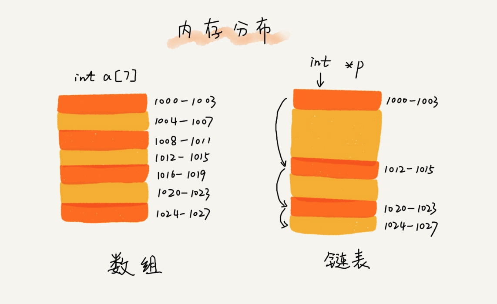
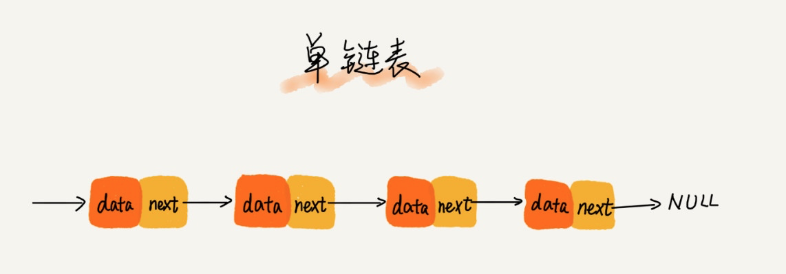
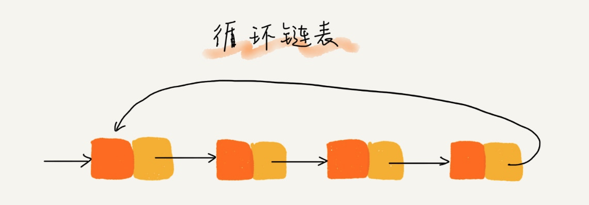
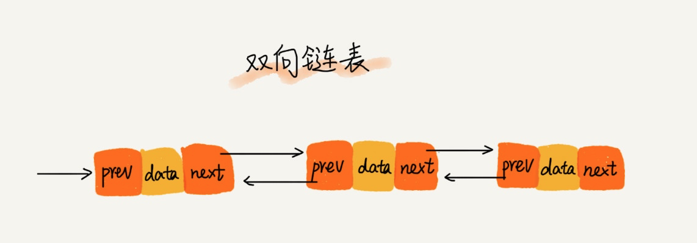
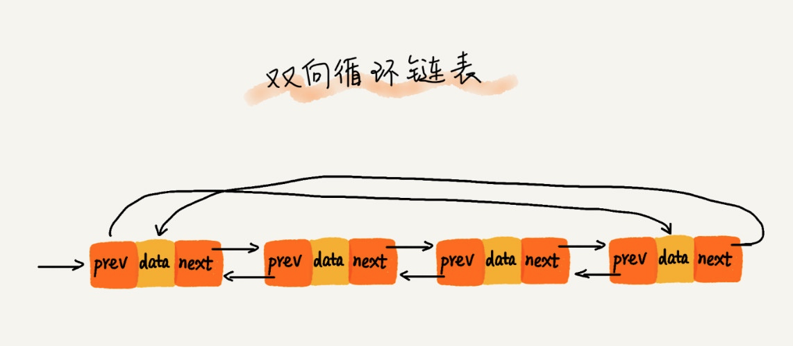
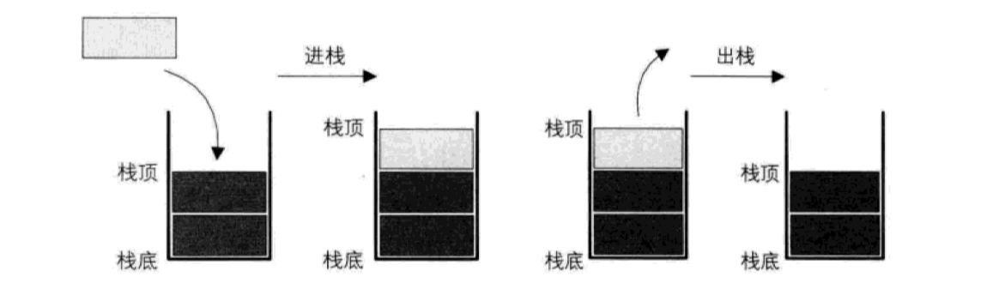
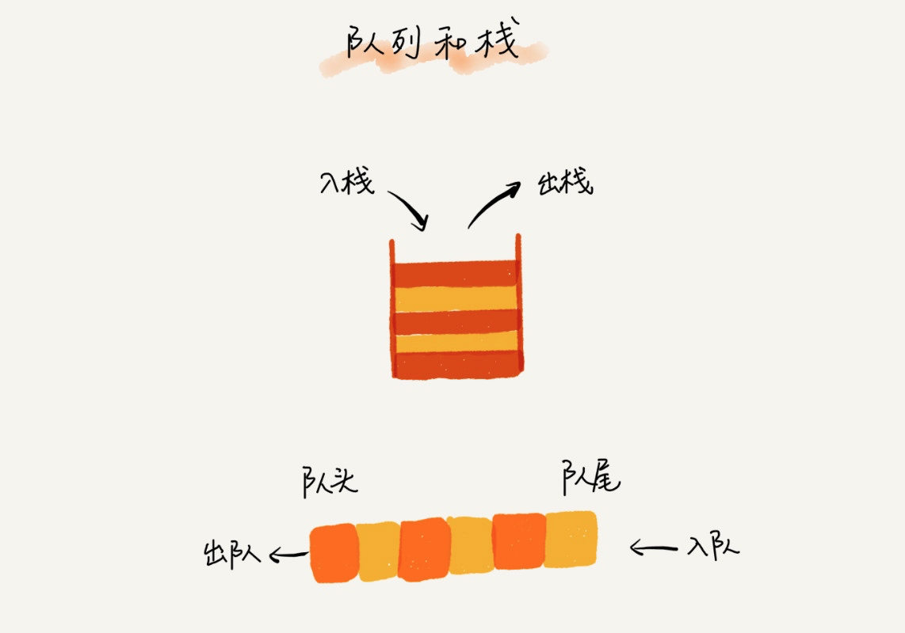
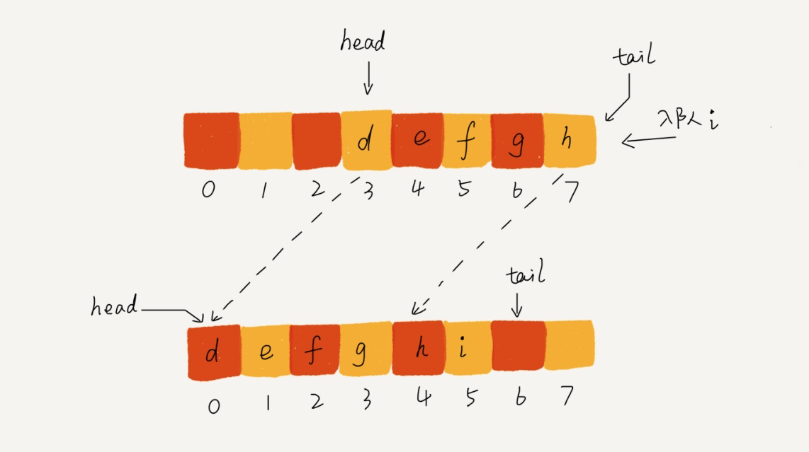
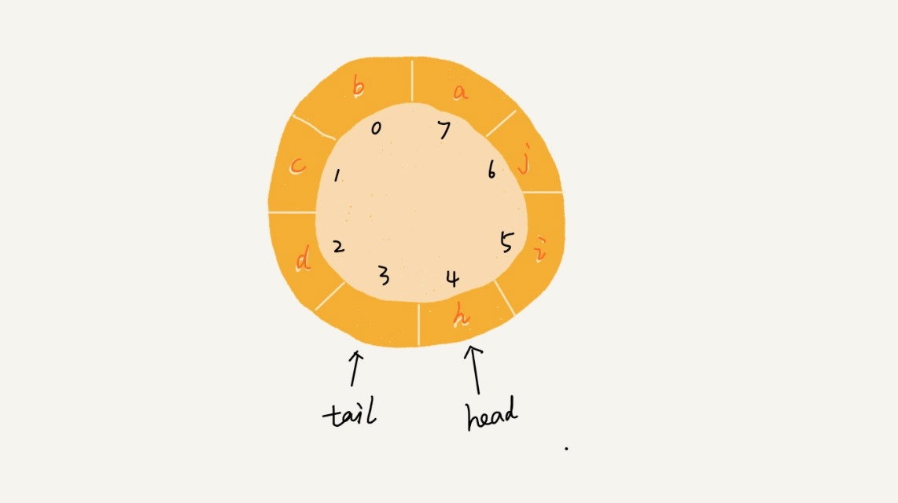

# 数据结构

## 线性表结构

### 数组

数组（Array）是一种线性表数据结构，它用一组连续的内存空间，来存储一组具有相同类型的数据。如果你学习过 C 语言，应该对这段定义很熟悉，但是在 PHP 这种动态语言中，因为数组底层是通过散列表（后面我们会介绍这个数据结构）实现的，所以功能异常强大，这段常规的数组定义在 PHP 中并不成立，PHP 的数组可以存储任何类型数据，如果与 Java 对比的话，PHP 数组集成了 Java 的数组、List、Set、Map 于一身，所以写代码的效率比 Java 高了几个量级。

抛开 PHP 或 JavaScript 这种动态语言，对于传统的数组，比如 C 语言和 Java 中的数组，在使用之前都需要声明数组存储数据的类型和数组的大小，数组的优点是可以通过下标值随机访问数组内的任何元素，算法复杂度是 O(1)，非常高效，但是缺点是删除/插入元素比较费劲，以删除为例，需要在删除某个元素后，将后续元素都往前移一位，如果是插入，则需要将插入位置之后的元素都往后移，所以对数组的插入/删除而言，算法复杂度是 O(n)，当然了，这个是针对 C / Java 这种语言而言，PHP 不受此约束，因为它不是传统一样上的数组嘛。

### 链表

今天介绍第二个数据结构 —— 链表，和数组不同，链表并不需要一块连续的内存空间，它通过“指针”将一组零散的内存块串联起来使用，如图所示：

#### 单链表

链表有多种类型，最简单的是单链表，单链表是最原生的链表，其结构如图所示：



单链表中有两个节点比较特殊，分别是第一个结点和最后一个结点。我们通常把第一个结点叫作头结点，把最后一个结点叫作尾结点。其中，头结点用来记录链表的基地址，有了它，我们就可以遍历得到整条链表。而尾结点特殊的地方是：指针不是指向下一个结点，而是指向一个空地址 NULL，表示这是链表上最后一个结点。对单链表而言，理论上来说，插入和删除节点的时间复杂度是 O(1)，查询节点的时间复杂度是 O(n)。

#### 循环列表

然后还有在单链表的基础上扩展还有循环链表，循环链表和单链表的区别是尾节点指向了头结点，从而首尾相连，有点像贪吃蛇，可用于解决「约瑟夫环」问题，循环链表的结构如图所示：



#### 双向链表

此外，还有比较常见的双向链表，顾名思义，与单链表的区别是双向链表除了有一个指向下一个节点的指针外，还有一个用于指向上一个节点的指针，从而实现通过 O(1) 复杂度找到上一个节点。正是因为这个节点，使得双向链表在插入、删除节点时比单链表更高效，虽然我们前面已经提到单链表插入、删除时间复杂度已经是 O(1) 了，但是这没有考虑还只是针对插入、删除操作本身而言，以删除为例，删除某个节点后，需要将其前驱节点的指针指向被删除节点的下一个节点，这样，我们还需要获取其前驱节点，在单链表中获取前驱节点的时间复杂度是 O(n)，所以综合来看单链表的删除、插入操作时间复杂度也是 O(n)，而双向链表则不然，它有一个指针指向上一个节点，所以其插入和删除时间复杂度才是真正的 O(1)。

此外，对于有序链表而言，双向链表的查询效率显然也要高于单链表，不过更优的时间复杂度是靠更差的空间复杂度换取的，双向链表始终需要单链表的两倍空间，但是正如我们之前说的，在 Web 应用中，时间效率优先级更高，所以我们通常都是空间换时间来提高性能，Java 的 `LinkedHashMap` 底层就用到了双向链表。

双向链表的结构如图所示：



#### 双向循环链表

最后我们要介绍的是结合循环链表和双向链表为一体的双向循环链表：



#### 通过数组函数模拟实现单链表

```php
<?php

/**
 * 通过 PHP 数组模拟实现单链表
 */
class LinkedList
{
    private $list = [];

    // 获取链表指定位置的元素值，从0开始
    public function get($index)
    {
        $value = NULL;
        while (current($this->list)) {
            if (key($this->list) == $index) {
                $value = current($this->list);
            }
            next($this->list);
        }
        reset($this->list);
        return $value;
    }

    // 在链表指定位置插入值，默认插到链表头部
    public function add($value, $index = 0)
    {
        array_splice($this->list, $index, 0, $value);
    }

    // 从链表指定位置删除元素
    public function remove($index)
    {
        array_splice($this->list, $index, 1);
    }

    public function isEmpty()
    {
        return !next($this->list);
    }

    public function size()
    {
        return count($this->list);
    }
}

$linkedList = new LinkedList();
$linkedList->add(4);
$linkedList->add(5);
$linkedList->add(3);
print $linkedList->get(1);   # 输出5
$linkedList->add(1, 1);      # 在结点1的位置上插入1
print $linkedList->get(1);   # 输出1
$linkedList->remove(1);      # 移除结点1上的元素
print $linkedList->get(1);   # 输出5
print $linkedList->size();   # 输出3
```

### 特殊的线性表：栈

栈又叫堆栈，是限定只能在一端进行插入和删除操作的线性表，并且满足后进先出（LIFO）的特点。我们把允许插入和删除的一端叫做栈顶，另一个端叫做栈底，不含任何数据的栈叫做空栈。



栈支持通过数组/链表实现，通过数组实现的通常叫做顺序栈，通过链表实现的叫做链栈。在 PHP 底层 SPL 库中也提供了堆栈的实现类 [SplStack](https://www.php.net/manual/zh/class.splstack.php)。

演示下如何在 PHP 中通过数组实现一个简单的顺序栈：

```php
<?php

/**
 * 通过 PHP 数组实现简单的顺序栈
 */
class SimpleStack {

    private $_stack = [];
    private $_size = 0;

    public function __construct($size = 10)
    {
        $this->_size = $size;
    }

    // 获取栈顶元素
    public function pop()
    {
        // 空栈
        if (count($this->_stack) == 0) {
            return false;
        }
        return array_pop($this->_stack);
    }

    // 推送元素到栈顶
    public function push($value)
    {
        // 满栈
        if (count($this->_stack) == $this->_size) {
            return false;
        }
        array_push($this->_stack, $value);
        return true;
    }

    public function isEmpty()
    {
        return current($this->_stack) == false;
    }

    public function size()
    {
        return count($this->_stack);
    }
}

$stack = new SimpleStack(15);
var_dump($stack->isEmpty());  # true
$stack->push(111);
$stack->push('学院君');
var_dump($stack->pop());  # 学院君
var_dump($stack->size());  # 1
```

### 特殊的线性表：队列

队列，和栈一样，队列也是一中特殊的线性表结构，只不过队列是在一端插入，另一端删除，就跟我们平常排队一样的道理，从队尾入队，在队头出去，所以队列的特性是先入先出（FIFO），允许插入的一端叫队尾，允许删除的一端叫队头。



和栈一样，队列也可以通过数组和链表实现，通过数组实现的叫顺序队列，通过链表实现的叫做链式队列，栈只需要一个栈顶指针就可以了，因为**只允许在栈顶插入删除**，但是队列需要两个指针，一个指向队头，一个指向队尾。我们先来看通过 PHP 数组实现的顺序队列代码：

```php
<?php
/**
 * 通过 PHP 数组实现的队列
 */
class SimpleQueue
{
    private $_queue = [];
    private $_size = 0;

    public function __construct($size = 10)
    {
        $this->_size = $size;
    }

    // 入队
    public function enqueue($value)
    {
        if (count($this->_queue) > $this->_size) {
            return false;
        }
        array_push($this->_queue, $value);
    }

    // 出队
    public function dequeue()
    {
        if (count($this->_queue) == 0) {
            return false;
        }
        return array_shift($this->_queue);
    }

    public function size()
    {
        return count($this->_queue);
    }
}

$queue = new SimpleQueue(5);
$queue->enqueue(1);
$queue->enqueue(3);
$queue->enqueue(5);
var_dump($queue->dequeue());  # 1
var_dump($queue->size());  # 2
```

通过数组实现的顺序队列有一个问题，就是随着队列元素的插入和删除，队尾指针和队头指针不断后移，而导致队尾指针指向末尾无法插入数据，这时候有可能队列头部还是有剩余空间的，如下图所示：



我们当然可以通过数据搬移的方式把所有队列数据往前移，但这会增加额外的时间复杂度，如果频繁操作数据量很大的队列，显然对性能有严重损耗，对此问题的解决方案是循环队列，即把队列头尾连起来：



这样一来就不会出现之前的问题了，此时判断队列是否为空的条件还是 `tail==head`，但是判断队列是否满的条件就变成了 `(tail+1) % maxsize == head`，`maxsize` 是数组的长度，浪费一个空间是为了避免混淆判断空队列的条件。当然如果通过链表来实现队列的话，显然没有这类问题，因为链表没有空间限制。

## 推荐阅读

> [数据结构与算法](https://xueyuanjun.com/books/data-structure-and-algorithms)

