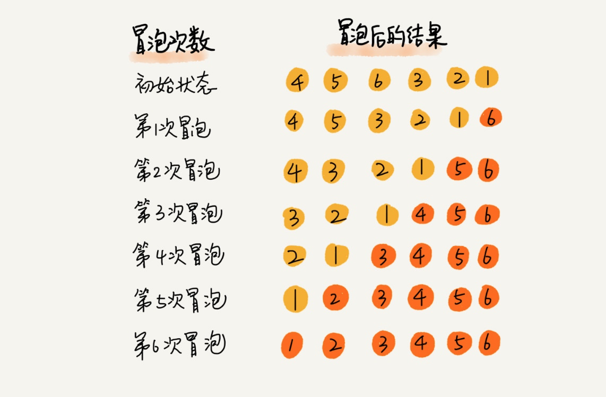
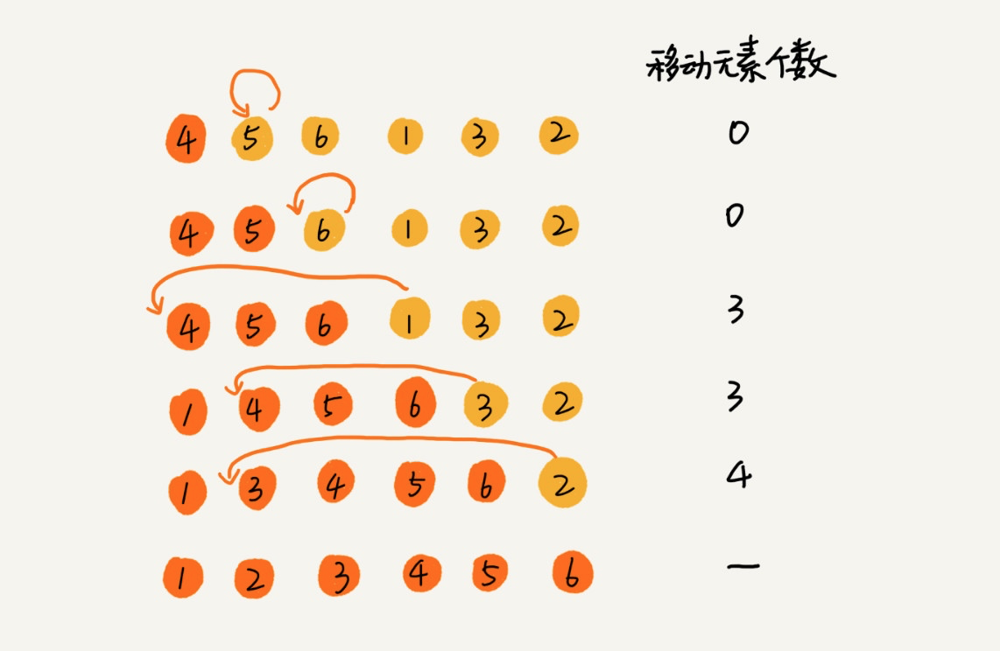

# 算法

## 排序算法

常见基于选择的排序算法有冒泡排序、插入排序、选择排序、归并排序和快速排序，我们在选择排序算法的时候，通常会根据以下几个维度来考虑：

1. 时间复杂度
2. 空间复杂度（对内存空间的消耗）
3. 算法的稳定性（如果待排序的序列中存在值相等的元素，经过排序之后，相等元素之间原有的先后顺序不变）

### 冒泡排序

冒泡排序只会操作相邻的两个数据。每次冒泡操作都会对相邻的两个元素进行比较，看是否满足大小关系要求，如果不满足就让它俩互换。一次冒泡会让至少一个元素移动到它应该在的位置，重复
n 次，就完成了 n 个数据的排序工作。



```php
<?php

/**
 * 冒泡排序实现函数（PHP）        
 * 优：如果一次命中的话，就不用排序
 * @param $nums
 * @return mixed
 */
function bubble_sort($nums) {
    if (count($nums) <= 1) {
        return $nums;
    }

    for ($i = 0; $i < count($nums); $i++) {
        $flag = false;
        for ($j = 0; $j < count($nums) - $i - 1; $j++) {
            if ($nums[$j] > $nums[$j+1]) {
                $temp  = $nums[$j];
                $nums[$j] = $nums[$j+1];
                $nums[$j+1] = $temp;
                $flag = true;
            }
        }
        if (!$flag) {
            break;
        }
    }

    return $nums;
}

$nums = [4, 5, 6, 3, 2, 1];
$nums = bubble_sort($nums);
print_r($nums);
```

```php
<?php

/**
 * 冒泡排序实现函数（PHP）        
 * 劣：必须调用_sort $len次，哪怕一次命中
 * @param $nums
 * @return mixed
 */
function bubble_sort($nums)
{
    $str = (string)$nums;
    $len = strlen($str);
    do {
        $str = _sort($str, $len);
        $len--;
    } while ($len != 0);
    return (int)$str;
}

//一次排序
function _sort($str, $len)
{
    for ($i = 0; $i < $len - 1; $i++) {
        switch ($str[$i] <=> $str[$i + 1]) {
            case 1:
                // $temp  = $str[$i];
                // $str[$i] = $str[$i+1];
                // $str[$i+1] = $temp;
                $str = substr_replace($str, $str[$i + 1] . $str[$i], $i, 2);
                break;
            default:
                break;
        }
    }
    return $str;
}

var_dump(bubble_sort(23421));
```

```php
<?php
//给出一串字符串，按顺序排列：   输入"asdasdasd"	输出"aaadddsss"
class Solution
{
    /**
     * 劣：用新字符串和旧的比较，但还是每个字符串比较n次
     * @param String $s
     * @return String
     */
    function sortString($s)
    {
        $s_new = $s[0];
        for ($i = 0; $i < strlen($s); $i++) {
            switch ($s_new[$i] <=> $s[$i + 1]) {
                case -1:            //最好的情况，直接拼在后面
                    $s_new = $s_new . $s[$i + 1];
                    break;
                case 0:             //一般的情况，直接插入在当前字符串后面
                    $s_new = substr_replace($s_new, $s[$i + 1], $i, 0);
                    break;
                case 1:             //最坏的情况，和前面的字符串依次比较
                    for ($j = $i; $j >= 0; $j--) {
                        if ($j == 0) {
                            $s_new = $s[$i + 1] . $s_new;
                            break;
                        }
                        switch ($s_new[$j - 1] <=> $s[$i + 1]) {
                            case 1:
                                break;
                            default:
                                $s_new = substr_replace($s_new, $s[$i + 1], $j, 0);
                                break 2;
                        }
                    }
                    break;
            }
        }
        return $s_new;
    }
}
//或者先重组为数组，使用sort函数排序，再拼接为字符串
```

### 插入排序

插入排序的原理是：我们将数组中的数据分为两个区间，已排序区间和未排序区间。初始已排序区间只有一个元素，就是数组的第一个元素。插入算法的核心思想是取未排序区间中的元素，在已排序区间中找到合适的插入位置将其插入，并保证已排序区间数据一直有序。重复这个过程，直到未排序区间中元素为空，算法结束。



## 推荐阅读

> [数据结构与算法](https://xueyuanjun.com/books/data-structure-and-algorithms)