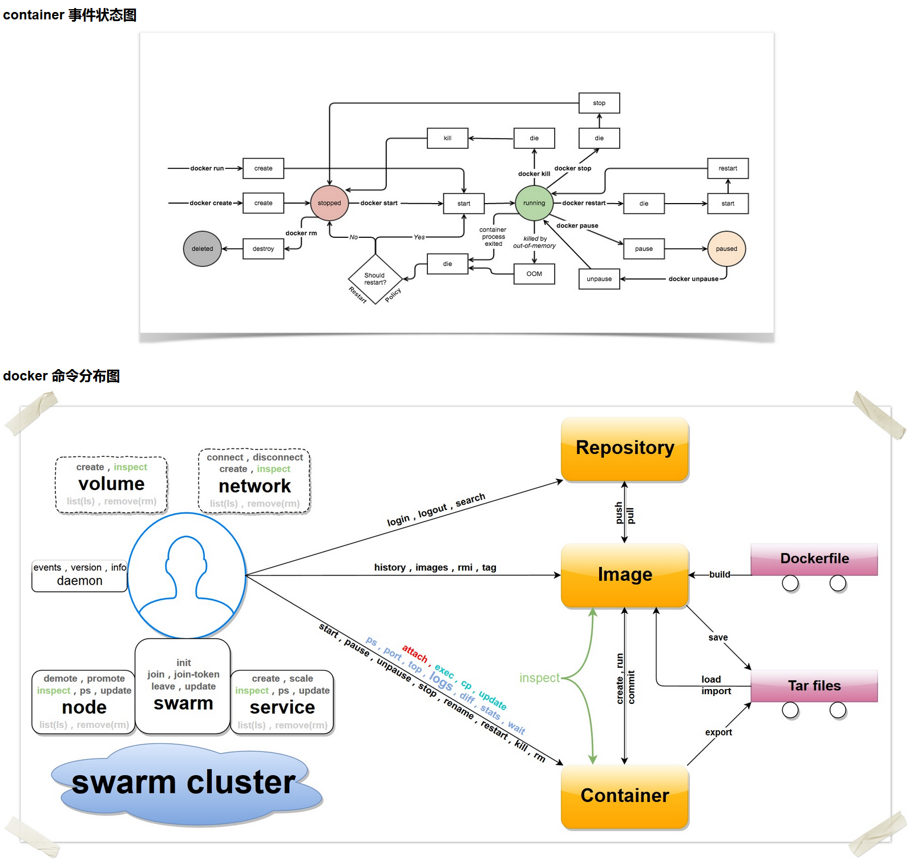

# Docker

## 配置

```json
{
  "experimental": false,
  "debug": true,
  "registry-mirrors": [
    "https://******.mirror.aliyuncs.com",
    "https://dockerhub.azk8s.cn",
    "https://hub-mirror.c.163.com"
  ]
}
```

## 基础命令

- 客户端命令：基本命令格式为 `docker [OPTIONS] COMMAND [arg...]`；
- 服务端命令：基本命令格式为 `dockerd [OPTIONS]`。

### 客户端命令

#### **客户端命令选项**

- `--config=""`：指定客户端配置文件，默认为 `~/.docker`；
- `-D=true|false`：是否使用 debug 模式。默认不开启；
- `-H, --host=[]`：指定命令对应 Docker 守护进程的监听接口，可以为 unix 套接字 `unix:///path/to/socket`
  ，文件句柄 `fd://socketfd` 或 tcp 套接字 `tcp://[host[:port]]`，默认为 `unix:///var/run/docker.sock`；
- `-l, --log-level="debug|info|warn|error|fatal"`：指定日志输出级别；
- `--tls=true|false`：是否对 Docker 守护进程启用 TLS 安全机制，默认为否；
- `--tlscacert=/.docker/ca.pem`：TLS CA 签名的可信证书文件路径；
- `--tlscert=/.docker/cert.pem`：TLS 可信证书文件路径；
- `--tlscert=/.docker/key.pem`：TLS 密钥文件路径；
- `--tlsverify=true|false`：启用 TLS 校验，默认为否。

#### **客户端命令**

可以通过 `docker COMMAND --help` 来查看这些命令的具体用法。

- `attach`：依附到一个正在运行的容器中；
- `build`：从一个 Dockerfile 创建一个镜像；
- `commit`：从一个容器的修改中创建一个新的镜像；
- `cp`：在容器和本地宿主系统之间复制文件中；
- `create`：创建一个新容器，但并不运行它；
- `diff`：检查一个容器内文件系统的修改，包括修改和增加；
- `events`：从服务端获取实时的事件；
- `exec`：在运行的容器内执行命令；
- `export`：导出容器内容为一个 `tar` 包；
- `history`：显示一个镜像的历史信息；
- `images`：列出存在的镜像；
- `import`：导入一个文件（典型为 `tar` 包）路径或目录来创建一个本地镜像；
- `info`：显示一些相关的系统信息；
- `inspect`：显示一个容器的具体配置信息；
- `kill`：关闭一个运行中的容器 (包括进程和所有相关资源)；
- `load`：从一个 tar 包中加载一个镜像；
- `login`：注册或登录到一个 Docker 的仓库服务器；
- `logout`：从 Docker 的仓库服务器登出；
- `logs`：获取容器的 log 信息；
- `network`：管理 Docker 的网络，包括查看、创建、删除、挂载、卸载等；
- `node`：管理 swarm 集群中的节点，包括查看、更新、删除、提升/取消管理节点等；
- `pause`：暂停一个容器中的所有进程；
- `port`：查找一个 nat 到一个私有网口的公共口；
- `ps`：列出主机上的容器；
- `pull`：从一个Docker的仓库服务器下拉一个镜像或仓库；
- `push`：将一个镜像或者仓库推送到一个 Docker 的注册服务器；
- `rename`：重命名一个容器；
- `restart`：重启一个运行中的容器；
- `rm`：删除给定的若干个容器；
- `rmi`：删除给定的若干个镜像；
- `run`：创建一个新容器，并在其中运行给定命令；
- `save`：保存一个镜像为 tar 包文件；
- `search`：在 Docker index 中搜索一个镜像；
- `service`：管理 Docker 所启动的应用服务，包括创建、更新、删除等；
- `start`：启动一个容器；
- `stats`：输出（一个或多个）容器的资源使用统计信息；
- `stop`：终止一个运行中的容器；
- `swarm`：管理 Docker swarm 集群，包括创建、加入、退出、更新等；
- `tag`：为一个镜像打标签；
- `top`：查看一个容器中的正在运行的进程信息；
- `unpause`：将一个容器内所有的进程从暂停状态中恢复；
- `update`：更新指定的若干容器的配置信息；
- `version`：输出 Docker 的版本信息；
- `volume`：管理 Docker volume，包括查看、创建、删除等；
- `wait`：阻塞直到一个容器终止，然后输出它的退出符。

### 服务端命令

#### **dockerd 命令选项**

- `--api-cors-header=""`：CORS 头部域，默认不允许 CORS，要允许任意的跨域访问，可以指定为 "*"；
- `--authorization-plugin=""`：载入认证的插件；
- `-b=""`：将容器挂载到一个已存在的网桥上。指定为 `none` 时则禁用容器的网络，与 `--bip` 选项互斥；
- `--bip=""`：让动态创建的 `docker0` 网桥采用给定的 CIDR 地址; 与 `-b` 选项互斥；
- `--cgroup-parent=""`：指定 cgroup 的父组，默认 fs cgroup 驱动为 `/docker`，systemd cgroup 驱动为 `system.slice`；
- `--cluster-store=""`：构成集群（如 `Swarm`）时，集群键值数据库服务地址；
- `--cluster-advertise=""`：构成集群时，自身的被访问地址，可以为 `host:port` 或 `interface:port`；
- `--cluster-store-opt=""`：构成集群时，键值数据库的配置选项；
- `--config-file="/etc/docker/daemon.json"`：daemon 配置文件路径；
- `--containerd=""`：containerd 文件的路径；
- `-D, --debug=true|false`：是否使用 Debug 模式。缺省为 false；
- `--default-gateway=""`：容器的 IPv4 网关地址，必须在网桥的子网段内；
- `--default-gateway-v6=""`：容器的 IPv6 网关地址；
- `--default-ulimit=[]`：默认的 ulimit 值；
- `--disable-legacy-registry=true|false`：是否允许访问旧版本的镜像仓库服务器；
- `--dns=""`：指定容器使用的 DNS 服务器地址；
- `--dns-opt=""`：DNS 选项；
- `--dns-search=[]`：DNS 搜索域；
- `--exec-opt=[]`：运行时的执行选项；
- `--exec-root=""`：容器执行状态文件的根路径，默认为 `/var/run/docker`；
- `--fixed-cidr=""`：限定分配 IPv4 地址范围；
- `--fixed-cidr-v6=""`：限定分配 IPv6 地址范围；
- `-G, --group=""`：分配给 unix 套接字的组，默认为 `docker`；
- `-g, --graph=""`：Docker 运行时的根路径，默认为 `/var/lib/docker`；
- `-H, --host=[]`：指定命令对应 Docker daemon 的监听接口，可以为 unix 套接字 `unix:///path/to/socket`
  ，文件句柄 `fd://socketfd` 或 tcp 套接字 `tcp://[host[:port]]`，默认为 `unix:///var/run/docker.sock`；
- `--icc=true|false`：是否启用容器间以及跟 daemon 所在主机的通信。默认为 true。
- `--insecure-registry=[]`：允许访问给定的非安全仓库服务；
- `--ip=""`：绑定容器端口时候的默认 IP 地址。缺省为 `0.0.0.0`；
- `--ip-forward=true|false`：是否检查启动在 Docker 主机上的启用 IP 转发服务，默认开启。注意关闭该选项将不对系统转发能力进行任何检查修改；
- `--ip-masq=true|false`：是否进行地址伪装，用于容器访问外部网络，默认开启；
- `--iptables=true|false`：是否允许 Docker 添加 iptables 规则。缺省为 true；
- `--ipv6=true|false`：是否启用 IPv6 支持，默认关闭；
- `-l, --log-level="debug|info|warn|error|fatal"`：指定日志输出级别；
- `--label="[]"`：添加指定的键值对标注；
- `--log-driver="json-file|syslog|journald|gelf|fluentd|awslogs|splunk|etwlogs|gcplogs|none"`
  ：指定日志后端驱动，默认为 `json-file`；
- `--log-opt=[]`：日志后端的选项；
- `--mtu=VALUE`：指定容器网络的 `mtu`；
- `-p=""`：指定 daemon 的 PID 文件路径。缺省为 `/var/run/docker.pid`；
- `--raw-logs`：输出原始，未加色彩的日志信息；
- `--registry-mirror=<scheme>://<host>`：指定 `docker pull` 时使用的注册服务器镜像地址；
- `-s, --storage-driver=""`：指定使用给定的存储后端；
- `--selinux-enabled=true|false`：是否启用 SELinux 支持。缺省值为 false。SELinux 目前尚不支持 overlay 存储驱动；
- `--storage-opt=[]`：驱动后端选项；
- `--tls=true|false`：是否对 Docker daemon 启用 TLS 安全机制，默认为否；
- `--tlscacert=/.docker/ca.pem`：TLS CA 签名的可信证书文件路径；
- `--tlscert=/.docker/cert.pem`：TLS 可信证书文件路径；
- `--tlscert=/.docker/key.pem`：TLS 密钥文件路径；
- `--tlsverify=true|false`：启用 TLS 校验，默认为否；
- `--userland-proxy=true|false`：是否使用用户态代理来实现容器间和出容器的回环通信，默认为 true；
- `--userns-remap=default|uid:gid|user:group|user|uid`：指定容器的用户命名空间，默认是创建新的 UID 和 GID 映射到容器内进程。



## 常用技巧

### 修改端口映射

#### 一、通过修改配置文件修改

1.使用**docker ps -a**命令找到要修改容器的**CONTAINER ID**

2.运行以下命令，进入该容器目录

```shell
docker inspect【CONTAINER ID】| grep Id
cd /var/lib/docker/containers
```

2.停止容器

```shell
docker stop [容器id]
```

3.停止主机docker服务

```shell
systemctl stop docker
```

4.进入2得到的文件夹内，修改hostconfig.json 和 config.v2.json

```shell
vi hostconfig.json

比如新增一个 80 端口，在PortBindings下边添加以下内容，端口配置之间用英文字符逗号隔开

"80/tcp": [ 
{
 "HostIp": "0.0.0.0",
 "HostPort": "80"
 }
]
接着修改vi config.v2.json, 找到ExposedPorts和Ports  仿照之前内容添加端口映射
"ExposedPorts":  {
    "2000/tcp":   {}
},

"Ports":{
   "2000/tcp":[
        {
         "HostIp": "0.0.0.0",
         "HostPort":  "2000"
         }
]
},
```

5.保存之后重启docker服务和容器

```shell
systemctl start docker
docker start [docker i
```

#### 二、修改yml文件

1. 修改`docker-composer.yml` 文件
2. `docker-composer up -d [container]` 重新启动（会自动验证有没有更新）

## 进阶

### dockerfile

- **FROM**
    - 必须是 Dockerfile 中**非注释行的第一个指令**
    - 用于**为镜像文件构建过程指定基础镜像**
    - 可以在一个 Dockerfile 中出现多次
    - 如果没有指定镜像标签，则**默认使用latest标签**
- **MAINTAINER**
    - 用于让dockerfile制作者提供本人的详细信息
    - 推荐将其放置于FROM指令之后
- **ENV**
    - 用于为镜像定义所需的**环境变量**，并可被Dockerfile文件中**位于其后的**其它指令所调用
    - 调用格式为`$variable_ name` 或 `${variable_ name}`
- **COPY**
    - 用于从docker 主机复制新文件或者目录至创建的新镜像指定路径中，**建议<dest>使用绝对路径**
    - **<src>是目录**，则其**内部文件或子目录会被递归复制**，但**<src>目录自身不会被复制**
    - 如果指定了多个<src>，则<dest>必须是一个目录，且**必须以 / 结尾**
- **ADD**
    - ADD 指令类似于COPY指令，ADD支持使用TAR文件和URL路径
- **WORKDIR**
    - 用于为Dockerfile中所有的RUN、CMD、ENTRYPOINT、COPY和ADD指定**设定工作目录**
    - **WORKDIR指令可出现多次**，其路径也可以为相对路径，不过，其是相对此**前一个WORKDIR**指令指定的路径
    - WORKDIR也可调用由ENV指定定义的变量
- **VOLUME**
    - 用于在image中创建一个挂载点目录，以挂载Docker host.上的卷或其它容器上的卷
- **EXPOSE**
    - 用于为容器**打开指定要监听的端口**以实现与外部通信
    - 这只是个声明
- **RUN**
    - 用于指定**docker build**过程中运行的**程序**或**命令**
- **CMD**
    - 运行于基于Dockerfile构建出的新映像文件**启动**一个容器时
    - 可以被docker run的命令行选项所覆盖
    - 可以存在**多个CMD指令，但仅最后一个会生效**
- **ENTRYPOINT**
    - 类似**CMD**指令的功能，用于为容器指定默认运行程序，从而使得容器像是一个单独的可执行程序
    - ENTRYPOINT启动的程序**不会被docker run命令行指定的参数所覆盖**，而且，这些**命令行参数**会被当作参数传递给ENTRYPOINT指定指定的程序
- **ONBUILD**
- **USER**
    - 指定运行容器时的用户名或 UID，后续的 RUN 也会使用指定用户

```
FROM <repository>[:<tag>]
MAINTAINER <authtor's detail>
ENV <key>=<value> . .
COPY <src> .. <dest>
ADD <src> .. <dest> 
WORKDIR <dirpath>
VOLUME /data/mysql  # 挂载到/data/mysql目录下
EXPOSE <port>[/ <protocol>] [<port>[/ <protocol>] ....
RUN <command>
CMD <command>
ENTRYPOINT <command>
ONBUILD < Instruction>
USER <UID>| <U JserName >
```

### docker-compose

#### 命令

##### **命令选项**

- `-f, --file FILE` 指定使用的 Compose 模板文件，默认为 `docker-compose.yml`，可以多次指定。
- `-p, --project-name NAME` 指定项目名称，默认将使用所在目录名称作为项目名。
- `--x-networking` 使用 Docker 的可拔插网络后端特性
- `--x-network-driver DRIVER` 指定网络后端的驱动，默认为 `bridge`
- `--verbose` 输出更多调试信息。
- `-v, --version` 打印版本并退出。

##### 具体命令

- build Build or rebuild services
- config Validate and view the Compose file
- create Create services
- down Stop and remove containers, networks, images, and volumes
- events Receive real time events from containers
- exec Execute a command in a running container
- help Get help on a command
- images List images
- kill Kill containers
- logs View output from containers
- pause Pause services
- port Print the public port for a port binding
- ps List containers
- pull Pull service images
- push Push service images
- restart Restart services
- rm Remove stopped containers
- run Run a one-off command
- scale Set number of containers for a service
- start Start services
- stop Stop services
- top Display the running processes
- unpause Unpause services
- up Create and start containers
- version Show the Docker-Compose version information

#### 配置

- **version**      —— 配置文件的版本
- **networks**    —— 定义网络
    - frontend:
        - driver:               ——指定该网络所要使用的驱动
        - driver_opts:     ——数据卷驱动的列表选项
        - attachable:       ——是否允许除服务之外的独立容器连接到该网络（>=3.2）
        - labels:               ——将元数据以标签的形式添加到容器中
        - external:           ——指定该网络是否是外部网络
        - name:               ——为该网络设置一个自定义名称（>=3.5）
    - backend:
        - ...
- **volumes**      —— 定义数据卷
    - 用户自定义的服务名称（指定镜像名称或id）
        - driver:               ——指定该数据卷所要使用的数据卷驱动
        - driver_opts:      ——数据卷驱动的列表选项
        - external:           ——指定该数据卷是否是外部数据卷
        - labels:               ——将元数据以标签的形式添加到容器中
        - name:                ——为该数据卷设置一个自定义名称（>=3.4）
- **services**       —— 定义服务
    - 用户自定义的服务名称（指定镜像名称或id）
        - build:                 ——构建时应用的配置项
            - context ... ——上下文路径
            - dockerfile ... ——指定构建镜像的 Dockerfile 文件名（必须要指定构建上下文路径）
            - args ... ——添加构建参数，这是只能在构建过程中访问的环境变量
            - cache_from ... ——指定缓存解析镜像列表（>=3.2）
            - labels ... ——将元数据以标签的形式添加到生成的镜像中（>=3.3）
            - network ... ——设置容器网络连接以获取构建过程中的RUN指令（>=3.4）
            - target ... ——多层构建，可以指定构建哪一层（>=3.4）
            - shm_size ... ——指定容器的/dev/shm分区大小（>=3.5）
        - command:        ——覆盖容器启动后默认执行的命令
        - image:               ——指定要从中启动容器的镜像（repository/tag/ID）
        - environment:   ——设置环境变量
        - depends_on:    ——指定服务之间的依赖关系
        - ports:                ——暴露端口
        - networks:         ——指定所加入的网络（需要在顶层networks配置项中引入具体的网络信息）
        - volumes:          ——指定所挂载的主机路径或数据卷名称
        - labels:               ——将元数据以标签的形式添加到容器中
        - container_name:    指定自定义容器的名称
        - devices:            ——指定设备映射列表
        - dns:                   ——自定义DNS服务器
        - entrypoint:       ——覆盖默认的入口命令
        - expose:             ——暴露指定端口，但不映射到宿主机，只被连接的服务访问
        - extra_hosts:     ——添加主机名到IP的映射
        - logging:             ——服务的日志配置
- **configs**         ——定义或引用了授予此堆栈中的服务的configs
- **secrets**         —— 定义服务

```yaml
version: "3.8"

networks:
  frontend:
  backend:

volumes:
  db-data:

services:

  redis:
    image: redis:alpine
    ports:
      - "6379"
    networks:
      - frontend
    deploy:
      replicas: 2
      update_config:
        parallelism: 2
        delay: 10s
      restart_policy:
        condition: on-failure

  db:
    image: postgres:9.4
    volumes:
      - db-data:/var/lib/postgresql/data
    networks:
      - backend
    deploy:
      placement:
        constraints:
          - "node.role==manager"

  vote:
    image: dockersamples/examplevotingapp_vote:before
    ports:
      - "5000:80"
    networks:
      - frontend
    depends_on:
      - redis
    deploy:
      replicas: 2
      update_config:
        parallelism: 2
      restart_policy:
        condition: on-failure

  result:
    image: dockersamples/examplevotingapp_result:before
    ports:
      - "5001:80"
    networks:
      - backend
    depends_on:
      - db
    deploy:
      replicas: 1
      update_config:
        parallelism: 2
        delay: 10s
      restart_policy:
        condition: on-failure

  worker:
    image: dockersamples/examplevotingapp_worker
    networks:
      - frontend
      - backend
    deploy:
      mode: replicated
      replicas: 1
      labels: [ APP=VOTING ]
      restart_policy:
        condition: on-failure
        delay: 10s
        max_attempts: 3
        window: 120s
      placement:
        constraints:
          - "node.role==manager"

  visualizer:
    image: dockersamples/visualizer:stable
    ports:
      - "8080:8080"
    stop_grace_period: 1m30s
    volumes:
      - "/var/run/docker.sock:/var/run/docker.sock"
    deploy:
      placement:
        constraints:
          - "node.role==manager"

```

## 推荐阅读

[Docker —— 从入门到实践](https://yeasy.gitbook.io/docker_practice/)

[Docker系列](https://www.cnblogs.com/along21/p/8116905.html)

[Docker Compose配置文件详解（V3）](https://www.cnblogs.com/sanduzxcvbnm/p/13188274.html)

