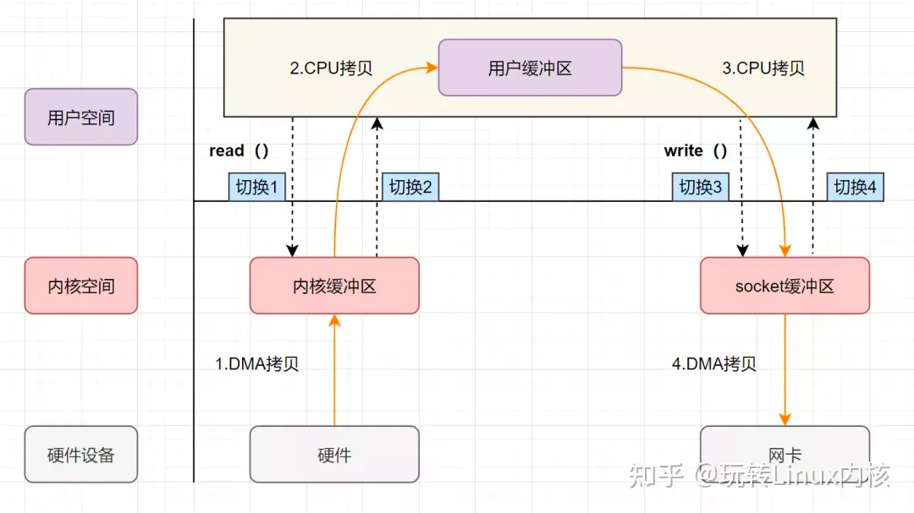
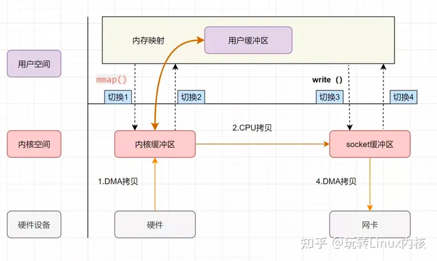
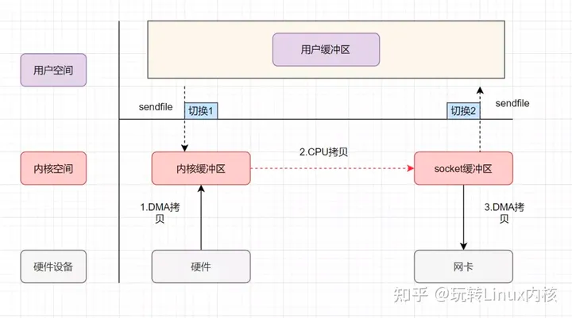
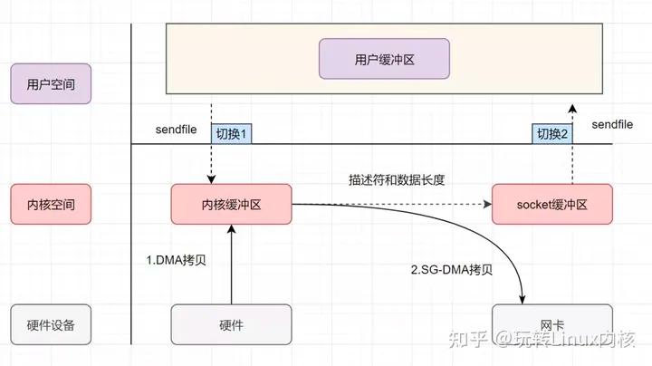
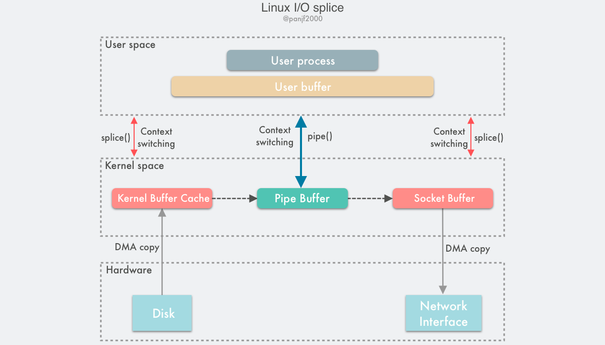

# 零拷贝

[思维导图](/mind.html?path=/technology-stack/unix/零拷贝)

零拷贝可以让CPU释放出来不去执行内存中数据拷贝的功能，或者避免不必要的拷贝。
所以说零拷贝不是没有数据的拷贝(复制)，而是广义上讲的减少和避免不必要的数据拷贝，可以用来节省CPU使用和内存带宽等。

1. DMA从磁盘读取数据到内核缓冲区
2. CPU从内核缓冲区拷贝到用户缓冲区
3. CPU从用户缓冲区拷贝到socket缓冲区
4. DMA从socket缓冲区拷贝到网卡

两次系统调用，四次数据拷贝。

## mmap + write

通过mmap系统调用，将用户空间的虚拟地址和内核空间的虚拟地址映射成同一个物理地址这样可以减少内核空间和内核空间的数据拷贝。

1. DMA从磁盘读取数据到内核缓冲区
2. CPU从内核缓冲区拷贝到socket缓冲区
3. DMA从socket缓冲区拷贝到网卡

两次系统调用，三次数据拷贝。

## [sendfile](https://man7.org/linux/man-pages/man2/sendfile.2.html)

sendfile可以在文件描述符之间传递数据，避免了内核缓冲区和用户缓冲区之间的数据拷贝，所以非常高效。
但是源文件描述符要求必须是支持mmap操作的文件描述符，普通的文件可以，但是socket就不行了。
所以sendfile适合从文件读取数据写socket场景，所以sendfile这个名字还是很贴切的，发送文件。

1. DMA从磁盘读取数据到内核缓冲区
2. CPU从内核缓冲区拷贝到socket缓冲区
3. DMA从socket缓冲区拷贝到网卡

一次系统调用，三次数据拷贝。

linux 2.4之后，又对sendfile做了优化，对于支持 dms scatter/gather功能的网卡，只把关于数据的位置和长度的信息的描述符被追加到了socket缓冲区中。
DMA引擎直接把数据从内核缓冲区传输到网卡(protocol engine），从而消除了仅有的一次CPU拷贝。

一次系统调用，两次数据拷贝。

## [splice](https://man7.org/linux/man-pages/man2/splice.2.html)

在源和目的都是socket的时候可以使用splice。

## 参考文章

- [零拷贝技术第一篇：综述](https://colobu.com/2022/11/19/zero-copy-and-how-to-use-it-in-go/)
- [零拷贝技术第二篇：Go语言中的应用](https://colobu.com/2022/11/21/zero-copy-and-how-to-use-it-in-go-2/)
- [Linux中的零拷贝技术，sendfile，splice和tee之间的区别是什么](https://www.zhihu.com/question/35093238?utm_id=0)
- [Optimizing Large File Transfers in Linux with Go — An Exploration of TCP and Syscall](https://itnext.io/optimizing-large-file-transfers-in-linux-with-go-an-exploration-of-tcp-and-syscall-ebe1b93fb72f)
- [Go 语言中的零拷贝优化](https://strikefreedom.top/archives/pipe-pool-for-splice-in-go)
- [Zero-copy](https://en.wikipedia.org/wiki/Zero-copy)
- [Zero Copy I: User-Mode Perspective](https://www.linuxjournal.com/article/6345)